# 1. NoSQL的四大分类

- **KV键值对：**

  - 新浪：Redis
  - 美团：Redis + Tail
  - 阿里、百度：Redis + memcache

- **文档型数据库：**

  - MangoDB

    MongoDB是一个基于分布式文件存储的数据库，使用C++编写，主要用于处理大量的文档。

    MongoDB是一个介于关系型数据库和非关系型数据库中间的产品。

    MongoDB是功能最丰富，最像关系型数据库的非关系型数据库。

  - ConthDB

- **列存储数据库：**

  - HBase
  - 分布式文件系统

- **图关系数据库：**

  存放的不是图形，而是关系。比如朋友圈的社交网络，广告推荐。

  - Neo4j
  - InfoGrid

|       **分类**        |                **Examples举例**                 |                       **典型应用场景**                       |                  **数据模型**                   |                           **优点**                           |                           **缺点**                           |
| :-------------------: | :---------------------------------------------: | :----------------------------------------------------------: | :---------------------------------------------: | :----------------------------------------------------------: | :----------------------------------------------------------: |
| **键值（key-value）** | Tokyo Cabinet/Tyrant ==Redis== Voldemort Oracle | 内容缓存，主要用于处理大量数据的高访问负载，也用于一些日志系统等等。 | Key 指向 Value 的键值对，通常用hash table来实现 |                          查找速度快                          |        数据无结构化，通常只被当作字符串或者二进制数据        |
|   **列存储数据库**    |            Cassandra ==HBase== Riak             |                       分布式的文件系统                       |       以列簇式存储，将同一列数据存在一起        |         查找速度快，可扩展性强，更容易进行分布式扩展         |                         功能相对局限                         |
|   **文档型数据库**    |               CouchDB ==MongoDb==               | Web应用（与Key-Value类似，Value是结构化的，不同的是数据库能够了解Value的内容） |    Key-Value对应的键值对，Value为结构化数据     | 数据结构要求不严格，表结构可变，不需要像关系型数据库一样需要预先定义表结构 |            查询性能不高，而且缺乏统一的查询语法。            |
| **图形(Graph)数据库** |       ==Neo4J== InfoGrid Infinite   Graph       |           社交网络，推荐系统等。专注于构建关系图谱           |                     图结构                      |     利用图结构相关算法。比如最短路径寻址，N度关系查找等      | 很多时候需要对整个图做计算才能得出需要的信息，而且这种结构不太好做分布式的集群 |

# 2. 什么是Redis

Redis官网：[https://redis.io/](https://redis.io/)

Redis中文网：[http://www.redis.cn/](http://www.redis.cn/)

> Redis 是一个开源（BSD许可）的，内存中的数据结构存储系统，它可以用作数据库、缓存和消息中间件。 它支持多种类型的数据结构，如 [字符串（strings）](http://www.redis.cn/topics/data-types-intro.html#strings)， [散列（hashes）](http://www.redis.cn/topics/data-types-intro.html#hashes)， [列表（lists）](http://www.redis.cn/topics/data-types-intro.html#lists)， [集合（sets）](http://www.redis.cn/topics/data-types-intro.html#sets)， [有序集合（sorted sets）](http://www.redis.cn/topics/data-types-intro.html#sorted-sets) 与范围查询， [bitmaps](http://www.redis.cn/topics/data-types-intro.html#bitmaps)， [hyperloglogs](http://www.redis.cn/topics/data-types-intro.html#hyperloglogs) 和 [地理空间（geospatial）](http://www.redis.cn/commands/geoadd.html) 索引半径查询。 Redis 内置了 [复制（replication）](http://www.redis.cn/topics/replication.html)，[LUA脚本（Lua scripting）](http://www.redis.cn/commands/eval.html)， [LRU驱动事件（LRU eviction）](http://www.redis.cn/topics/lru-cache.html)，[事务（transactions）](http://www.redis.cn/topics/transactions.html) 和不同级别的 [磁盘持久化（persistence）](http://www.redis.cn/topics/persistence.html)， 并通过 [Redis哨兵（Sentinel）](http://www.redis.cn/topics/sentinel.html)和自动 [分区（Cluster）](http://www.redis.cn/topics/cluster-tutorial.html)提供高可用性（high availability）。

Redis（==Re==mote ==Di==ctionary ==S==erver )，即远程字典服务，是一个开源的使用ANSI C语言编写、支持网络、可基于内存亦可持久化的日志型、Key-Value数据库，并提供多种语言的API。

redis是一个key-value存储系统。和Memcached类似，它支持存储的value类型相对更多，包括string(字符串)、list(链表)、set(集合)、zset(sorted set --有序集合)和hash（哈希类型）。这些数据类型都支持push/pop、add/remove及取交集并集和差集及更丰富的操作，而且这些操作都是原子性的。在此基础上，redis支持各种不同方式的排序。与memcached一样，为了保证效率，数据都是缓存在内存中。区别的是redis会周期性的把更新的数据写入磁盘或者把修改操作写入追加的记录文件，并且在此基础上实现了master-slave(主从)同步。

# 3. Redis特性

- 多样的数据类型
- 持久化
- 集群
- 事务
- ……

# 4. Redis的功能

- 内存存储，持久化（==rdb、aof==）
- 效率高，常用作高速缓存
- 发布订阅系统
- 地图数据分析
- 计时器、计数器（浏览量）
- ……

# 5. Redis安装

## 5.1 Windows环境安装

### 5.1.1 在GitHub中下载压缩包

下载网址：[https://hub.fastgit.org/ServiceStack/redis-windows/blob/master/downloads/redis-latest.zip](https://hub.fastgit.org/ServiceStack/redis-windows/blob/master/downloads/redis-latest.zip)

### 5.1.2 解压压缩包

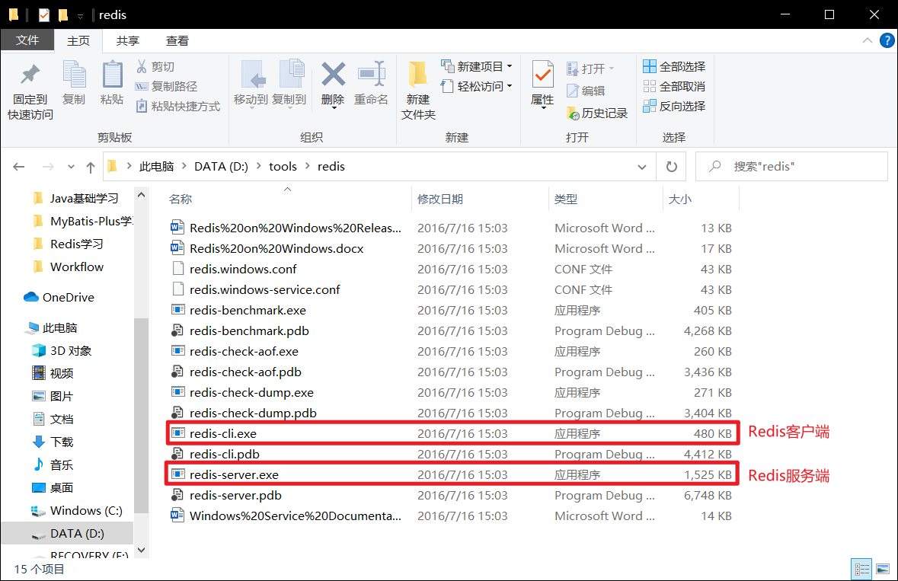

### 5.1.3 启动Redis服务端

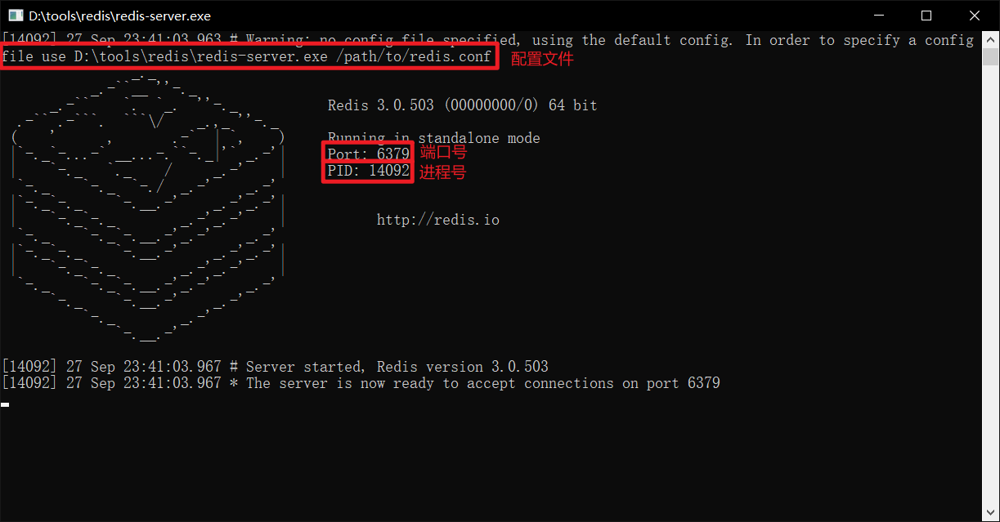

### 5.1.4 启动Redis客户端进行测试

不关闭Redis服务端，启动Redis客户端。

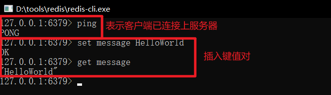

## 5.2 Linux环境安装

### 5.2.1 在Redis官网下载Redis的Linux最新版本压缩包

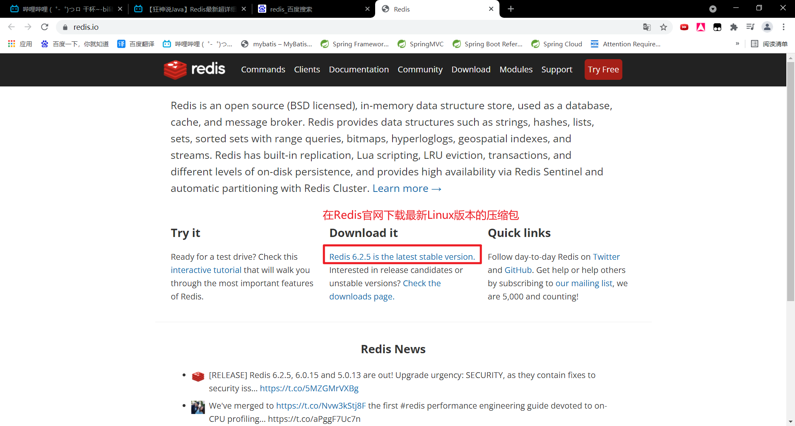

### 5.2.2 将压缩包通过Xftp传输到Linux操作系统中

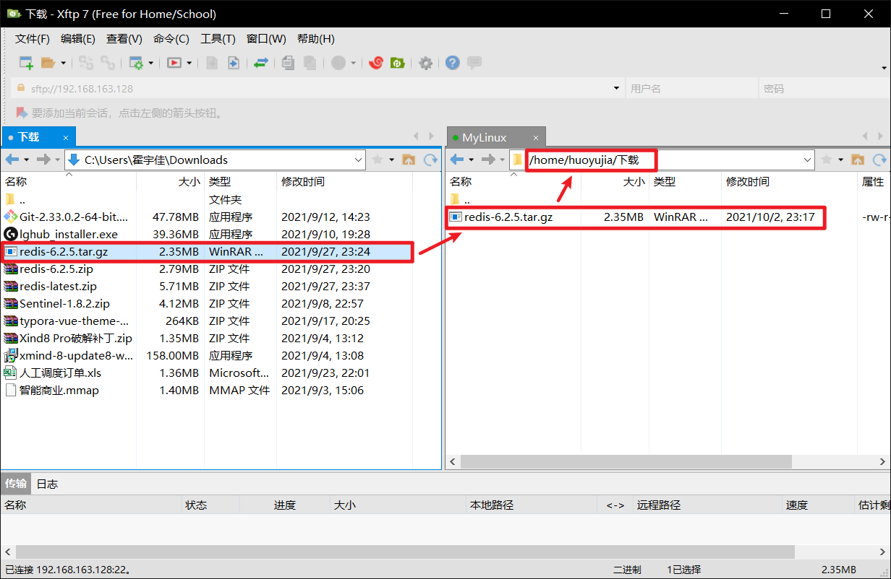

### 5.2.3 解压Redis压缩包

在Linux操作系统中，用户自己下载的程序一般存放在`/opt`目录下。

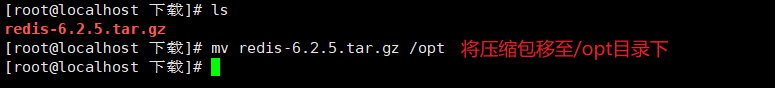

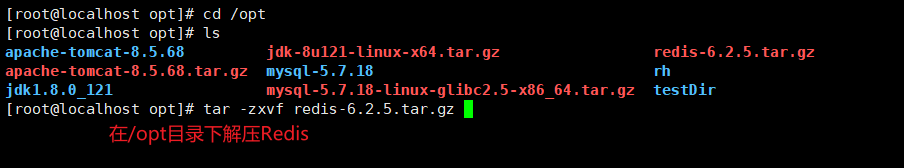

解压完成后的Redis文件夹内容如下：

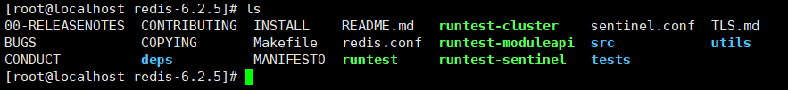

### 5.2.4 安装C++环境

因为Redis是使用C++语言编写的，所以需要搭建C++环境。

```shell
##安装gcc-c++
yum install gcc-c++

##把所有需要的文件配置上（把redis编译）
make

##安装redis
make install
```

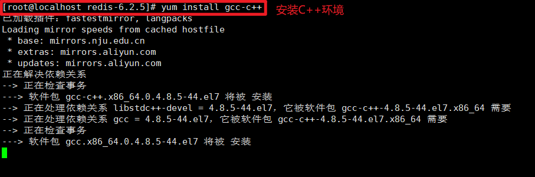

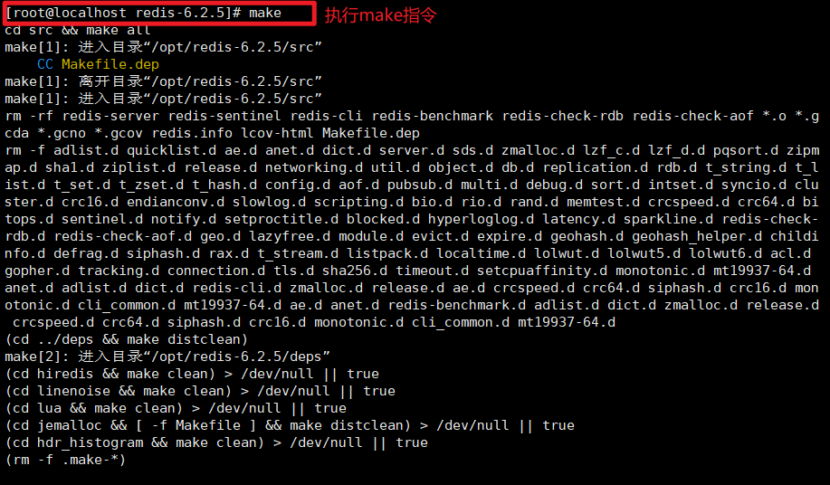


### 5.2.5 Redis的默认安装路径

Redis的默认安装路径是`/usr/local/bin`

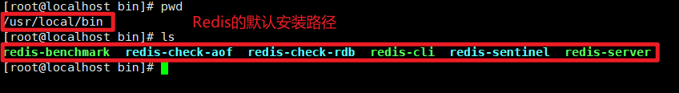

### 5.2.6 在`/usr/local/bin`目录下新建配置文件夹，将Redis原来的配置文件复制过来

在`/usr/local/bin`文件夹下新建config文件夹，用于存放我们自定义的config配置文件。

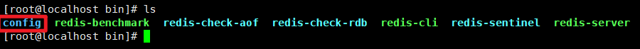

将默认的Redis配置文件复制过来。


### 5.2.7 修改Redis配置文件

默认的Redis是直接打开的，打开Redis服务器后，我们不能进行其他的操作。

因此需要将Redis改成后台启动。

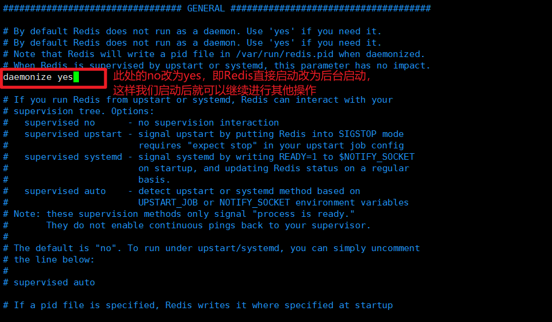

### 5.2.8 通过自定义的配置文件启动Redis服务端


### 5.2.9 启动Redis客户端，进行测试

```shell
## -h：服务端主机 -p：端口号 -a：密码
$ redis-cli -h host -p port -a password
```


### 5.2.10 查看Redis进程是否开启

在Xshell中新建一个会话，查看Redis进程状态。

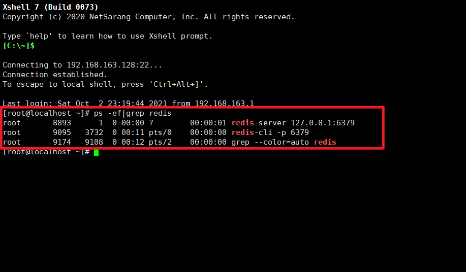

### 5.2.11 关闭Redis服务

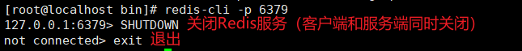

**注意：此时，Redis客户端和服务端同时关闭。**

