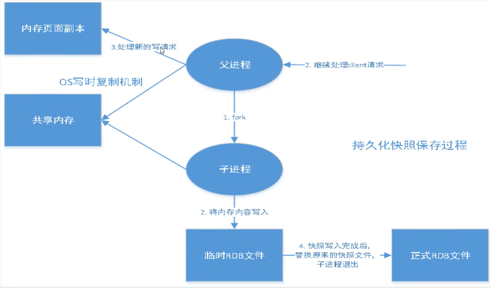
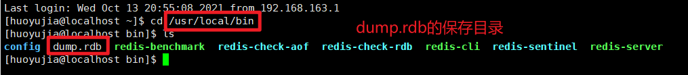
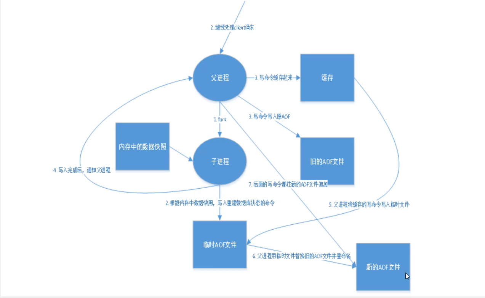
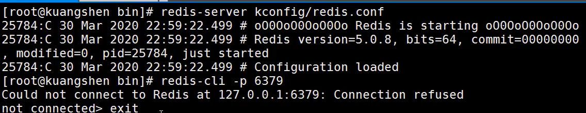
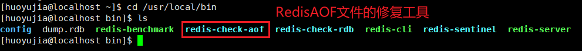

# 1. Redis持久化概述

Redis是一个==内存型的数据库==，数据保存在内存中，断电即失。因此，Redis提供了持久化的机制来避免因进程退出造成的数据丢失问题，当下次重启时利用之前持久化的文件即可实现数据恢复。

Redis持久化不管是工作还是面试，都是重中之重。

Redis 提供了不同级别的持久化方式:

- **RDB**持久化方式能够在指定的时间间隔能对你的数据进行快照存储。
- **AOF**持久化方式记录每次对服务器写的操作,当服务器重启的时候会重新执行这些命令来恢复原始的数据,AOF命令以redis协议追加保存每次写的操作到文件末尾.Redis还能对AOF文件进行后台重写,使得AOF文件的体积不至于过大。
- 如果你只希望你的数据在服务器运行的时候存在,你也可以不使用任何持久化方式。
- 你也可以同时开启两种持久化方式, 在这种情况下, 当redis重启的时候会优先载入AOF文件来恢复原始的数据,因为在通常情况下AOF文件保存的数据集要比RDB文件保存的数据集要完整。
- 最重要的事情是了解RDB和AOF持久化方式的不同。

# 2. RDB持久化

## 2.1 RDB持久化原理

RDB持久化是指在指定的时间间隔内将内存的数据快照（snapshot）写入磁盘中的快照文件，恢复时则将快照文件从磁盘读入内存。



上图为RDB持久化的底层原理：

Redis父进程会创建（folk）一个子进程，该子进程会将数据写入到一个临时文件中，当持久化结束后，会用这个临时文件替换掉在磁盘中上次持久化保存的文件。因为父进程不参与任何的I/O操作因此，对于Redis的性能不造成任何的影响。

## 2.2 RDB持久化配置

一般情况下，我们使用默认的RDB配置即可，即无需更改`redis.conf`里的`SNAPSHOTTING`部分内容，Redis默认使用的也是RDB持久化。

```shell
################################ SNAPSHOTTING  ################################

# Save the DB to disk.
#
# save <seconds> <changes>
#
# Redis will save the DB if both the given number of seconds and the given
# number of write operations against the DB occurred.
#
# Snapshotting can be completely disabled with a single empty string argument
# as in following example:
#
# save ""
#
# Unless specified otherwise, by default Redis will save the DB:
#   * After 3600 seconds (an hour) if at least 1 key changed
#   * After 300 seconds (5 minutes) if at least 100 keys changed
#   * After 60 seconds if at least 10000 keys changed
#
# You can set these explicitly by uncommenting the three following lines.
#
# save 3600 1
# save 300 100
# save 60 10000

# By default Redis will stop accepting writes if RDB snapshots are enabled
# (at least one save point) and the latest background save failed.
# This will make the user aware (in a hard way) that data is not persisting
# on disk properly, otherwise chances are that no one will notice and some
# disaster will happen.
#
# If the background saving process will start working again Redis will
# automatically allow writes again.
#
# However if you have setup your proper monitoring of the Redis server
# and persistence, you may want to disable this feature so that Redis will
# continue to work as usual even if there are problems with disk,
# permissions, and so forth.
stop-writes-on-bgsave-error yes

# Compress string objects using LZF when dump .rdb databases?
# By default compression is enabled as it's almost always a win.
# If you want to save some CPU in the saving child set it to 'no' but
# the dataset will likely be bigger if you have compressible values or keys.
rdbcompression yes

# Since version 5 of RDB a CRC64 checksum is placed at the end of the file.
# This makes the format more resistant to corruption but there is a performance
# hit to pay (around 10%) when saving and loading RDB files, so you can disable it
# for maximum performances.
#
# RDB files created with checksum disabled have a checksum of zero that will
# tell the loading code to skip the check.
rdbchecksum yes

# Enables or disables full sanitation checks for ziplist and listpack etc when
# loading an RDB or RESTORE payload. This reduces the chances of a assertion or
# crash later on while processing commands.
# Options:
#   no         - Never perform full sanitation
#   yes        - Always perform full sanitation
#   clients    - Perform full sanitation only for user connections.
#                Excludes: RDB files, RESTORE commands received from the master
#                connection, and client connections which have the
#                skip-sanitize-payload ACL flag.
# The default should be 'clients' but since it currently affects cluster
# resharding via MIGRATE, it is temporarily set to 'no' by default.
#
# sanitize-dump-payload no

# The filename where to dump the DB
dbfilename dump.rdb

# Remove RDB files used by replication in instances without persistence
# enabled. By default this option is disabled, however there are environments
# where for regulations or other security concerns, RDB files persisted on
# disk by masters in order to feed replicas, or stored on disk by replicas
# in order to load them for the initial synchronization, should be deleted
# ASAP. Note that this option ONLY WORKS in instances that have both AOF
# and RDB persistence disabled, otherwise is completely ignored.
#
# An alternative (and sometimes better) way to obtain the same effect is
# to use diskless replication on both master and replicas instances. However
# in the case of replicas, diskless is not always an option.
rdb-del-sync-files no

# The working directory.
#
# The DB will be written inside this directory, with the filename specified
# above using the 'dbfilename' configuration directive.
#
# The Append Only File will also be created inside this directory.
#
# Note that you must specify a directory here, not a file name.
dir ./
```

### 2.2.1 save

> save <seconds> <changes>

持久化。在规定的时间内，执行多少次操作就会保存到文件里。

> * After 3600 seconds (an hour) if at least 1 key changed
>
> * After 300 seconds (5 minutes) if at least 100 keys changed
>
> * After 60 seconds if at least 10000 keys changed

默认情况下，RDB的持久化规则如下：

- 3600秒内至少有一个key改变，则进行持久化。
- 300秒内至少有100个key改变，则进行持久化。
- 60秒内至少有10000个key改变，则进行持久化。

如果我们不需要进行持久化，可以添加下述配置：

```shell
save ""
```

### 2.2.2 stop-writes-on-bgsave-error

在持久化失败后，是否还要继续工作。

### 2.2.3 rdbcompression

是否压缩rdb文件。需要消耗一些CPU资源。如果为了节省 CPU 时间，可以关闭该选项，但会导致数据库文件变的巨大。

### 2.2.4 rdbchecksum

保存rdb文件时是否进行错误的校验。

### 2.2.5 dir

持久化文件的生成目录。默认是在当前目录生成。

### 2.2.6 dbfilename

指定RDB的持久化文件名，默认的文件名为`dump.rdb`，会保存在`redis-server`的同级目录下。



## 2.3 dump.rdb文件的生成时间

有三种方式可以生成或者更新该文件：

- save规则满足
- 执行flushall
- 退出Redis

## 2.4 如何使dump.rdb文件生效

使`dump.rdb`文件生效的意思是：我们在启动Redis服务端时，可以将`dump.rdb`文件中保存的内容再次加载到Redis数据库（内存）中。

只需将`dump.rdb`文件放置在`redis-server`的同级目录下即可。

下面的指令可以查看`redis-server`的所在目录：

```shell
127.0.0.1:6379> config get dir
1) "dir"
2) "/usr/local/bin"
```

## 2.5 RDB持久化的优缺点

### 2.5.1 RDB优点

- RDB是一个非常紧凑的文件,它保存了某个时间点得数据集,非常适用于数据集的备份,比如你可以在每个小时报保存一下过去24小时内的数据,同时每天保存过去30天的数据,这样即使出了问题你也可以根据需求恢复到不同版本的数据集.
- RDB是一个紧凑的单一文件,很方便传送到另一个远端数据中心或者亚马逊的S3（可能加密），非常适用于灾难恢复.
- RDB在保存RDB文件时父进程唯一需要做的就是fork出一个子进程,接下来的工作全部由子进程来做，父进程不需要再做其他IO操作，所以RDB持久化方式可以最大化redis的性能.
- 与AOF相比,在恢复大的数据集的时候，RDB方式会更快一些.

### 2.5.2 RDB缺点

- 如果你希望在redis意外停止工作（例如电源中断）的情况下丢失的数据最少的话，那么RDB不适合你.虽然你可以配置不同的save时间点(例如每隔5分钟并且对数据集有100个写的操作),是Redis要完整的保存整个数据集是一个比较繁重的工作,你通常会每隔5分钟或者更久做一次完整的保存,万一在Redis意外宕机,你可能会丢失几分钟的数据.
- RDB 需要经常fork子进程来保存数据集到硬盘上,当数据集比较大的时候,fork的过程是非常耗时的,可能会导致Redis在一些毫秒级内不能响应客户端的请求.如果数据集巨大并且CPU性能不是很好的情况下,这种情况会持续1秒,AOF也需要fork,但是你可以调节重写日志文件的频率来提高数据集的耐久度.

# 3. AOF持久化

## 3.1 AOF持久化原理

AOF是==apppend-only-file==的缩写，通过记录每次对服务器写的操作，当服务器重启时会重新执行这些命令恢复原始的数据，AOF命令以Redis协议追加保存每次写的操作到文件的末尾。

Redis还能对AOF文件进行后台重写（==rewrite==），使AOF文件的体积不会过大。



首先父进程会创建（folk）一个子进程，由该子进程根据内存中的数据来创建一个临时的AOF文件（保存内存数据），同时父进程继续受理请求，并将其中的写命令缓存起来。

一旦子进程创建临时的AOF文件完成之后，父进程立刻将缓存的写命令追加（append）到临时AOF文件中。

最后，父进程会用临时的AOF文件来替代原来的AOF文件，此后的写命令通通追加到新的AOF文件中。

## 3.2 AOF持久化配置

```shell
############################## APPEND ONLY MODE ###############################

# By default Redis asynchronously dumps the dataset on disk. This mode is
# good enough in many applications, but an issue with the Redis process or
# a power outage may result into a few minutes of writes lost (depending on
# the configured save points).
#
# The Append Only File is an alternative persistence mode that provides
# much better durability. For instance using the default data fsync policy
# (see later in the config file) Redis can lose just one second of writes in a
# dramatic event like a server power outage, or a single write if something
# wrong with the Redis process itself happens, but the operating system is
# still running correctly.
#
# AOF and RDB persistence can be enabled at the same time without problems.
# If the AOF is enabled on startup Redis will load the AOF, that is the file
# with the better durability guarantees.
#
# Please check https://redis.io/topics/persistence for more information.

appendonly no

# The name of the append only file (default: "appendonly.aof")

appendfilename "appendonly.aof"

# The fsync() call tells the Operating System to actually write data on disk
# instead of waiting for more data in the output buffer. Some OS will really flush
# data on disk, some other OS will just try to do it ASAP.
#
# Redis supports three different modes:
#
# no: don't fsync, just let the OS flush the data when it wants. Faster.
# always: fsync after every write to the append only log. Slow, Safest.
# everysec: fsync only one time every second. Compromise.
#
# The default is "everysec", as that's usually the right compromise between
# speed and data safety. It's up to you to understand if you can relax this to
# "no" that will let the operating system flush the output buffer when
# it wants, for better performances (but if you can live with the idea of
# some data loss consider the default persistence mode that's snapshotting),
# or on the contrary, use "always" that's very slow but a bit safer than
# everysec.
#
# More details please check the following article:
# http://antirez.com/post/redis-persistence-demystified.html
#
# If unsure, use "everysec".

# appendfsync always
appendfsync everysec
# appendfsync no

# When the AOF fsync policy is set to always or everysec, and a background
# saving process (a background save or AOF log background rewriting) is
# performing a lot of I/O against the disk, in some Linux configurations
# Redis may block too long on the fsync() call. Note that there is no fix for
# this currently, as even performing fsync in a different thread will block
# our synchronous write(2) call.
#
# In order to mitigate this problem it's possible to use the following option
# that will prevent fsync() from being called in the main process while a
# BGSAVE or BGREWRITEAOF is in progress.
#
# This means that while another child is saving, the durability of Redis is
# the same as "appendfsync none". In practical terms, this means that it is
# possible to lose up to 30 seconds of log in the worst scenario (with the
# default Linux settings).
#
# If you have latency problems turn this to "yes". Otherwise leave it as
# "no" that is the safest pick from the point of view of durability.

no-appendfsync-on-rewrite no

# Automatic rewrite of the append only file.
# Redis is able to automatically rewrite the log file implicitly calling
# BGREWRITEAOF when the AOF log size grows by the specified percentage.
#
# This is how it works: Redis remembers the size of the AOF file after the
# latest rewrite (if no rewrite has happened since the restart, the size of
# the AOF at startup is used).
#
# This base size is compared to the current size. If the current size is
# bigger than the specified percentage, the rewrite is triggered. Also
# you need to specify a minimal size for the AOF file to be rewritten, this
# is useful to avoid rewriting the AOF file even if the percentage increase
# is reached but it is still pretty small.
#
# Specify a percentage of zero in order to disable the automatic AOF
# rewrite feature.

auto-aof-rewrite-percentage 100
auto-aof-rewrite-min-size 64mb

# An AOF file may be found to be truncated at the end during the Redis
# startup process, when the AOF data gets loaded back into memory.
# This may happen when the system where Redis is running
# crashes, especially when an ext4 filesystem is mounted without the
# data=ordered option (however this can't happen when Redis itself
# crashes or aborts but the operating system still works correctly).
#
# Redis can either exit with an error when this happens, or load as much
# data as possible (the default now) and start if the AOF file is found
# to be truncated at the end. The following option controls this behavior.
#
# If aof-load-truncated is set to yes, a truncated AOF file is loaded and
# the Redis server starts emitting a log to inform the user of the event.
# Otherwise if the option is set to no, the server aborts with an error
# and refuses to start. When the option is set to no, the user requires
# to fix the AOF file using the "redis-check-aof" utility before to restart
# the server.
#
# Note that if the AOF file will be found to be corrupted in the middle
# the server will still exit with an error. This option only applies when
# Redis will try to read more data from the AOF file but not enough bytes
# will be found.
aof-load-truncated yes

# When rewriting the AOF file, Redis is able to use an RDB preamble in the
# AOF file for faster rewrites and recoveries. When this option is turned
# on the rewritten AOF file is composed of two different stanzas:
#
#   [RDB file][AOF tail]
#
# When loading, Redis recognizes that the AOF file starts with the "REDIS"
# string and loads the prefixed RDB file, then continues loading the AOF
# tail.
aof-use-rdb-preamble yes
```

### 3.2.1 appendonly

默认不开启aof模式，即持久化默认使用的是rdb模式。

### 3.2.2 appendfilename

aof持久化文件的名字。

### 3.2.3 appendfsync

设置同步的频率。可以设置为以下三种方式：

- **appendfsync always**：每次修改都会进行同步，消耗处理资源。
- **appendfsync everysec**：每秒都会进行一次同步，如果宕机则会丢失这一秒的数据。
- **appendfsync no**：不进行同步，由操作系统自己同步数据。

### 3.2.4 no-appendfsync-on-rewrite

是否在重写的时候不进行数据的同步（同步：将内存的数据存储到磁盘中）。

- 如果该配置属性为no，进行数据同步，涉及到写命令时如果此时正在进行AOF文件的重写，该指令会被阻塞掉，因此一定不会造成数据的丢失。
- 如果该属性配置为yes，不进行数据同步，那么任何的写命令都会进行缓存，只有当AOF文件全部重写完成后，才会将写命令追加到AOF文件中。这样有可能会造成数据的丢失。

### 3.2.5 auto-aof-rewrite-percentage

假设该值为50，则当新的AOF文件比之前旧的AOF文件增长了50%后，进行AOF文件的重写。

### 3.2.6 auto-aof-rewrite-min-size

假设该值为64，则只有AOF文件大于64MB的时候，才会进行重写。

## 3.3 修复AOF文件

如果AOF文件被破坏，我们是不能够连接到Redis服务端的，需要进行AOF文件的修复，如下为AOF损坏时启动Redis客户端的场景：



Redis提供了AOF文件的修复工具`redis-check-aof`，我们可以利用该工具进行AOF文件的修复。



```shell
#进行AOF文件的修复
redis-check-aof --fix appendonly.aof
```

## 3.4 AOF持久化的优缺点

### 3.4.1 **AOF 优点**

- 使用AOF 会让你的Redis更加耐久: 你可以使用不同的fsync策略：无fsync，每秒fsync，每次写的时候fsync。使用默认的每秒fsync策略，Redis的性能依然很好(fsync是由后台线程进行处理的,主线程会尽力处理客户端请求)，一旦出现故障，你最多丢失1秒的数据.

- AOF文件是一个只进行追加的日志文件，所以不需要写入seek,即使由于某些原因(磁盘空间已满，写的过程中宕机等等)未执行完整的写入命令，你也也可使用redis-check-aof工具修复这些问题。

- Redis 可以在 AOF 文件体积变得过大时，自动地在后台对 AOF 进行重写： 重写后的新 AOF 文件包含了恢复当前数据集所需的最小命令集合。 整个重写操作是绝对安全的，因为 Redis 在创建新 AOF 文件的过程中，会继续将命令追加到现有的 AOF 文件里面，即使重写过程中发生停机，现有的 AOF 文件也不会丢失。 而一旦新 AOF 文件创建完毕，Redis 就会从旧 AOF 文件切换到新 AOF 文件，并开始对新 AOF 文件进行追加操作。

- AOF 文件有序地保存了对数据库执行的所有写入操作， 这些写入操作以 Redis 协议的格式保存， 因此 AOF 文件的内容非常容易被人读懂， 对文件进行分析（parse）也很轻松。 导出（export） AOF 文件也非常简单： 举个例子， 如果你不小心执行了 FLUSHALL 命令， 但只要 AOF 文件未被重写， 那么只要停止服务器， 移除 AOF 文件末尾的 FLUSHALL 命令， 并重启 Redis ， 就可以将数据集恢复到 FLUSHALL 执行之前的状态。

### 3.4.2 AOF 缺点

- 对于相同的数据集来说，AOF 文件的体积通常要大于 RDB 文件的体积。

- 根据所使用的 fsync 策略，AOF 的速度可能会慢于 RDB 。 在一般情况下， 每秒 fsync 的性能依然非常高， 而关闭 fsync 可以让 AOF 的速度和 RDB 一样快， 即使在高负荷之下也是如此。 不过在处理巨大的写入载入时，RDB 可以提供更有保证的最大延迟时间（latency）。

# 4. 如何选择持久化方式

如果我们开启AOF和RDB两种持久化方式，系统会优先选择AOF文件来恢复原始的数据，因为通常情况下AOF的数据集要比RDB更加完整。

一般来说， 如果想达到足以媲美 PostgreSQL 的数据安全性， 你应该同时使用两种持久化功能。

如果你非常关心你的数据， 但仍然可以承受数分钟以内的数据丢失， 那么你可以只使用 RDB 持久化。

有很多用户都只使用 AOF 持久化， 但我们并不推荐这种方式： 因为定时生成 RDB 快照（snapshot）非常便于进行数据库备份， 并且 RDB 恢复数据集的速度也要比 AOF 恢复的速度要快， 除此之外， 使用 RDB 还可以避免之前提到的 AOF 程序的 bug 。
