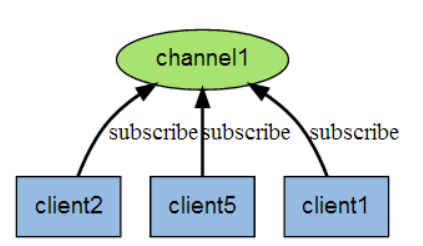
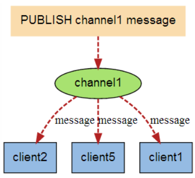
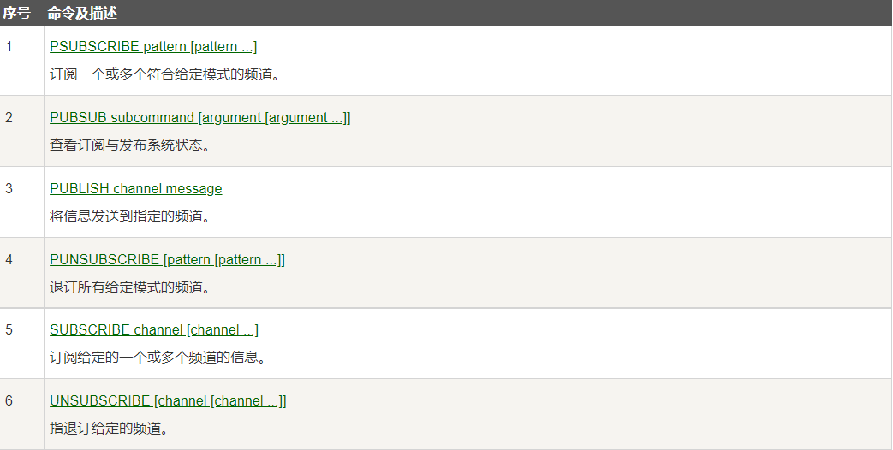
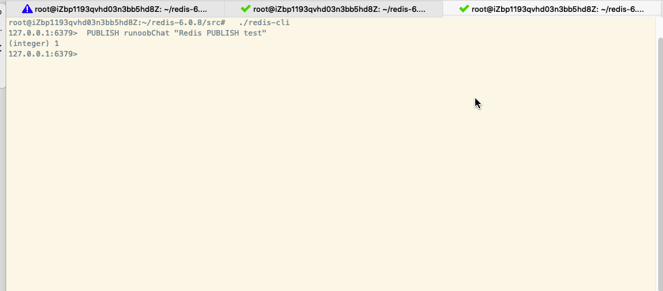

# 1. 发布与订阅过程分析

Redis发布（pub）订阅（sub）是一种==消息通信模式==：发送者（pub）消息，订阅者（sub）接收消息。Redis客户端可以订阅任何数量的频道。

下图展示了频道channel1，以及订阅这个频道的三个客户端——client2、client5和client1之间的关系：

当有新的消息通过`PUBLISH`命令发送给频道channel1时，这个消息就会发送给订阅它的三个客户端：

# 2. 发布订阅的命令

这些命令被广泛使用于构建及时通信应用，比如网络聊天室（群聊）和实时广播、实时提醒等。

# 3. Redis发布订阅的测试

- 开启本地 Redis 服务，开启两个 redis-cli 客户端。
- 在**第一个 redis-cli 客户端**输入 `SUBSCRIBE runoobChat`，意思是订阅 `runoobChat` 频道。
- 在**第二个 redis-cli 客户端**输入`PUBLISH runoobChat "Redis PUBLISH test"`往 runoobChat 频道发送消息，这个时候在第一个 redis-cli 客户端就会看到由第二个 redis-cli 客户端发送的测试消息。

# 4. Redis发布订阅底层原理

`redis-server`里维护了一个字典，字典的键就是一个个频道，字典的值为一个链表，该链表并保存的是订阅该频道的所有客户端。==通过`SUBSCRIBE`命令订阅某个频道的本质是将客户端添加到该频道的链表中==。

通过`PUBLISH`命令可以向订阅者发送信息，`redis-server`会将指定的频道作为键，在维护的channel字典中查找，直到找到该键所对应的订阅者链表。之后自动遍历该链表，将消息发布给所有的订阅者。

# 5. 发布订阅的使用场景

1. 实时消息系统：会员消息，关注的人的空间动态等。
2. 聊天：群聊，聊天室等。

如果更复杂的消息系统需要使用消息队列（RabbitMQ、Kafka等）。
