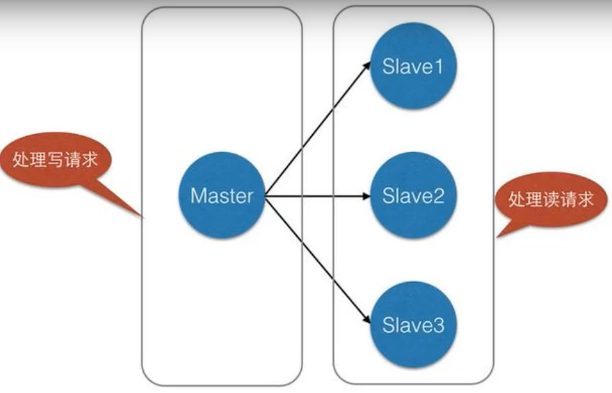
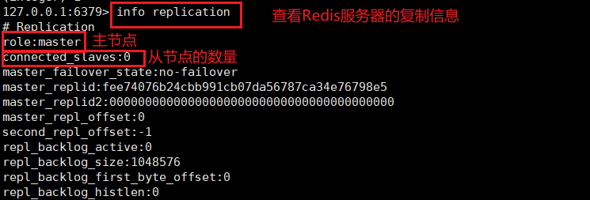
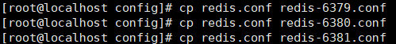
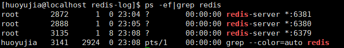
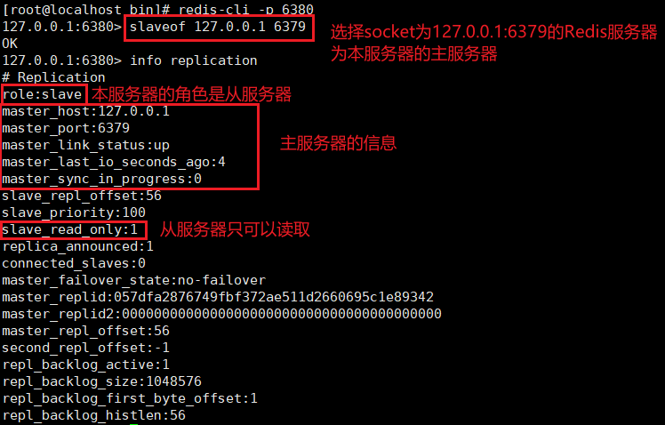
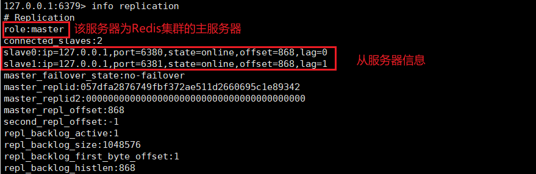
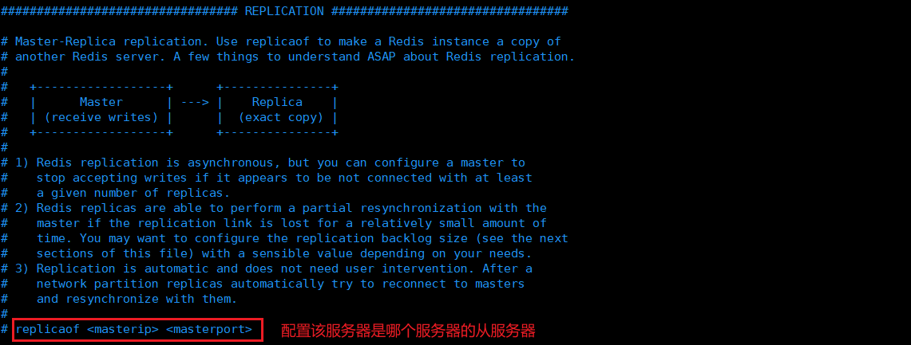
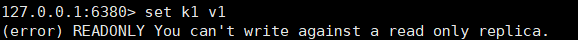
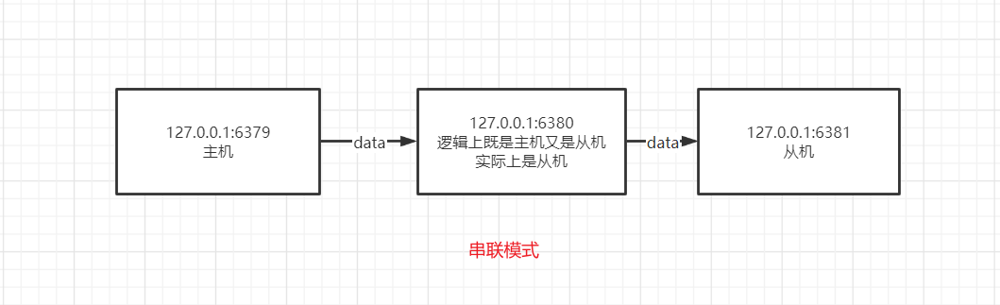
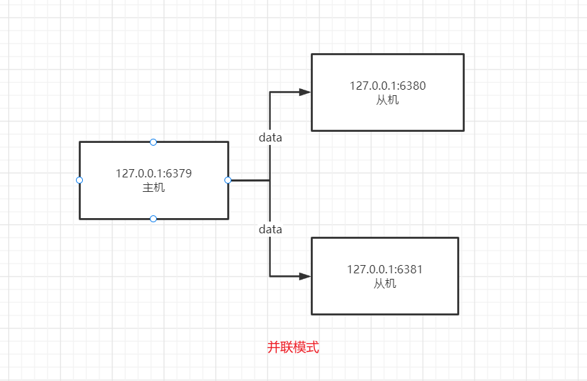

# 1. Redis主从复制概述

主从复制，是指将一台Redis服务器的数据复制到其他的Redis服务器，前者称为主节点（master），后者成为从节点（slave）。并且，==数据的复制只能是单向的，只能从主节点复制到从节点==。主节点以写为主，从节点以读为主。

Redis中默认每一台服务器都是主节点。主节点可以有多个从节点，单一个从节点只能有一个主节点（类似于树的概念）。

**主从复制的作用**

- **数据冗余**：主从复制实现了数据的热备份，是持久化之外的另外一种冗余方式。
- **故障恢复**：当主节点出现问题时，可以由从节点提供服务，实现快速的故障恢复。
- **负载均衡**：在主从复制的基础上，配合读写分离，可以由主节点提供写服务，由从节点提供读服务，分担服务器的负载。多个服务器同时提供读服务，可以提高Redis服务器的并发量。
- **高可用基石**：主从复制是哨兵和集群实现的基础，因此主从复制是Redis高可用基石。

# 2. Redis集群环境搭建

## 2.1 查看当前连接的Redis服务器的复制状态

我们可以使用`info replication`（复制信息）来查看客户端所连接的Redis服务端的复制信息。

## 2.2 复制三个Redis服务器的配置文件，并修改配置

首先复制Redis服务器的配置文件。

需要修改的配置信息：

1. **port**：端口号
2. **pidfile**：进程文件
3. **dbfilename**：RDB持久化文件名
4. **logfile**

修改完成之后，启动三个Redis服务器，端口号分别是：6379、6380、6381。

# 3. Redis一主二从配置

一个Redis集群应该至少有三台Redis服务器，其中一台Redis主服务器，两台Redis从服务器。

我们在配置Redis服务器集群时，一般只配置从服务器即可。下面的场景以端口号为6379的服务器为Redis集群的主服务器，端口号分别为6380和6381的服务器为Redis集群的从服务器。

## 3.1 配置Redis集群从服务器

> SLAVEOF host port

- 如果当前服务器已经是某个主服务器(master server)的从属服务器，那么执行 `SLAVEOF host port `将使当前服务器停止对旧主服务器的同步，丢弃旧数据集，转而开始对新主服务器进行同步。

- 另外，对一个从属服务器执行命令 `SLAVEOF NO ONE` 将使得这个从属服务器关闭复制功能，并从从属服务器转变回主服务器，原来同步所得的数据集不会被丢弃。

- 利用『 SLAVEOF NO ONE 不会丢弃同步所得数据集』这个特性，可以在主服务器失败的时候，将从属服务器用作新的主服务器，从而实现无间断运行。

下面将端口号为6380的服务器作为端口号为6379的服务器的从服务器。

同理，将端口号为6381的服务器也作为端口号为6379的服务器的从服务器。

配置从服务器完成后，下图为主服务器（127.0.0.1:6379）的复制信息（info replication）。

## 3.2 在配置文件里配置Redis集群从服务器

3.1节介绍了使用命令来配置从服务器，但是这种方法只是暂时的，==一旦从服务器宕机重启，则该服务器不再是从服务器==，因此我们可以通过配置文件的方式来永久设置从服务器。如下所示：

# 4. Redis集群的注意事项

## 4.1 主机可以写，从机不能写

主机中的所有保存信息都会自动复制到从机。

在从机进行写操作会出现如下错误：

## 4.2 主机重启之后，仍然是之前的从机的主机

主机宕机之后，此时整个Redis集群只能进行读操作，不能进行写操作。

如果此时主机重新启动，仍然是该集群其他从机的主机。从机依旧可以读取主机写入的数据。

## 4.3 从机重启之后，不再是之前主机的从机

Redis集群中的从机宕机之后，如果重新启动，则不再是之前主机的从机，不能读取之前主机中写入的数据。

但是一旦该从机重新称为原来主机的从机，则可以继续读取之前主机写入的数据。

# 5. Redis从机复制原理

从机如果成功连接到主机会发送一个`sync`命令。

主机收到命令后，启动后台的存盘进程，同时收集所有接收到的用于修改数据集的命令，在后台进程执行完毕后，主机将发送整个数据文件给从机，并完成一次完全同步（全量复制）。

- **全量复制**：从机接收到主机发送的数据文件后，将其存盘并加载到内存里。
- **增量复制**：主机继续将新的所有收集到的修改命令发送给从机，完成同步。

==只要从机连接主机，就必定完成一次全量复制。==

# 6. 主从复制的两种模式

