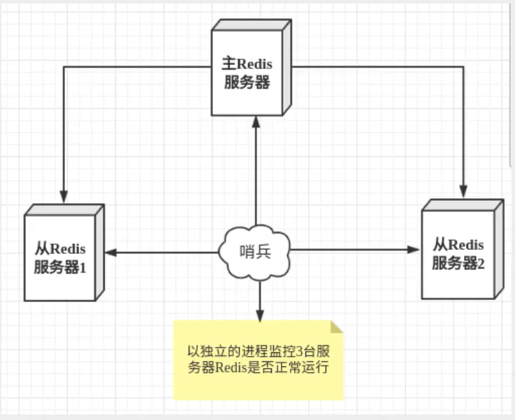
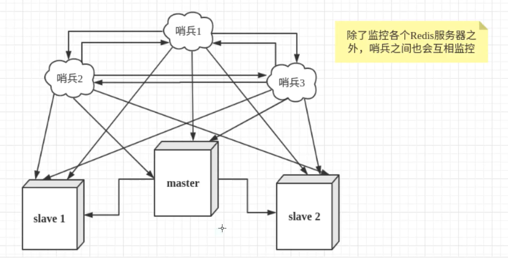
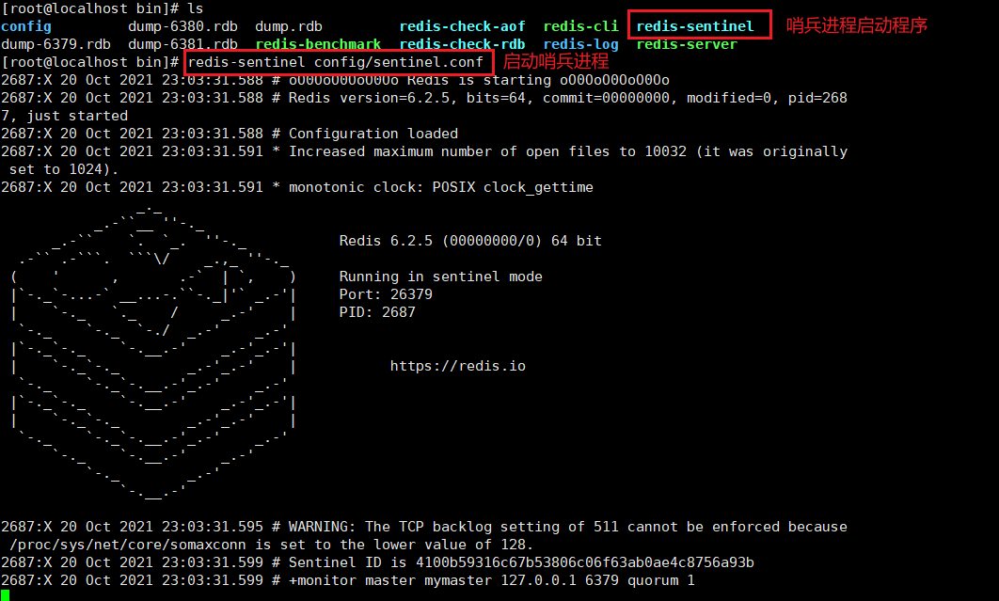
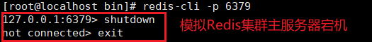

# 1. 哨兵模式简介

## 1.1 什么是哨兵模式

当主服务器宕机后，我们可以使用`slaveof no one`来手动选择一个从服务器升级为主服务器。但是这需要耗费人力，并且如果一段时间得不到人为处理，则会造成一段时间服务不可用。

因此Redis提出了哨兵模式（sentinel）来实现Redis集群自动选取主服务器的功能。==如果Redis集群中的主服务器出现了故障，能够根据投票数自动地将集群中的某一个从服务器升级为主服务器。==

哨兵模式是一种特殊的模式，并且是一个独立的进程。哨兵模式的原理是哨兵进程发送命令给各个Redis服务器，接收各个Redis服务器的响应，实现实时地监控各个Redis实例。



## 1.2 哨兵系统的作用

Redis的哨兵系统负责管理多个Redis服务器（实例/instance），该系统的任务为：

- **监控（Monitoring**）： Sentinel 会不断地检查你的主服务器和从服务器是否运作正常。
- **提醒（Notification）**： 当被监控的某个 Redis 服务器出现问题时， Sentinel 可以通过 API 向管理员或者其他应用程序发送通知。
- **自动故障迁移（Automatic failover）**： 当一个主服务器不能正常工作时， Sentinel 会开始一次自动故障迁移操作， 它会将失效主服务器的其中一个从服务器升级为新的主服务器， 并让失效主服务器的其他从服务器改为复制新的主服务器； 当客户端试图连接失效的主服务器时， 集群也会向客户端返回新主服务器的地址， 使得集群可以使用新主服务器代替失效服务器。

## 1.3 哨兵系统的架构

目前大多数应用使用的是下面这种服务器集群架构模式：



如果主服务器宕机，并且哨兵1率先检测到主服务器宕机，此时系统并不会立即进行故障迁移，仅仅是哨兵1主观地人为主服务器已不可用，这称为**主观下线**，当检测到主服务器宕机的哨兵达到一定数量后，哨兵们将会进行一次投票，将该Redis集群中的某一个从服务器升级为主服务器，这个过程称为**故障转移（failover）**。投票完成后，会通过**发布订阅模式**，让其他的从服务器改变主服务器，这个过程称为**客观下线**。

# 2. 哨兵模式测试

## 2.1 编写哨兵模式配置文件

Redis 源码中包含了一个名为 sentinel.conf 的文件， 这个文件是一个带有详细注释的 Sentinel 配置文件示例。下面以哨兵模式最简单的配置文件举例：

```shell
# sentinel monitor 被监控的服务器名称 host port 触发投票的哨兵数量
sentinel monitor mymaster 127.0.0.1 6379 1
```

该配置指示Sentinel去监视一个名为mymaster的主服务器，这个主服务器的IP地址为127.0.0.1 ，端口号为6379， 而将这个主服务器判断为失效至少需要1个Sentinel同意 （只要同意Sentinel的数量不达标，自动故障迁移就不会执行）。

## 2.2 启动哨兵进程



## 2.3 建立一主二从的Redis集群

先建立一个主服务器两个从服务器的Redis集群，其中端口号6379的Redis服务器为主服务器，端口号6380和6381的Redis服务器为从服务器。详细过程见`12.Redis主从复制`。

## 2.4 测试主服务器宕机

我们需要退出端口号为6379的Redis服务器，以模拟主服务器宕机的情况。



## 2.5 详解哨兵进程输出信息

主服务器宕机之后，哨兵进程会输出如下信息：

```shell
#给定的实例现在处于主观下线状态。
2687:X 20 Oct 2021 23:13:31.748 # +sdown master mymaster 127.0.0.1 6379

#给定的实例现在处于客观下线状态。
2687:X 20 Oct 2021 23:13:31.749 # +odown master mymaster 127.0.0.1 6379 #quorum 1/1

#当前的纪元（epoch）已经被更新。
2687:X 20 Oct 2021 23:13:31.749 # +new-epoch 2

#一个新的故障迁移操作正在执行中，等待被大多数 Sentinel 选中
2687:X 20 Oct 2021 23:13:31.749 # +try-failover master mymaster 127.0.0.1 6379

#哨兵正在进行投票
2687:X 20 Oct 2021 23:13:31.752 # +vote-for-leader 4100b59316c67b53806c06f63ab0ae4c8756a93b 2

#赢得指定纪元的选举，可以进行故障迁移操作了。
2687:X 20 Oct 2021 23:13:31.752 # +elected-leader master mymaster 127.0.0.1 6379

#故障转移操作现在处于 select-slave 状态 —— Sentinel 正在寻找可以升级为主服务器的从服务器。
2687:X 20 Oct 2021 23:13:31.752 # +failover-state-select-slave master mymaster 127.0.0.1 6379

#Sentinel 顺利找到适合进行升级的从服务器。
2687:X 20 Oct 2021 23:13:31.831 # +selected-slave slave 127.0.0.1:6380 127.0.0.1 6380 @ mymaster 127.0.0.1 6379

#Sentinel 正在将指定的从服务器升级为主服务器，等待升级功能完成。
2687:X 20 Oct 2021 23:13:31.831 * +failover-state-send-slaveof-noone slave 127.0.0.1:6380 127.0.0.1 6380 @ mymaster 127.0.0.1 6379

#从服务器正在等待升级
2687:X 20 Oct 2021 23:13:31.917 * +failover-state-wait-promotion slave 127.0.0.1:6380 127.0.0.1 6380 @ mymaster 127.0.0.1 6379

#升级从服务器为主服务器
2687:X 20 Oct 2021 23:13:32.459 # +promoted-slave slave 127.0.0.1:6380 127.0.0.1 6380 @ mymaster 127.0.0.1 6379

#故障转移状态切换到了 reconf-slaves 状态。
2687:X 20 Oct 2021 23:13:32.459 # +failover-state-reconf-slaves master mymaster 127.0.0.1 6379

#领头（leader）的 Sentinel 向实例发送了SLAVEOF命令，为实例设置新的主服务器。
2687:X 20 Oct 2021 23:13:32.524 * +slave-reconf-sent slave 127.0.0.1:6381 127.0.0.1 6381 @ mymaster 127.0.0.1 6379

#实例正在将自己设置为指定主服务器的从服务器，但相应的同步过程仍未完成。
2687:X 20 Oct 2021 23:13:33.484 * +slave-reconf-inprog slave 127.0.0.1:6381 127.0.0.1 6381 @ mymaster 127.0.0.1 6379

#从服务器已经成功完成对新主服务器的同步。
2687:X 20 Oct 2021 23:13:33.484 * +slave-reconf-done slave 127.0.0.1:6381 127.0.0.1 6381 @ mymaster 127.0.0.1 6379

#故障转移操作顺利完成。所有从服务器都开始复制新的主服务器了。
2687:X 20 Oct 2021 23:13:33.546 # +failover-end master mymaster 127.0.0.1 6379

#配置变更，主服务器的 IP 和地址已经改变。 这是绝大多数外部用户都关心的信息。
2687:X 20 Oct 2021 23:13:33.546 # +switch-master mymaster 127.0.0.1 6379 127.0.0.1 6380

#一个新的从服务器已经被 Sentinel 识别并关联。
2687:X 20 Oct 2021 23:13:33.546 * +slave slave 127.0.0.1:6381 127.0.0.1 6381 @ mymaster 127.0.0.1 6380

#一个新的从服务器已经被 Sentinel 识别并关联。
2687:X 20 Oct 2021 23:13:33.546 * +slave slave 127.0.0.1:6379 127.0.0.1 6379 @ mymaster 127.0.0.1 6380

#给定的实例现在处于主观下线状态。
2687:X 20 Oct 2021 23:14:03.584 # +sdown slave 127.0.0.1:6379 127.0.0.1 6379 @ mymaster 127.0.0.1 6380
```

- +reset-master ：主服务器已被重置。
- +slave ：一个新的从服务器已经被 Sentinel 识别并关联。
- +failover-state-reconf-slaves ：故障转移状态切换到了 reconf-slaves 状态。
- +failover-detected ：另一个 Sentinel 开始了一次故障转移操作，或者一个从服务器转换成了主服务器。
- +slave-reconf-sent ：领头（leader）的 Sentinel 向实例发送了 [SLAVEOF](/commands/slaveof.html) 命令，为实例设置新的主服务器。
- +slave-reconf-inprog ：实例正在将自己设置为指定主服务器的从服务器，但相应的同步过程仍未完成。
- +slave-reconf-done ：从服务器已经成功完成对新主服务器的同步。
- -dup-sentinel ：对给定主服务器进行监视的一个或多个 Sentinel 已经因为重复出现而被移除 —— 当 Sentinel 实例重启的时候，就会出现这种情况。
- +sentinel ：一个监视给定主服务器的新 Sentinel 已经被识别并添加。
- +sdown ：给定的实例现在处于主观下线状态。
- -sdown ：给定的实例已经不再处于主观下线状态。
- +odown ：给定的实例现在处于客观下线状态。
- -odown ：给定的实例已经不再处于客观下线状态。
- +new-epoch ：当前的纪元（epoch）已经被更新。
- +try-failover ：一个新的故障迁移操作正在执行中，等待被大多数 Sentinel 选中（waiting to be elected by the majority）。
- +elected-leader ：赢得指定纪元的选举，可以进行故障迁移操作了。
- +failover-state-select-slave ：故障转移操作现在处于 select-slave 状态 —— Sentinel 正在寻找可以升级为主服务器的从服务器。
- no-good-slave ：Sentinel 操作未能找到适合进行升级的从服务器。Sentinel 会在一段时间之后再次尝试寻找合适的从服务器来进行升级，又或者直接放弃执行故障转移操作。
- selected-slave ：Sentinel 顺利找到适合进行升级的从服务器。
- failover-state-send-slaveof-noone ：Sentinel 正在将指定的从服务器升级为主服务器，等待升级功能完成。
- failover-end-for-timeout ：故障转移因为超时而中止，不过最终所有从服务器都会开始复制新的主服务器（slaves will eventually be configured to replicate with the new master anyway）。
- failover-end ：故障转移操作顺利完成。所有从服务器都开始复制新的主服务器了。
- +switch-master ：配置变更，主服务器的 IP 和地址已经改变。 这是绝大多数外部用户都关心的信息。
- +tilt ：进入 tilt 模式。
- -tilt ：退出 tilt 模式。

## 2.6 主服务器重启后哨兵进程输出信息

Redis集群中，如果主服务器进行重启，则重启成功之后，==原来的主服务器只能在现在的Redis集群中承担从服务器的角色。==

```shell
#给定的实例已经不再处于主观下线状态。
2687:X 20 Oct 2021 23:30:19.759 # -sdown slave 127.0.0.1:6379 127.0.0.1 6379 @ mymaster 127.0.0.1 6380

#给定的实例转换为从服务器
2687:X 20 Oct 2021 23:30:29.805 * +convert-to-slave slave 127.0.0.1:6379 127.0.0.1 6379 @ mymaster 127.0.0.1 6380
```

# 3. 哨兵模式的优缺点

## 3.1 优点

- 哨兵集群基于主从复制模式，具有所有主从复制的优点
- 主从服务器转换，故障可以转移，系统可用性提高
- 哨兵模式为主从复制模式的升级，节省了人力，并且极大缩短了主服务器宕机后服务不可用的时间

## 3.2 缺点

- 哨兵模式下的Redis集群不好扩容

# 4. 哨兵模式的全部配置

```shell
# Example   sentinel.conf

# 哨兵sentinel实例运行的端口   默认是26379，如果有哨兵集群，我们还需要配置每个哨兵端口
port 26379

#哨兵sentinel的工作目录
dir /tmp

# 哨兵sentine1监控的redis主节点的ip port   
# master-name，可以自己命名的主节点名字，只能由字母A-Z、数字0-9、这三个字符".  -  _ "组成。
# quorum配置多少个sentine1哨兵统一认为master主节点失联那么这时客观上认为主节点失联了
# sentine1 monitor <master-name> <ip> <redis-port> <quorum>
sentinel monitor mymaster 127.0.0.1 6379 2

#当在Redis实例中开启了requirepass foobared 授权密码这样所有连接redis实例的客户端都要提供密码
#设置哨兵sentinel连接主从的密码注意必须为主从设置一样的验证密码
# sentine1 auth-pass <master-name> <password>
sentine1 auth-pass mymaster MySUPER--secret-0123passwOrd

#指定多少毫秒之后主节点没有应答哨兵sentinel此时哨兵主观上认为主节点下线，默认30秒
# sentinel down-after-mi 11i seconds <master-name> <mi 11iseconds>
sentine1 down-after-mi11iseconds mymaster 30000

#这个配置项指定了在发生failover主备切换时最多可以有多少个slave同时对新的master进行同步，这个数字越小，完成failover所需的时间就越长，但是如果这个数字越大，就意味着越多的slave因为replication而不可用。可以通过将这个值设为1来保证每次只有一个slave处于不能处理命令请求的状态。
# sentine1 paralle1-syncs <master-name> <numslaves>
sentine1 paralle1-syncs mymaster 1

#故障转移的超时时间failover-timeout 可以用在以下这些方面:
#1.同一个sentinel对同一个master两次failover之间的间隔时间。
#2.当一个slave从一个错误的master那里同步数据开始计算时间。直到s1ave被纠正为向正确的master那里同步数据时。
#3.当想要取消一个正在进行的failover所需要的时间。
#4.当进行failover时，配置所有s1aves指向新的master所需的最大时间。不过，即使过了这个超时，slaves依然会被正确配置为指向master,但是就不按parallel-syncs所配置的规则来了
#默认三分钟
# sentine1 failover-timeout <master-name> <milliseconds>
sentine1 failover-timeout mymaster 180000

# SCRIPTS EXECUTION
# 配置当某一事件发生时所需要执行的脚本，可以通过脚本来通知管理员，例如当系统运行不正常时发邮件通知相关人员。
# 对于脚本的运行结果有以下规则:
# 若脚本执行后返回1，那么该脚本稍后将会被再次执行，重复次数目前默认为10
# 若脚本执行后返回2，或者比2更高的一个返回值，脚本将不会重复执行。
# 如果脚本在执行过程中由于收到系统中断信号被终止了，则同返回值为1时的行为相同。
# 一个脚本的最大执行时间为60s，如果超过这个时间，脚本将会被-一个SIGKILL信号终止，之后重新执行。
# 通知型脚本:当sentinel有任何警告级别的事件发生时(比如说redis实例的主观失效和客观失效等等)，将会去调用这个脚本，这时这个脚本应该通过邮件，SMS等方式去通知系统管理员关于系统不正常运行的信息。调用该脚本时，将传给脚本两个参数，一个是事件的类型，一个是事件的描述。如果sentinel.conf配置文件中配置了这个脚本路径，那么必须保证这个脚本存在于这个路径，并且是可执行的，否则sentinel无法正常启动成功。
# 通知脚本
# shell编程
# sentinel notification-script <master-name> <script-path>
sentine1 notificati on-script mymaster /var/redis/notify.sh

#客户端重新配置主节点参数脚本
#当一个master由于failover而发生改变时，这个脚本将会被调用，通知相关的客户端关于master地址已经发生改变的信息。
#以下参数将会在调用脚本时传给脚本: 
# <master-name> <role> <state> <from-ip> <from-port> <to-ip> <to-port>
#目前<state>总是“failover",
# <role>是“Teader"或者"observer"中的一个。
#参数from-ip， from-port， to-ip，to-port是用来和旧的master和新的master(即旧的slave)通信的
#这个脚本应该是通用的，能被多次调用，不是针对性的。
# sentinel client-reconfig-script <master-name> <script-path>
sentinel client-reconfig-script mymaster /var/redis/reconfig.sh #一般都是由运维来配置!
```

