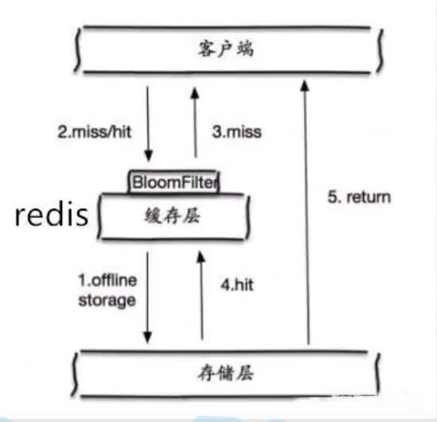
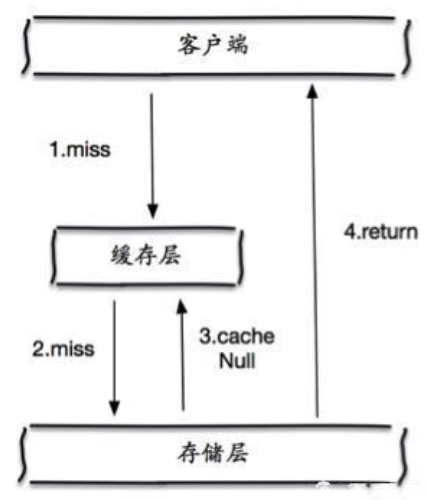
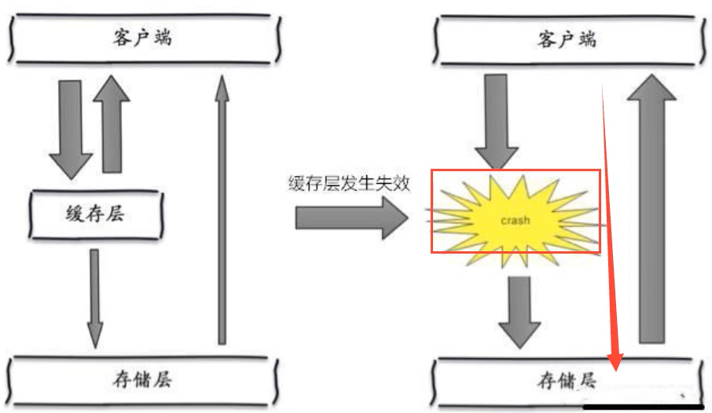

# 1.  Redis缓存带来的问题
Redis缓存的使用，极大地提升了应用程序的性能和效率，尤其针对数据查询方面。但是也会带来数据一致性的问题，如果对数据的一致性要求特别高，那么就不能使用缓存。

此外，缓存穿透、缓存击穿以及雪崩，也是Redis缓存所需要面对的问题，业界目前已有流行方案来解决。

# 2. 缓存穿透

## 2.1 概念

缓存穿透实际上就是缓存和数据库都反复查不到数据。

缓存穿透的概念很简单，用户想要查询一个数据，发现Redis缓存中没有，也就是缓存没有命中，于是就向数据库查询，然后发现也没有，于是本次查询失败。于是不断地进行查询，不断地向服务器发出请求。这时的用户相当于攻击者。**当用户很多的时候（秒杀场景），如果缓存都没有命中，于是都去请求了数据库DB，一瞬间就给数据库造成巨大的压力，这种情况就是常说的缓存穿透。**

## 2.2 解决方法

### 2.2.1 布隆过滤器

布隆过滤器是一种数据结构，对所有可能查询的参数以hash形式存储，在控制层先进行校验，不符合则丢弃，从而避免了对底层存储系统的查询压力。

### 2.2.2 缓存空对象

当存储层不命中时，即使返回的空对象也将其缓存起来，同时会设置一个过期时间，之后再访问这个数据将会从缓存中获取，从而保护了后端数据源。

但是这种方式存在两个问题：

- 如果空值能够被缓存起来，这就意味着需要更多的空间存储更多的键，因为其中可能会有很多空值的键。
- 即使对空值设置了过期时间，还是会存在缓存层和存储层的数据会有一段时间窗口不一致的问题，这对于需要保持一致的业务会有影响。

# 3. 缓存击穿

## 3.1 概念

缓存击穿实际上就是查询缓存中某一个key的查询量过多，当key失效时瞬间大量请求发送到后台的数据库。

这里和缓存穿透不同，缓存穿透是查询不到数据，所以都去查询数据库，给数据库造成很大压力；而缓存击穿是一个key十分热点（比如微博某明星热搜），缓存在不停地抗着高并发，始终对一个点访问，当这个缓存数据失效后，大量的高并发请求穿破缓存，在很短时间去请求数据库（就好比一梭子子弹打容器上），就像在屏幕中凿了个洞。

当这个热点key失效过期后，大量并发请求前往数据库查询最新数据，查询完后并写入缓存，会使数据库压力过大。

## 3.2 解决方法

### 3.2.1 设置热点数据永不过期
从缓存层面来看，没有设置过期时间，所以不会出现热点key过期后产生的问题。

### 3.2.2 加互斥锁
分布式锁：使用分布式锁（针对后端数据库加锁），保证对每个key同时只有一个线程去查询后端服务，其它线程没有获得分布式锁的权限，因此只需要等待即可。这种方式将高并发的压力转移到了分布式锁，因此对分布式锁的考验很大。

# 4. 雪崩

## 4.1 概念

缓存雪崩是因为大面积的缓存在一个时间点集中失效，打崩了数据库。

**举个简单的例子**：如果所有首页的Key失效时间都是12小时，中午12点刷新的，在零点的时候有个秒杀活动会有大量用户涌入，假设当时每秒 6000 个请求，本来缓存在可以扛住每秒 5000 个请求，但是这个时候缓存所有的Key都失效了。此时 1 秒 6000 个请求全部落数据库，数据库必然扛不住，它会报一下警，真实情况可能DBA（管理员）都没反应过来就直接挂了。此时，如果没用什么特别的方案来处理这个故障，DBA 很着急，重启数据库，但是数据库立马又被新的流量给打死了。这就是缓存雪崩。

缓存雪崩的情形除了某一个时间点缓存集中失效之外，还有某一个缓存的服务器节点宕机，这种情况相较于前者更加致命，因为后者无法预知，前者可以预知（双十一活动、六一八活动）。

## 4.2 解决方法

### 4.2.1 Redis高可用
这个思想的含义就是：既然Redis有可能会挂掉，那我多增设几台Redis，这样一台挂掉了之后其它的还可以继续工作，高可用其实就是搭建的Redis集群。将热点数据均匀分布在不同的Redis库中。

### 4.2.2 限流降级
这个解决方案的思想就是：在缓存失效后，通过加锁或者队列来控制读数据库写缓存的线程数量。比如对某个key只允许一个线程查询数据和写缓存，其它线程等待。

### 4.2.3 数据预热
数据预热的含义就是在正式部署之前，先把可能高访问的数据预先访问一遍，这样可能大部分的数据就能加载到缓存中。在即将发生大并发访问前手动触发加载缓存中不同的key，设置不同的过期时间，让缓存失效的时间点尽量均匀一点。

### 4.2.4 随机失效

在批量往Redis存数据的时候，把每个key的失效时间都加个随机值，这样保证数据不会在同一时间大面积失效。

