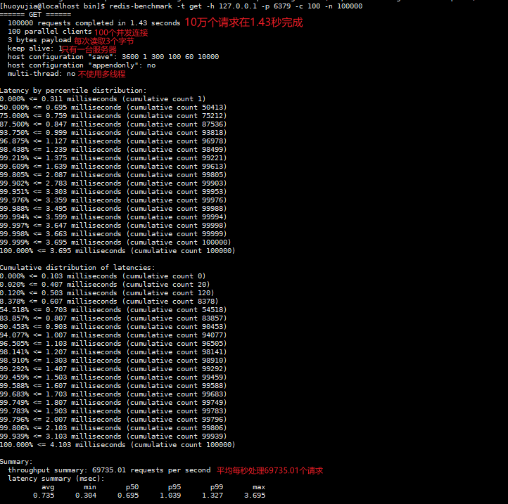

# 1. Redis-BenchMark概述

> Redis includes the redis-benchmark utility that simulates running commands done by N clients at the same time sending M total queries (it is similar to the Apache's ab utility). 
>
> Redis包括redis-benchmark工具，它模拟N个客户端在发送M个总查询的同时运行的命令（类似于Apache的ab实用程序）。

| 序号 |          选项          |                    描述                    |  默认值   |
| :--: | :--------------------: | :----------------------------------------: | :-------: |
|  1   |         **-h**         |              指定服务器主机名              | 127.0.0.1 |
|  2   |         **-p**         |               指定服务器端口               |   6379    |
|  3   |         **-s**         |             指定服务器 socket              |           |
|  4   |         **-c**         |               指定并发连接数               |    50     |
|  5   |         **-n**         |                 指定请求数                 |   10000   |
|  6   |         **-d**         |   以字节的形式指定 SET/GET 值的数据大小    |     3     |
|  7   |         **-k**         |          1=keep alive 0=reconnect          |     1     |
|  8   |         **-r**         | SET/GET/INCR 使用随机 key, SADD 使用随机值 |           |
|  9   |         **-P**         |         通过管道传输 <numreq> 请求         |     1     |
|  10  |         **-q**         |    强制退出 redis。仅显示 query/sec 值     |           |
|  11  |       **--csv**        |              以 CSV 格式输出               |           |
|  12  | **-l（L 的小写字母）** |           生成循环，永久执行测试           |           |
|  13  |         **-t**         |      仅运行以逗号分隔的测试命令列表。      |           |
|  14  | **-I（i 的大写字母）** |  Idle 模式。仅打开 N 个 idle 连接并等待。  |           |

# 2. redis-benchmark的使用

下面简单地对redis-benchmark进行使用测试。

```shell
#100个并发连接，100000个请求
redis-benchmark -h 127.0.0.1 -p 6379 -c 100 -n 100000
```



