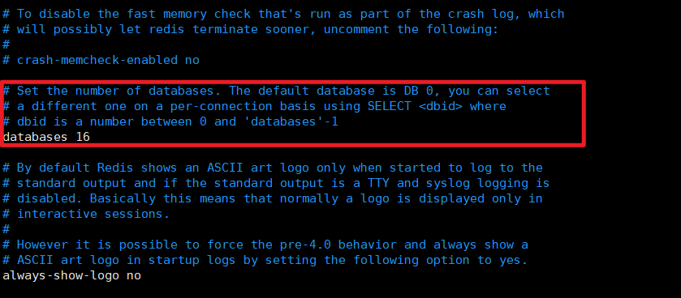

# 1. Redis的16个数据库

Redis数据库有16个，分别是0-15，每个数据库用数字命名，而且每个数据库的连接密码都一样。数据库之间不能共享，并且基于单机才有，如果是集群，就没有数据库的概念了。

Redis之所以有16个数据库，是为了区分不同的项目。一般一个项目使用一个Redis数据库，这样不同项目就不会有数据的交叉。

我们可以更改`redis.conf`文件，来修改Redis的数据库数量，如下所示：



## 1.1 切换Redis数据库

Redis的默认数据库是**0号数据库**，如果想要切换到其他数据库，可以使用下面的指令：

```shell
#切换Redis数据库，其中dbid可以为0~databases-1
SELECT <dbid>
```

## 1.2 清除当前数据库

如果我们想要清除某一个Redis数据库的内容，可以先使用`SELECT`指令来切换到该数据库，再使用以下的指令清除当前的数据库。

```shell
#清除当前数据库
FLUSHDB
```

## 1.3 清除所有数据库

如果我们想要清除所有的Redis数据库，可以使用以下指令：

```shell
##清除所有的数据库
FLUSHALL
```

# 2. Redis的多线程和单线程

Redis在6.0版本正式推出了多线程。这是Redis改动最大的版本，经过这次改动后，Redis的性能有了极大的提升。

详见[https://www.cnblogs.com/gz666666/p/12901507.html](https://www.cnblogs.com/gz666666/p/12901507.html)


