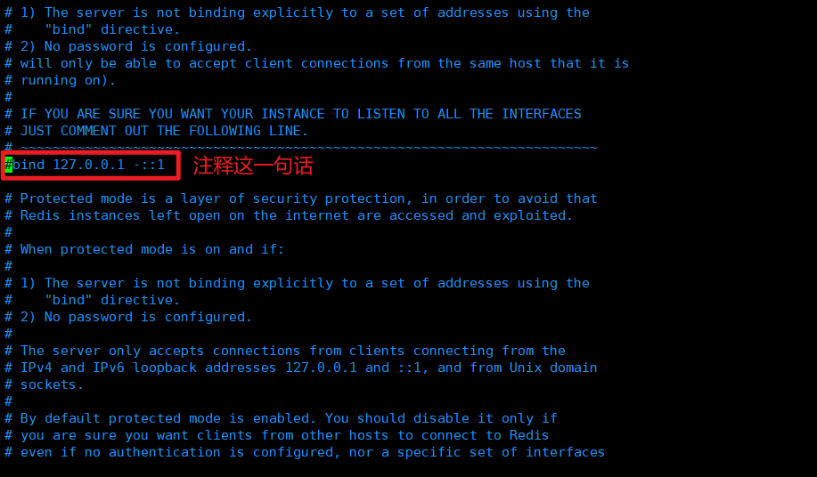

# 1. 搭建Jedis开发环境

Jedis是Redis首选的Java客户端开发包，我们可以使用Jedis来对Redis数据库进行操作。

## 1.1 新建一个Maven项目


## 1.2 在项目下新建一个Maven模块


## 1.3 导入相关依赖

```xml
<!--jedis-->
<!-- https://mvnrepository.com/artifact/redis.clients/jedis -->
<dependency>
    <groupId>redis.clients</groupId>
    <artifactId>jedis</artifactId>
    <version>3.7.0</version>
</dependency>

<!--fastjson-->
<!-- https://mvnrepository.com/artifact/com.alibaba/fastjson -->
<dependency>
    <groupId>com.alibaba</groupId>
    <artifactId>fastjson</artifactId>
    <version>1.2.78</version>
</dependency>
```

# 2. 连接到Redis服务

## 2.1 服务端修改配置以允许客户端访问

一般情况下，访问外网的Redis需要先修改以下配置，否则会出现下面的连接超时异常。


### 2.1.1 开放Linux系统中的6379端口

```shell
#查看6379端口是否开放，如果返回yes则无需下面的操作
[root@localhost bin]# firewall-cmd --query-port=6379/tcp
no

#永久开放6379端口
[root@localhost bin]# firewall-cmd --add-port=6379/tcp --permanent
success

#重启防火墙使配置生效
[root@localhost bin]# firewall-cmd --reload
success

#再次查询6379端口是否开放
[root@localhost bin]# firewall-cmd --query-port=6379/tcp
yes
```

### 2.1.2 修改redis.conf




修改完成之后保存退出

### 2.1.3 重启Redis服务

必须退出Redis，可以进入到Redis-cli后使用`shutdown`命令，也可以杀死进程。

## 2.2 测试是否能够连通Redis

连接的时候，主机的IP地址需要和虚拟机的ip地址保持一致。以下是使用Xshell远程登录Linux系统，可以查看ip地址：


也可以使用`ifconfig -a`命令查看ip地址：


```java
package pers.yujia.redis.jedis;

import redis.clients.jedis.Jedis;

public class TestPing {
    public static void main(String[] args) {
        Jedis jedis = new Jedis("192.168.163.128", 6379);
        System.out.println(jedis.ping());
    }
}
```

输出的结果为`PONG`，表明连接Redis服务端成功。


# 3. 使用Jedis操作Redis

创建完成Jedis对象之后，我们就可以使用它的方法来进行操作Redis。方法和Redis的指令完全一致，在此不再赘述。

# 4. 使用Jedis理解Redis事务

```java
package pers.yujia.redis.jedis;

import com.alibaba.fastjson.JSONObject;
import redis.clients.jedis.GeoCoordinate;
import redis.clients.jedis.Jedis;
import redis.clients.jedis.Transaction;

public class TestPing {
    public static void main(String[] args) {
        /*连接Redis服务端*/
        Jedis jedis = new Jedis("192.168.163.128", 6379);

        /*清空数据库*/
        jedis.flushDB();

        /*开启事务*/
        Transaction multi = jedis.multi();

        /*创建Json字符串*/
        JSONObject jsonObject = new JSONObject();
        jsonObject.put("name", "zhangsan");
        jsonObject.put("age", "13");
        String result = jsonObject.toJSONString();

        try {
            /*命令入队*/
            multi.set("k1", result);
            multi.set("k2", result);

            /*执行事务*/
            multi.exec();
        } catch (Exception e) {
            /*放弃事务*/
            multi.discard();

            e.printStackTrace();
        } finally {
            System.out.println(jedis.get("k1"));
            /*关闭Jedis连接*/
            jedis.close();
        }

    }
}
```

