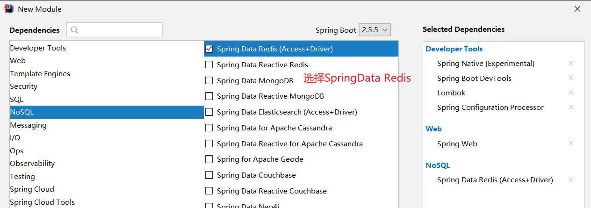

# 1. Spring Data概述

> Spring Data’s mission is to provide a familiar and consistent, Spring-based programming model for data access while still retaining the special traits of the underlying data store.
>
> Spring Data的任务是为数据访问提供一个熟悉的、一致的、基于Spring的编程模型，同时仍然保留底层数据存储的特殊特性。

**特性：**

- 强大的存储库和自定义对象映射抽象
- 从存储库方法名称动态派生查询
- 提供基本属性的实现域基类
- 支持透明审核（已创建、上次更改）
- 集成自定义存储库代码的可能性
- 通过JavaConfig和自定义XML名称空间轻松集成Spring
- 与Spring MVC控制器的高级集成
- 对跨存储持久性的实验支持

Spring Data是与SpringBoot齐名的项目。

# 2. SpringBoot整合Redis

## 2.1 新建一个SpringBoot模块




## 2.2 分析为什么底层使用的是Lettuce而不是Jedis

SpringBoot2.x之后，操作Redis的底层是Lettuce而不是Jedis。为何要替换成Lettuce呢？

- **Jedis：**采用的直连，多个线程操作的话会不安全，如果需要避免这种情况需要使用Jedis Pool连接池。
- **Lettuce：**采用netty，实例可以在多个线程中共享，不存在线程不安全的情况。

打开`RedisAutoConfiguration`类（在2.3节介绍），其中配置的bean`RedisTemplate`的方法参数接口`RedisConnectionFactory`有两个实现类：`JedisConnectionFactory`和`LettuceConnectionFactory`。


其中`JedisConnectionFactory`类中有很多类是缺失的，因此会自动选择`LettuceConnectionFactory`。


## 2.3 在SpringBoot里配置Redis

SpringBoot所有的配置类，都有一个自动配置类。自动配置类会绑定一个properties配置文件。


我们可以在`RedisPropertis`的Java文件中查看Redis的配置属性：


我们可以配置`application.yml`文件如下所示，来连接Redis服务端。

```yaml
#配置Redis
spring:
  redis:
    host: 192.168.163.128
    port: 6379
```

## 2.4 连接Redis测试

```java
@SpringBootTest
class Redis02SpringbootApplicationTests {

    @Autowired
    private RedisTemplate redisTemplate;

    @Test
    void contextLoads() {
        /*操作字符串*/
        redisTemplate.opsForValue().set("k1", "v1");

        /*操作集合*/
        redisTemplate.opsForSet().add("k2", "v2");

        /*操作Hash*/
        redisTemplate.opsForHash().put("k3", "name", "zhangsan");

        /*操纵有序集合ZSet*/
        redisTemplate.opsForZSet().add("k4", "v4", 2);

        /*操纵列表*/
        redisTemplate.opsForList().leftPush("k5", "v5");

        /*操作地理空间geospatial*/
        Point point = new Point(130, 32);
        redisTemplate.opsForGeo().add("china:city", point, "beijing");

        /*操作基数*/
        redisTemplate.opsForHyperLogLog().add("k6", 1, 2);

        /*除了基本操作外，还可以执行事务的操作*/
        redisTemplate.multi();
        redisTemplate.exec();

        /*进行数据库级别的操作需要获取连接*/
        RedisConnection connection = redisTemplate.getConnectionFactory().getConnection();
        connection.flushDb();   //清除数据库
        connection.select(1);   //选择数据库
    }
```

# 3. key和value的中文乱码问题

## 3.1 没有进行序列化的Java对象存储到Redis数据库

如果Java对象没有进行序列化，是不能够直接存储到redis数据库中的String的。如下：

```java
@Data
@NoArgsConstructor
@AllArgsConstructor
public class User {
    private String name;
    private int age;
}
```

```java
@Test
public void test(){
    User user = new User("张三", 12);
    redisTemplate.opsForValue().set("user", user);
    System.out.println(redisTemplate.opsForValue().get("user"));
}
```

运行程序出现错误，提示`org.springframework.data.redis.serializer.SerializationException`。


## 3.2 已经进行序列化的Java对象存储到Redis数据库

将3.1节中的`User`类实现`Serializable`接口，再存储到Redis数据库，如下：

```java
@Data
@NoArgsConstructor
@AllArgsConstructor
/*User类实现Serializable接口，即User类序列化*/
public class User implements Serializable {
    private String name;
    private int age;
}
```

```java
@Test
public void test(){
    User user = new User("张三", 12);
    redisTemplate.opsForValue().set("user", user);
    System.out.println(redisTemplate.opsForValue().get("user"));
}
```

发现Java程序正常执行，且能获取到key=user时的value。运行结果如下：


但是在Linux系统中的Redis客户端获取key=user的value，出现以下情况：


使用命令`key *`查看所有的键，发现出现了乱码。


获取该键对应的值，如下：


==出现这种现象的原因为：spring-data-redis的RedisTemplate<K, V>模板类在操作redis时默认使用JdkSerializationRedisSerializer来进行序列化，这种方式似乎会导致序列化出现乱码，需要修改序列化的方式==


# 4. 解决Redis中文乱码问题

命令行输入`chcp 65001`(utf-8编码)，然后在命令行输入 `redis-cli --raw` 打开客户端就能正常显示了。


# 5. 使用自定义的RedisTemplate

由于`SpringData`自带的`RedisTemplate`仅仅实现了一小部分功能，并且会带来序列化乱码的问题，我们可以自定义一个`RedisTemplate`，来减少开发成本，加快开发速度。

## 5.1 源码分析

`RedisAutoConfiguration`源码分析如下：

```java
@Configuration(proxyBeanMethods = false)
@ConditionalOnClass(RedisOperations.class)
@EnableConfigurationProperties(RedisProperties.class) //Redis的配置文件
@Import({ LettuceConnectionConfiguration.class, JedisConnectionConfiguration.class })
public class RedisAutoConfiguration {

   @Bean
   /*当id为redisTemplate的类在Spring容器中不存在，下面的RedisTemplate才会注册到Spring容器*/
   @ConditionalOnMissingBean(name = "redisTemplate")  
   @ConditionalOnSingleCandidate(RedisConnectionFactory.class)
   public RedisTemplate<Object, Object> redisTemplate(RedisConnectionFactory redisConnectionFactory) {
      RedisTemplate<Object, Object> template = new RedisTemplate<>();
      template.setConnectionFactory(redisConnectionFactory);
      return template;
   }

   @Bean
   @ConditionalOnMissingBean
   @ConditionalOnSingleCandidate(RedisConnectionFactory.class)
   public StringRedisTemplate stringRedisTemplate(RedisConnectionFactory redisConnectionFactory) {
      StringRedisTemplate template = new StringRedisTemplate();
      template.setConnectionFactory(redisConnectionFactory);
      return template;
   }

}
```

## 5.2 自定义`RedisTemplate`

因此，我们可以自定义一个id为`redisTemplate`的类，来覆盖掉SpringData自带的。以后该类可以直接使用，无需自己再写。

```java
@Configuration
public class RedisConfig {
    //固定模板
    //自己定义了一个RedisTemplate
    @Bean
    public RedisTemplate<String,Object> redisTemplate(RedisConnectionFactory factory){
        // 我们为了自己开发方便，一般直接使用<String,Object>
        RedisTemplate<String,Object> template = new RedisTemplate<String,Object>();
        template.setConnectionFactory(factory);
        //序列化对象
        Jackson2JsonRedisSerializer jackson2JsonRedisSerializer = new Jackson2JsonRedisSerializer(Object.class);
        ObjectMapper om = new ObjectMapper();
        om.setVisibility(PropertyAccessor.ALL, JsonAutoDetect.Visibility.ANY);
        om.activateDefaultTyping(LaissezFaireSubTypeValidator.instance, ObjectMapper.DefaultTyping.NON_FINAL);
        jackson2JsonRedisSerializer.setObjectMapper(om);
        //String的序列化
        StringRedisSerializer stringRedisSerializer = new StringRedisSerializer();
        // key采用String的序列化方式
        template.setKeySerializer(stringRedisSerializer);
        // hash的key也采用String的序列化方式
        template.setHashKeySerializer(stringRedisSerializer);
        // value序列化方式采用jackson
        template.setValueSerializer(jackson2JsonRedisSerializer);
        // hash的value序列化方式采用jackson
        template.setHashValueSerializer(jackson2JsonRedisSerializer);
        template.afterPropertiesSet();
        return template;
    }
}
```

## 5.3 解决Redis客户端中文乱码问题

首先配置Xshell，需要让远程主机的编码为utf-8。


然后启动Redis客户端，在后面添加`--raw`。


## 5.4 测试自定义RedisTemplate


# 6. 使用自定义的RedisUtil

以后一般就是添加完`RedisTemplate`和`RedisUtil`类之后，使用`RedisUtil`的api进行项目的开发，极大提高了开发的效率。

```java
@Component
public class RedisUtil {
    @Autowired
    private RedisTemplate<String, Object> redisTemplate;
    // =============================common============================
    /**
    * 指定缓存失效时间
    * @param key 键
    * @param time 时间(秒)
    */
    public boolean expire(String key, long time) {
        try{
            if (time > 0) {
                redisTemplate.expire(key, time, TimeUnit.SECONDS);
            }
            return true;
        } catch (Exception e) {
            e.printStackTrace();
            return false;
        }
    }
    /**
       * 根据key 获取过期时间
       * @param key 键 不能为null
       * @return 时间(秒) 返回0代表为永久有效
       */
    public long getExpire(String key) {
        return redisTemplate.getExpire(key, TimeUnit.SECONDS);
    }
    /**
       * 判断key是否存在
       * @param key 键
       * @return true 存在 false不存在
       */
    public boolean hasKey(String key) {
        try {
            return redisTemplate.hasKey(key);
        } catch (Exception e) {
            e.printStackTrace();
            return false;
        }
    }
    /**
       * 删除缓存
       * @param key 可以传一个值 或多个
       */
    @SuppressWarnings("unchecked")
    public void del(String... key) {
        if (key != null && key.length > 0) {
            if (key.length == 1) {
                redisTemplate.delete(key[0]);
            } else {
                redisTemplate.delete((Collection<String>) 	CollectionUtils.arrayToList(key));
            }
        }
    }
    // ============================String=============================
    /**
       * 普通缓存获取
       * @param key 键
       * @return 值
       */
    public Object get(String key) {
        return key == null ? null : redisTemplate.opsForValue().get(key);
    }
    /**
       * 普通缓存放入
       * @param key  键
       * @param value 值
       * @return true成功 false失败
       */
    public boolean set(String key, Object value) {
        try {
            redisTemplate.opsForValue().set(key, value);
            return true;
        } catch (Exception e) {
            e.printStackTrace();
            return false;
        }
    }
    /**
       * 普通缓存放入并设置时间
       * @param key  键
       * @param value 值
       * @param time 时间(秒) time要大于0 如果time小于等于0 将设置无限期
       * @return true成功 false 失败
       */
    public boolean set(String key, Object value, long time) {
        try {
            if (time > 0) {
                redisTemplate.opsForValue().set(key, value, time,
                                                TimeUnit.SECONDS);
            } else {
                set(key, value);
            }
            return true;
        } catch (Exception e) {
            e.printStackTrace();
            return false;
        }
    }
    /**
       * 递增
       * @param key  键
       * @param delta 要增加几(大于0)
       */
    public long incr(String key, long delta) {
        if (delta < 0) {
            throw new RuntimeException("递增因子必须大于0");
        }
        return redisTemplate.opsForValue().increment(key, delta);
    }
    /**
       * 递减
       * @param key  键
       * @param delta 要减少几(小于0)
       */
    public long decr(String key, long delta) {
        if (delta < 0) {
            throw new RuntimeException("递减因子必须大于0");
        }
        return redisTemplate.opsForValue().increment(key, -delta);
    }
    // ================================Map=================================
    /**
       * HashGet
       * @param key 键 不能为null
       * @param item 项 不能为null
       */
    public Object hget(String key, String item) {
        return redisTemplate.opsForHash().get(key, item);
    }
    /**
       * 获取hashKey对应的所有键值
       * @param key 键
       * @return 对应的多个键值
       */
    public Map<Object, Object> hmget(String key) {
        return redisTemplate.opsForHash().entries(key);
    }
    /**
       * HashSet
       * @param key 键
       * @param map 对应多个键值
       */
    public boolean hmset(String key, Map<String, Object> map) {
        try {
            redisTemplate.opsForHash().putAll(key, map);
            return true;
        } catch (Exception e) {
            e.printStackTrace();
            return false;
        }
    }
    /**
       * HashSet 并设置时间
       * @param key 键
       * @param map 对应多个键值
       * @param time 时间(秒)
       * @return true成功 false失败
       */
    public boolean hmset(String key, Map<String, Object> map, long time) {
        try {
            redisTemplate.opsForHash().putAll(key, map);
            if (time > 0) {
                expire(key, time);
            }
            return true;
        } catch (Exception e) {
            e.printStackTrace();
            return false;
        }
    }
    /**
       * 向一张hash表中放入数据,如果不存在将创建
       *
       * @param key  键
       * @param item 项
       * @param value 值
       * @return true 成功 false失败
       */
    public boolean hset(String key, String item, Object value) {
        try {
            redisTemplate.opsForHash().put(key, item, value);
            return true;
        } catch (Exception e) {
            e.printStackTrace();
            return false;
        }
    }
    /**
       * 向一张hash表中放入数据,如果不存在将创建
       *
       * @param key  键
       * @param item 项
       * @param value 值
       * @param time 时间(秒) 注意:如果已存在的hash表有时间,这里将会替换原有的时间
       * @return true 成功 false失败
       */
    public boolean hset(String key, String item, Object value, long time) {
        try {
            redisTemplate.opsForHash().put(key, item, value);
            if (time > 0) {
                expire(key, time);
            }
            return true;
        } catch (Exception e) {
            e.printStackTrace();
            return false;
        }
    }
    /**
       * 删除hash表中的值
       *
       * @param key 键 不能为null
       * @param item 项 可以使多个 不能为null
       */
    public void hdel(String key, Object... item) {
        redisTemplate.opsForHash().delete(key, item);
    }
    /**
       * 判断hash表中是否有该项的值
       *
       * @param key 键 不能为null
       * @param item 项 不能为null
       * @return true 存在 false不存在
       */
    public boolean hHasKey(String key, String item) {
        return redisTemplate.opsForHash().hasKey(key, item);
    }
    /**
       * hash递增 如果不存在,就会创建一个 并把新增后的值返回
       *
       * @param key 键
       * @param item 项
       * @param by  要增加几(大于0)
       */
    public double hincr(String key, String item, double by) {
        return redisTemplate.opsForHash().increment(key, item, by);
    }
    /**
       * hash递减
       *
       * @param key 键
       * @param item 项
       * @param by  要减少记(小于0)
       */
    public double hdecr(String key, String item, double by) {
        return redisTemplate.opsForHash().increment(key, item, -by);
    }
    // ============================set=============================
    /**
       * 根据key获取Set中的所有值
       * @param key 键
       */
    public Set<Object> sGet(String key) {
        try {
            return redisTemplate.opsForSet().members(key);
        } catch (Exception e) {
            e.printStackTrace();
            return null;
        }
    }
    /**
       * 根据value从一个set中查询,是否存在
       *
       * @param key  键
       * @param value 值
       * @return true 存在 false不存在
       */
    public boolean sHasKey(String key, Object value) {
        try {
            return redisTemplate.opsForSet().isMember(key, value);
        } catch (Exception e) {
            e.printStackTrace();
            return false;
        }
    }
    /**
       * 将数据放入set缓存
       *
       * @param key  键
       * @param values 值 可以是多个
       * @return 成功个数
       */
    public long sSet(String key, Object... values) {
        try {
            return redisTemplate.opsForSet().add(key, values);
        } catch (Exception e) {
            e.printStackTrace();
            return 0;
        }
    }
    /**
       * 将set数据放入缓存
       *
       * @param key  键
       * @param time  时间(秒)
       * @param values 值 可以是多个
       * @return 成功个数
       */
    public long sSetAndTime(String key, long time, Object... values) {
        try {
            Long count = redisTemplate.opsForSet().add(key, values);
            if (time > 0)
                expire(key, time);
            return count;
        } catch (Exception e) {
            e.printStackTrace();
            return 0;
        }
    }
    /**
       * 获取set缓存的长度
       *
       * @param key 键
       */
    public long sGetSetSize(String key) {
        try {
            return redisTemplate.opsForSet().size(key);
        } catch (Exception e) {
            e.printStackTrace();
            return 0;
        }
    }
    /**
       * 移除值为value的
       *
       * @param key  键
       * @param values 值 可以是多个
       * @return 移除的个数
       */
    public long setRemove(String key, Object... values) {
        try {
            Long count = redisTemplate.opsForSet().remove(key, values);
            return count;
        } catch (Exception e) {
            e.printStackTrace();
            return 0;
        }
    }
    // ===============================list=================================
    /**
       * 获取list缓存的内容
       *
       * @param key  键
       * @param start 开始
       * @param end  结束 0 到 -1代表所有值
       */
    public List<Object> lGet(String key, long start, long end) {
        try {
            return redisTemplate.opsForList().range(key, start, end);
        } catch (Exception e) {
            e.printStackTrace();
            return null;
        }
    }
    /**
       * 获取list缓存的长度
       *
       * @param key 键
       */
    public long lGetListSize(String key) {
        try {
            return redisTemplate.opsForList().size(key);
        } catch (Exception e) {
            e.printStackTrace();
            return 0;
        }
    }
    /**
       * 通过索引 获取list中的值
       *
       * @param key  键
       * @param index 索引 index>=0时， 0 表头，1 第二个元素，依次类推；index<0
     时，-1，表尾，-2倒数第二个元素，依次类推
       */
    public Object lGetIndex(String key, long index) {
        try {
            return redisTemplate.opsForList().index(key, index);
        } catch (Exception e) {
            e.printStackTrace();
            return null;
        }
    }
    /**
       * 将list放入缓存
       *
       * @param key  键
       * @param value 值
       */
    public boolean lSet(String key, Object value) {
        try {
            redisTemplate.opsForList().rightPush(key, value);
            return true;
        } catch (Exception e) {
            e.printStackTrace();
            return false;
        }
    }
    /**
       * 将list放入缓存
       * @param key  键
       * @param value 值
       * @param time 时间(秒)
       */
    public boolean lSet(String key, Object value, long time) {
        try {
            redisTemplate.opsForList().rightPush(key, value);
            if (time > 0)
                expire(key, time);
            return true;
        } catch (Exception e) {
            e.printStackTrace();
            return false;
        }
    }
    /**
       * 将list放入缓存
       *
       * @param key  键
       * @param value 值
       * @return
       */
    public boolean lSet(String key, List<Object> value) {
        try {
            redisTemplate.opsForList().rightPushAll(key, value);
            return true;
        } catch (Exception e) {
            e.printStackTrace();
            return false;
        }
    }
    /**
       * 将list放入缓存
       *
       * @param key  键
       * @param value 值
       * @param time 时间(秒)
       * @return
       */
    public boolean lSet(String key, List<Object> value, long time) {
        try {
            redisTemplate.opsForList().rightPushAll(key, value);
            if (time > 0)
                expire(key, time);
            return true;
        } catch (Exception e) {
            e.printStackTrace();
            return false;
        }
    }
    /**
       * 根据索引修改list中的某条数据
       *
       * @param key  键
       * @param index 索引
       * @param value 值
       * @return
       */
    public boolean lUpdateIndex(String key, long index, Object value) {
        try {
            redisTemplate.opsForList().set(key, index, value);
            return true;
        } catch (Exception e) {
            e.printStackTrace();
            return false;
        }
    }
    /**
       * 移除N个值为value
       *
       * @param key  键
       * @param count 移除多少个
       * @param value 值
       * @return 移除的个数
       */
    public long lRemove(String key, long count, Object value) {
        try {
            Long remove = redisTemplate.opsForList().remove(key, count,
                                                            value);
            return remove;
        } catch (Exception e) {
            e.printStackTrace();
            return 0;
        }
    }
}
```

该类的使用方法如下，和在Redis客户端输入的命令一致：

```java
@SpringBootTest
class Redis02SpringbootApplicationTests {

    @Autowired
    private RedisUtil redisUtil;

    @Test
    public void test(){
        User user = new User("张三", 12);
        redisUtil.set("myuser", user);
        System.out.println(redisUtil.get("myuser"));
    }
}
```

