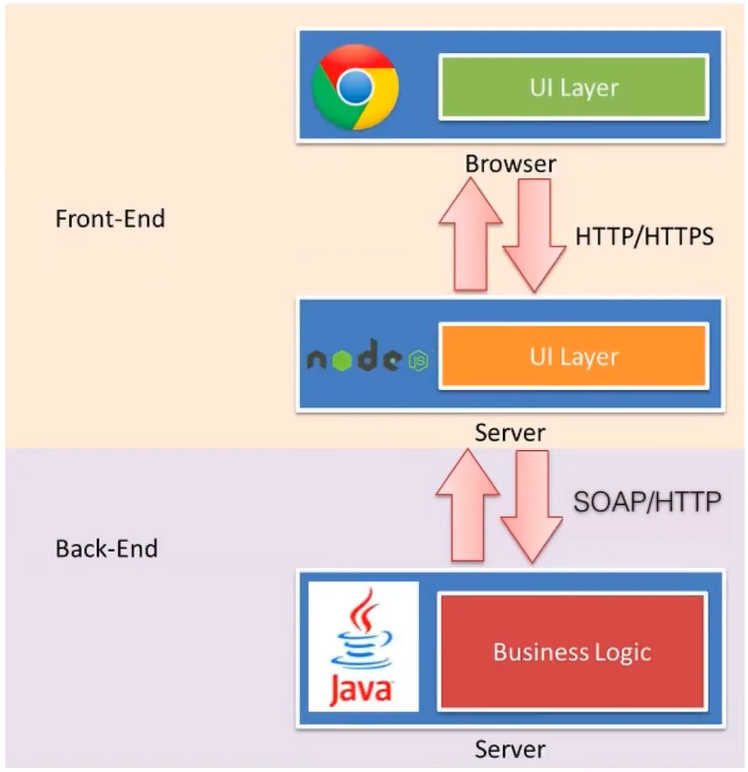

# 1. 概述

vue官方网址：[https://v3.cn.vuejs.org/](https://v3.cn.vuejs.org/)

Vue (读音 /vjuː/，类似于 **view**) 是一套用于构建用户界面的**渐进式框架**。与其它大型框架不同的是，Vue 被设计为可以自底向上逐层应用。Vue 的核心库只关注视图层，不仅易于上手，还便于与第三方库或既有项目整合。另一方面，当与[现代化的工具链](https://v3.cn.vuejs.org/guide/single-file-component.html)以及各种[支持类库](https://github.com/vuejs/awesome-vue#components--libraries)结合使用时，Vue 也完全能够为复杂的单页应用提供驱动。

Vue只关心视图层：HTML+CSS+JS，网络通信使用axios，页面跳转使用vue-router，状态管理使用vuex。

# 2. 前端三要素

- ****

  **HTML（结构）：**超文本标记语言（Hyper Text Markup Language），决定网页的结构和内容。

- **CSS（表现）：**层叠样式表（Cascading Style Sheets），设定网页的表现形式。

- **JavaScript（行为）：**是一种弱类型脚本语言，其源代码无需编译，而是由浏览器负责解释运行，用于控制网页的行为。

# 3. CSS预处理器

## 3.1 为什么要引入CSS预处理器

CSS层叠样式表是一门标记语言，并不是编程语言，因此没有变量等一门编程语言应有的概念。CSS的主要缺陷如下：

- 语言不够强大，无法嵌套，因此模块化开发需要书写很多的选择器。
- 没有变量和合理的样式复用机制，使得逻辑上相关的属性值必须以字面量的形式重复输出，导致难以维护。

为了解决这些问题，前端开发人员使用了**CSS预处理器**的工具，提供CSS缺失的样式复用机制，减少冗余代码，提高样式代码的可维护性，提高开发效率。

## 3.2 CSS预处理器概述

CSS预处理器定义了一种新的语言，基本思想是使用一种专门的编程语言为CSS增加编程特性，将CSS作为目标生成文件，然后开发者只需要使用这种语言进行CSS的编码工作。

目前常用的CSS预处理器有：

- **SASS：**基于Ruby，通过服务器处理，功能强大，解析效率高。但是需要额外学习Ruby语言，难于LESS。
- **LESS：**基于node.js，通过客户端处理，使用较简单。但是功能比SASS少，解析效率低于SASS。==学习后端的编程人员一般只掌握LESS即可。==

# 4. JavaScript框架

- **JQuery：**普遍的JavaScript框架，优点是简化了DOM操作，缺点是DOM操作太频繁，影响前端性能。前端的使用主要是为了兼容IE6、IE7、IE8。
- **Angular：**Google收购的前端框架，由Java程序员开发。特点是将后台的MVC模式应用到前端开发，并引入**模块化开发**的理念，采用的是TypeScript语法开发。对后端的程序员较友好，对前端的程序员不友好。
- **React：**Facebook出品，一款高性能的JS前端框架，特点是提出了新的概念：**虚拟DOM**，用于减少真实的DOM操作，在内存中模拟DOM，有效提高前端渲染效率。缺点是使用较为复杂，需要额外学习JSX语言。
- **Vue：**一款渐进式的JavaScript框架，==渐进性是指逐步实现新特性的意思，如实现模块化开发、路由、状态管理等新特性。==其特点是综合了Angular（模块化）和React（虚拟DOM）的优点。
- **Axios：**前端的通信框架，因为Vue的目的就是为了处理DOM，所以Vue并不具备通信的功能，此时需要额外使用通信框架`Axios`与服务器交互。也可以使用`JQuery`提供的`AJAX`通信。

# 5. UI框架

- **Ant-Design：**阿里巴巴出品，基于React的UI框架。
- **ElementUI、iView、ICE：**基于Vue的UI框架。
- **Bootstrap：**Twitter推出的用于前端开发的开源工具包。
- **AmazeUI：**一款HTML5跨屏前端框架。
- **WeUI：**微信小程序UI开发。

# 6. JavaScript构建工具

- **Babel：**JS编译工具，主要用于浏览器不支持的ES新特性，比如用于编译TypeScript。
- **WebPack：**模块打包器，主要作用是打包、压缩、合并以及按序加载。

# 7. 三端统一

三端统一的目的是实现一套代码三端统一（`PC`、`Android：.apk`、`iOS：.ipa`）并能够调用到设备底层硬件（传感器、GPS、摄像头等），打包方式有以下两种：

- **云打包：**HBuild：HBuildX，DCloud：API Cloud。
- **本地打包：**Cordova（PhoneGap）

# 8. 前端中的后端技术NodeJS

前端人员为了方便开发也需要了解一定的后端知识，但是Java的后端知识体系极其庞大，所以为了方便前端人员开发后台应用，出现了NodeJS这样独特的技术。

NodeJS框架以及项目管理工具如下：

- **Express：**NodeJS框架
- **Koa：**Express简化版
- **NPM：**项目综合管理工具，类似于Maven
- **YARN：**NPM的替代方案，类似于Maven和Gradle的关系

# 9. 前端为主的MP*时代

MP*模式包括：

- **MVC（同步通信为主）：**Model、View、Conroller
- **MVP（异步通信为主）：**Model、View、Presenter
- **MVVM（异步通信为主）：**Model、View、ViewModel

为了降低前端开发复杂性，涌现出了大量的前端框架，如：`Angular`、`React`、`Vue`、`Ember`等，这些框架总的原则是先按类型分层，比如Template、Controllers、Models，然后再在内层进行切分，如：

## 9.1 优点

- **前后端职责清晰：**前端工作在浏览器端，后端工作在服务器端。清晰的分工可以让前后端开发并行，测试数据的模拟不难，前端可以本地开发，后端则可以专注业务逻辑的处理，输出RESTful等接口。
- **前端开发的复杂度可控：**前端代码很重，但是合理的分层可以让前端开发各司其职。
- **部署相对独立：**可以快速改进产品体验。

## 9.2 缺点

- **代码不能复用：**后端依旧需要对数据进行校验。校验逻辑无法复用浏览器端的代码。
- **对SEO不利：**SEO指遵循搜索引擎的排名规则对网站内容进行优化。全异步往往还需要服务端做同步渲染的降级方案。
- **性能并非最佳**：尤其是移动互联网环境。

# 10. NodeJS带来的全栈时代

随着NodeJS的兴起，JavaScript开始有能力运行在服务端，这意味着一种新的研发模式：

在这种模式下，前后端的职责很清晰，对前端来说，两个UI层各司其职：

- **Front-end UI Layer：**处理浏览器的展现逻辑，通过CSS渲染样式，通过JavaScript添加交互功能，HTML的生成也可以放在这一层，具体需要看应用场景。
- **Back-end UI Layer：**处理路由、模板、数据获取、Cookie等。通过路由前端可以自主把控URL Design，这样无论单页面应用还是多页面应用，前端可以自由调控。后端可以专心业务逻辑层的开发。

通过NodeJS，Web Server层也是JavaScript代码，部分的代码可以前后端复用，需要SEO的场景可以在服务端同步渲染，由于异步请求太多的性能问题也可以通过服务端缓解。

但是这种模式依旧存在着一定的不足：

- 需要前端对服务端编程有一定的了解，比如TCP/IP等网络知识的掌握。
- NodeJS层与Java层的高效通信。
- 前端需要对部署运维的熟练了解，需要更多知识点和实操经验。

# 11. MVVM模式

## 11.1 什么是MVVM

MVVM（Model-View-ViewModel）是一种软件架构模式，是一种简化用户界面的**事件驱动编程方式**。

- **Model：**模型层，在这里表示为JavaScript对象
- **View：**视图层，在这里表示DOM（HTML操作的元素）
- **ViewModel：**连接视图和数据的中间件，Vue.js就是MVVM中的ViewModel层的实现者

MVVM的核心是ViewModel层，负责转换Model中的数据对象来让数据更加容易管理。其作用为：

- 该层向上与视图层进行双向**数据绑定**，能够监听到视图的变化，并通知数据发生改变
- 向下与Model层通过接口请求进行数据交互，能够观察到数据的变化，并对视图的对应内容进行更新

 ## 11.2 为什么要使用MVVM

MVVM模式和MVC模式一样，主要目的是分离视图（View）和模型（Model），有以下的优点：

- **低耦合：**视图（View）可以独立于Model变化和修改，一个ViewModel可以绑定到不同的View上，当View变化的时候Model可以不变，当Model变化的时候View可以不变。
- **可复用：**可以把一些视图逻辑放在一个ViewModel中，让很多View重用这段视图逻辑。
- **独立开发：**开发人员可以专注于业务逻辑和数据的开发（ViewModel），设计人员可以专注于页面的设计。
- **可测试：**测试可以针对ViewModel来写。

