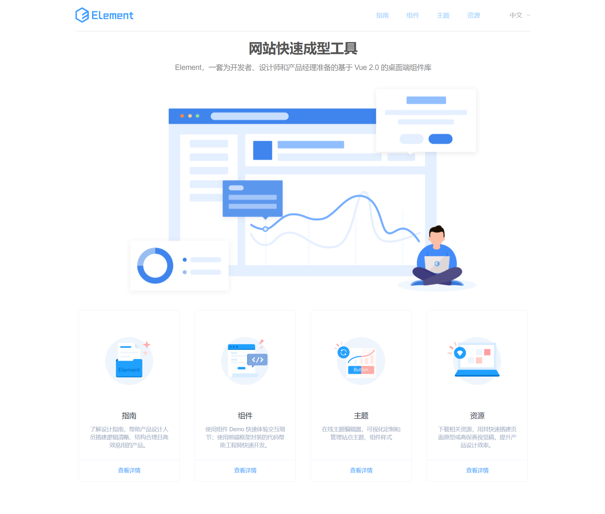
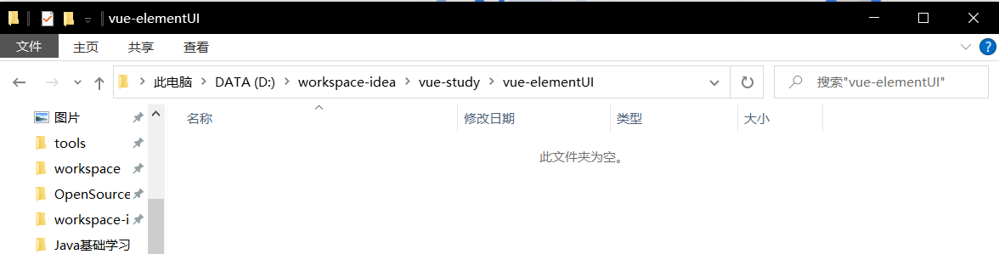
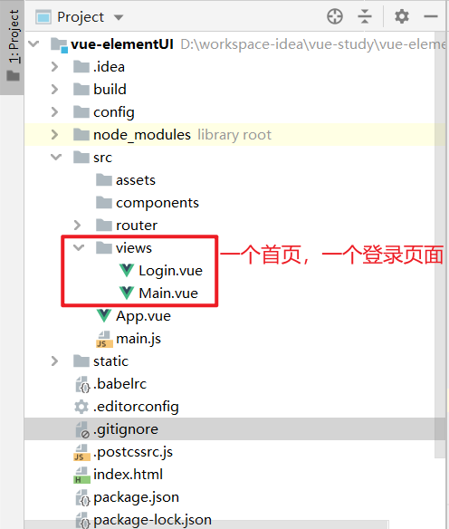
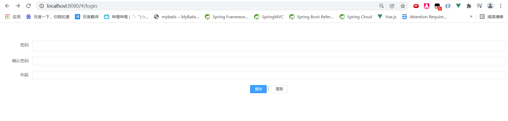

# 1. 什么是ElementUI

官网地址：[https://element.eleme.cn/#/zh-CN](https://element.eleme.cn/#/zh-CN)



Element，一套为开发者、设计师和产品经理准备的基于 Vue 2.0 的桌面端组件库

# 2. 初步使用ElementUI

## 2.1 创建一个Vue工程

1. 首先新建一个目录，用于Vue项目的根目录。

   

2. 使用Vue CLI创建一个Vue的项目框架

   使用指令`vue init webpack vue-elementUI`，初始化Vue项目。具体过程可看`7.Vue CLI第一个程序`。

3. 下载项目所需要的依赖

   ```shell
   # 安装vue-router
   npm install vue-router --save-dev
   
   # 安装elementUI
   npm i element-ui -S
   
   # 安装项目的所有依赖
   npm install
   
   # 安装SASS加载器
   cnpm install sass-loader node-sass --save-dev
   ```

   npm命令解释：

   - **npm install moduleName：**安装模块到项目目录下
   - **npm install -g moduleName：**-g表示将模块安装到全局，具体安装的位置可通过指令`npm config get prefix`查看。
   - **npm install -save moduleName：**--save是将模块安装到项目目录下，并在`package.json`文件的`dependencies`节点写入依赖，--save也可以用-S代替。
   - **npm install --save-dev moduleName：**--save-dev表示将模块安装到项目目录下，并在package文件的`devDependencies`节点写入依赖，--save-dev也可以用-D代替。

   > devDependencies是只会在开发环境下依赖的模块，生产环境不会被打入包内。而dependencies依赖的包不仅开发环境能使用，生产环境也能使用。
   >
   > 通过NODE_ENV=developement或NODE_ENV=production指定开发还是生产环境。

## 2.2 项目引入Element

我们可以完整引入Element，在`./src/main.js`中写入以下内容：

```js
import Vue from 'vue';

/* 引入Element所需要的模块，需要注意样式文件需要额外导入*/
import ElementUI from 'element-ui';
import 'element-ui/lib/theme-chalk/index.css';

import App from './App.vue';

/* 安装使用Element */
Vue.use(ElementUI);

new Vue({
  el: '#app',
  /*  */
  render: h => h(App)
});
```

我们需要同时导入`element-ui`以及一个CSS样式文件，并且显式地安装使用Element。

## 2.3 编写两个页面

我们可以在`./src/views`目录下面添加两个页面。



> Main.vue

```vue
<template>
  <h1>首页</h1>
</template>

<script>
    export default {
        name: "Main"
    }
</script>

<style scoped>

</style>
```

> Login.vue

这个页面我们可以使用`ElementUI`官网提供给我们的组件快速完成页面搭建。

`Element`组件官方地址：[https://element.eleme.cn/#/zh-CN/component](https://element.eleme.cn/#/zh-CN/component)


以登录界面为例，我们在页面中`Ctrl+F`搜索表单，进入之后查找自己所需要的组件。

点击`显示代码`后，将里面的内容复制进idea生成的`vue`模板里面，html代码复制到`<template>`标签里面，JavaScript代码复制进`<script>`标签里面。

```vue
<template>
  <el-form :model="ruleForm" status-icon :rules="rules" ref="ruleForm" label-width="100px" class="demo-ruleForm">
    <el-form-item label="密码" prop="pass">
      <el-input type="password" v-model="ruleForm.pass" autocomplete="off"></el-input>
    </el-form-item>
    <el-form-item label="确认密码" prop="checkPass">
      <el-input type="password" v-model="ruleForm.checkPass" autocomplete="off"></el-input>
    </el-form-item>
    <el-form-item label="年龄" prop="age">
      <el-input v-model.number="ruleForm.age"></el-input>
    </el-form-item>
    <el-form-item>
      <el-button type="primary" @click="submitForm('ruleForm')">提交</el-button>
      <el-button @click="resetForm('ruleForm')">重置</el-button>
    </el-form-item>
  </el-form>
</template>

<script>
  export default {
    name: "Login",
    data() {
      var checkAge = (rule, value, callback) => {
        if (!value) {
          return callback(new Error('年龄不能为空'));
        }
        setTimeout(() => {
          if (!Number.isInteger(value)) {
            callback(new Error('请输入数字值'));
          } else {
            if (value < 18) {
              callback(new Error('必须年满18岁'));
            } else {
              callback();
            }
          }
        }, 1000);
      };
      var validatePass = (rule, value, callback) => {
        if (value === '') {
          callback(new Error('请输入密码'));
        } else {
          if (this.ruleForm.checkPass !== '') {
            this.$refs.ruleForm.validateField('checkPass');
          }
          callback();
        }
      };
      var validatePass2 = (rule, value, callback) => {
        if (value === '') {
          callback(new Error('请再次输入密码'));
        } else if (value !== this.ruleForm.pass) {
          callback(new Error('两次输入密码不一致!'));
        } else {
          callback();
        }
      };
      return {
        ruleForm: {
          pass: '',
          checkPass: '',
          age: ''
        },
        rules: {
          pass: [
            {validator: validatePass, trigger: 'blur'}
          ],
          checkPass: [
            {validator: validatePass2, trigger: 'blur'}
          ],
          age: [
            {validator: checkAge, trigger: 'blur'}
          ]
        }
      };
    },
    methods: {
      submitForm(formName) {
        this.$refs[formName].validate((valid) => {
          if (valid) {
            alert('submit!');
          } else {
            console.log('error submit!!');
            return false;
          }
        });
      },
      resetForm(formName) {
        this.$refs[formName].resetFields();
      }
    }
  }
</script>

<style scoped>

</style>
```

## 2.4 配置路由

这里使用Vue Router来配置路由，过程与`9.Vue Router路由`里类似，需要注意的是我们如果直接通过浏览器的地址栏里跳转路由，则无需添加`<route-link>`标签，但仍需在`App.vue`里添加`<route-view>`标签来指定路由出口。

> ./src/router/index.js

```js
import Vue from 'vue'
import VueRouter from "vue-router"
import Login from "../views/Login";
import Main from "../views/Main";

Vue.use(VueRouter);

export default new VueRouter({
  routes:[{
    path: "/main",
    component: Main
  },{
    path: "/Login",
    component: Login
  }]
})
```

## 2.5 测试页面显示效果

在项目的根目录下输入指令`npm run dev`，启动项目。

如果我们想要进入`Main.vue`，在地址栏里输入url：`http://localhost:8080/#/main`

如果我们想要进入`Login.vue`，在地址栏里输入url：`http://localhost:8080/#/login`



