# 1. IntelliJ IDEA搭建环境

需要在IntelliJ IDEA中下载Vue的相关插件。

1. 打开IntelliJ IDEA中的`File-Settings`，即打开IntelliJ IDEA的设置。

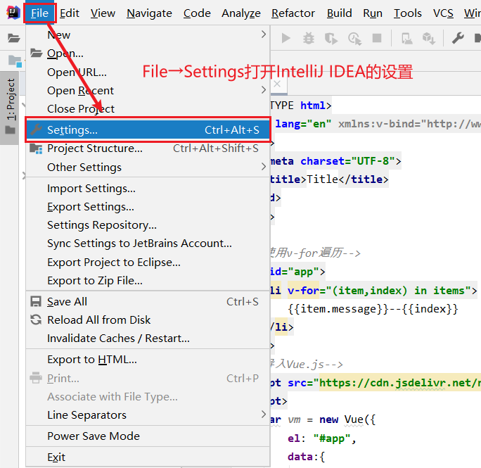

2. 在设置中搜索`Plugins`，打开插件窗口。在插件窗口中的`Marketplace`搜索“vue”，下载`Vue.js`插件。

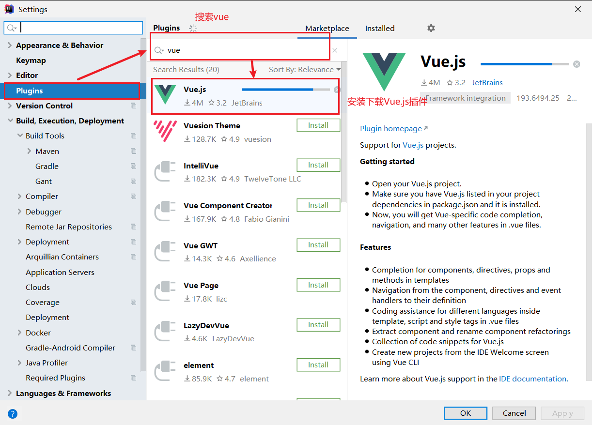

# 2. 起步

1. 新建空白项目`vue-study`，在该项目中新建文件夹`chapter-1`

   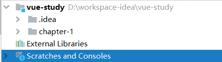

2. 在`chapter-1`文件夹新建一个`demo1.html`的文件。

   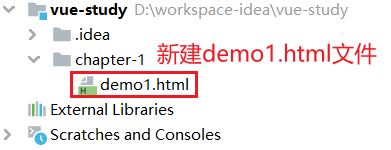
   
3. 引入Vue。

   这里我们选择的是Vue2.x的版本（Vue3.x的版本语法有所不同），我们可以通过以下两种方法来引入Vue：

   - ```html
     <!-- 开发环境版本，包含了有帮助的命令行警告 -->
     <script src="https://cdn.jsdelivr.net/npm/vue@2/dist/vue.js"></script>
     ```

   - ```html
     <!-- 生产环境版本，优化了尺寸和速度 -->
     <script src="https://cdn.jsdelivr.net/npm/vue@2"></script>
     ```

# 3. 声明式渲染

## 3.1 渲染的三种方式

- 命令式渲染 ： 命令我们的程序去做什么，程序就会跟着你的命令去一步一步执行。
- 声明式渲染 ： 我们只需要告诉程序我们想要什么效果，其他的交给程序来做。

>  声明式渲染和响应式渲染是两个维度的关系，二者并没有关系。
>
> - 声明式渲染：
>
>   vue使用 "模板语法" 来声明式地将数据渲染进dom系统
>   {{ test }} //这个就是模板语法，而使用模板语法的这种方式(手段)，就叫做声明式渲染
>
> - 响应式渲染：
>
>   数据的更新是响应式的，当你把属性“声明式地渲染”进DOM系统之后，如果属性的值发生了变化，无须你做任何其它的操作，这个与属性绑定的DOM，会自动的发生改变，这个就叫做属性的响应式触发

## 3.2 Vue的声明式渲染

==Vue.js 的核心是一个允许采用简洁的模板语法来声明式地将数据渲染进 DOM 的系统：==

```html
<!DOCTYPE html>
<html lang="en">
    <head>
        <meta charset="UTF-8">
        <title>Title</title>
    </head>
    <body>
        <!--Vue的模板语法-->
        <div id="app">
            {{message}}
        </div>
        
        <!--导入Vue.js，这里针对的是Vue2.x，Vue3.x需要导入其他CDN-->
        <script src="https://cdn.jsdelivr.net/npm/vue@2/dist/vue.js"></script>
        
        <script>
            var vm = new Vue({
                /*将property（属性）与DOM元素绑定*/
                el: "#app",
                data:{
                    message: "HelloVueWorld!"
                }
            });
        </script>
    </body>
</html>
```

使用IntelliJ IDEA中的“浏览器”控件打开该网页：

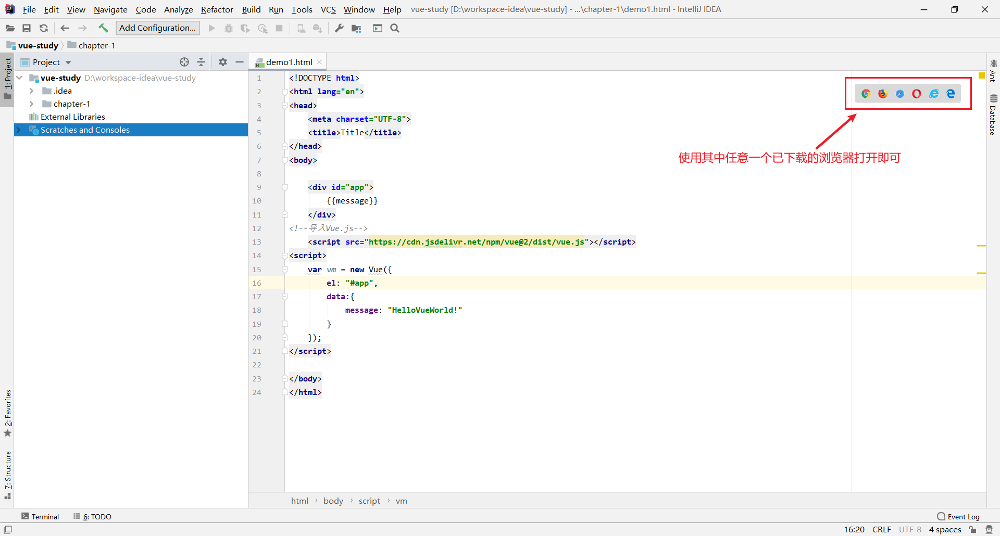

网页显示内容：

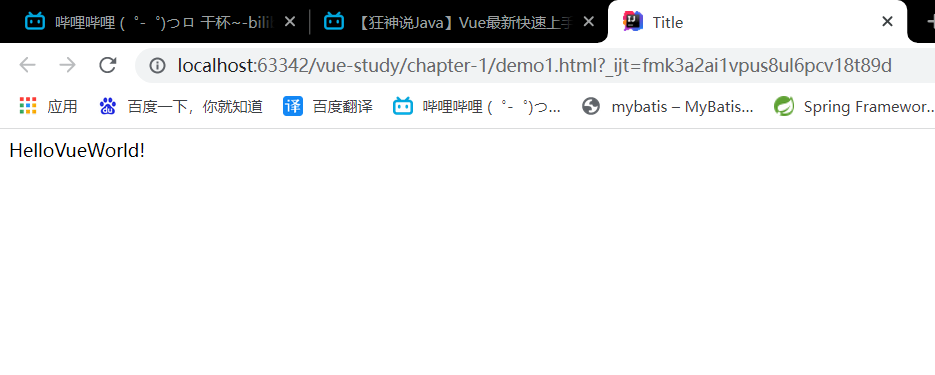

## 3.3 Vue的响应式渲染

现在我们已经成功创建了第一个 Vue 应用！看起来这跟渲染一个字符串模板非常类似，但是 Vue 在背后做了大量工作。现在数据和 DOM 已经被建立了关联，所有东西都是**响应式的**。我们要怎么确认呢？打开你的浏览器的 JavaScript 控制台 (就在这个页面打开)，并修改 `vm.message` 的值，你将看到上例相应地更新。

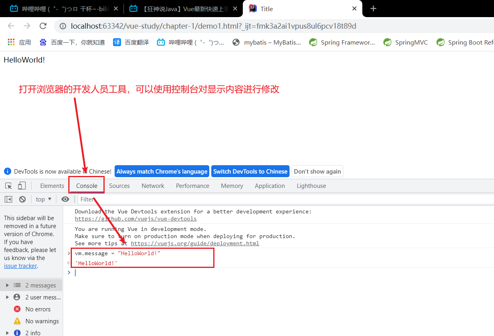

注意我们不再和 HTML 直接交互了。一个 Vue 应用会将其挂载到一个 DOM 元素上 (对于这个例子是 `#app`) 然后对其进行完全控制。那个 HTML 是我们的入口，但其余都会发生在新创建的 Vue 实例内部。

## 3.4 Vue的指令

除了文本插值，我们还可以像这样来绑定元素的特性：

```html
<div id="app-2">
    <!--将数据绑定到attribute，该attribute是Vue提供的-->
    <span v-bind:title="message">
        鼠标悬停几秒钟查看此处动态绑定的提示信息！
    </span>
</div>
```

```js
var app2 = new Vue({
  el: '#app-2',
  data: {
    message: '页面加载于 ' + new Date().toLocaleString()
  }
})
```

该页面的显示效果如下：

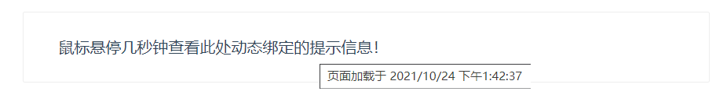

`v-bind:attribute` 被称为**指令**。指令带有前缀 `v-`，以表示它们是 Vue 提供的特殊 attribute。可能你已经猜到了，它们会在渲染的 DOM 上应用特殊的响应式行为。在这里，该指令的意思是：“将这个元素节点的 `title` attribute 和 Vue 实例的 `message` property 保持一致”。

如果你再次打开浏览器的 JavaScript 控制台，输入 `app2.message = '新消息'`，就会再一次看到这个绑定了 `title` attribute 的 HTML 已经进行了更新。

# 4. 条件与循环

## 4.1 条件

我们可以使用`v-if`/`v-else-if`/`v-else`来实现一个元素是否显示：

```html
<div id="app-3">
	<!--将property（属性）和DOM结构绑定-->
    <p v-if="seen">现在你看到我了</p>
</div>
```

```js
var app3 = new Vue({
  el: '#app-3',
  data: {
    seen: true
  }
})
```

页面就会显示“现在你看到我了”的消息。继续在控制台输入 `app3.seen = false`，你会发现之前显示的消息消失了。

==这个例子演示了我们不仅可以把数据绑定到 DOM 文本或 attribute，还可以绑定到 DOM **结构**==。

## 4.2 循环

`v-for` 指令可以绑定数组的数据来渲染一个项目列表：

```html
<div id="app-4">
    <!--复习：ol标签表示有序列表，ul标签表示无序列表，列表项用li标签-->
    <ol>
        <!--DOM的文本绑定property（属性）中的数组-->
        <li v-for="todo in todos">
            {{ todo.text }}
        </li>
    </ol>
</div>
```

```js
var app4 = new Vue({
    el: '#app-4',
    data: {
        todos: [
            { text: '学习 JavaScript' },
            { text: '学习 Vue' },
            { text: '整个牛项目' }
        ]
    }
})
```

页面显示的效果如下：

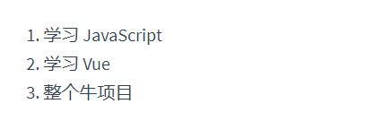

在控制台里，输入 `app4.todos.push({ text: '新项目' })`，你会发现列表最后添加了一个新项目。

# 5. 处理用户输入

为了让用户和你的应用进行交互，我们可以用 `v-on` 指令添加一个事件监听器，通过它调用在 Vue 实例中定义的方法：

```html
<div id="app">
    <p>{{message}}</p>
    <button v-on:click="helloWorld">Click Me!</button>
</div>
```

```js
var vm = new Vue({
    el: "#app",
    data: {
        message: "HelloWorld!"
    },
    methods: {
        helloWorld: function () {
            this.message = "Click Me!"
        }
    }
});
```

页面的显示效果如下：

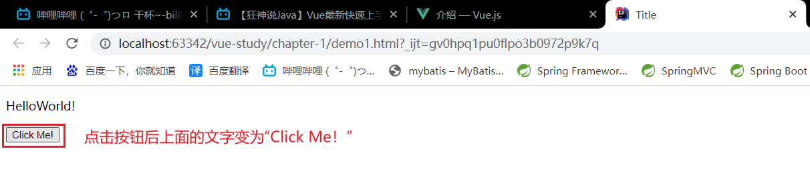

注意在 `helloWorld` 方法中，我们更新了应用的状态，但没有触碰 DOM——所有的 DOM 操作都由 Vue 来处理，你编写的代码只需要关注逻辑层面即可。

# 6. 双向绑定

Vue.js是一个MVVM框架，即==数据双向绑定——当数据发生变化的时候，视图也发生变化；当视图发生变化时，数据也会发生变化。==这里所说的数据双向绑定，仅针对UI控件来说，非UI控件不会涉及到数据双向绑定。

我们在处理表单时，常常使用`v-model`指令来实现数据双向绑定。`<input type="text">`、`<textarea>`、`<select>`、`<input type="radio">`中选择的元素可以与property属性相互绑定，表单元素设置的初始值可以使用property里面的预设值，表单元素输入的值可以保存到property中。

**注意：`v-model`会忽略所有表单元素的value、checked、selected特性的初始值，而总是将Vue实例的数据作为数据来源，因此设置初始值应当通过property设置。**

## 6.1 text数据双向绑定

```html
<div id="app">
    <p>{{message}}</p>
    <input type="text" v-model="message"/>
</div>
```

```js
var vm = new Vue({
    el: "#app",
    data: {
        message: "HelloWorld!"
    }
});
```

页面实现的效果如下：

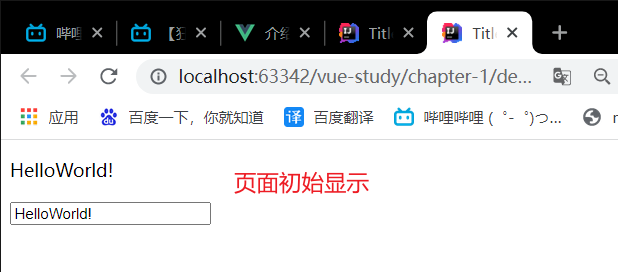

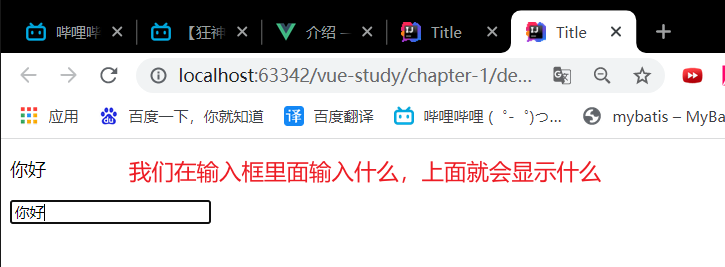

## 6.2 textarea数据双向绑定

```html
<div id="app">
    <p>{{message}}</p>
    <textarea v-model="message"></textarea>
</div>
```

```js
var vm = new Vue({
    el: "#app",
    data: {
        message: "HelloWorld!"
    }
});
```

页面的显示效果如下：

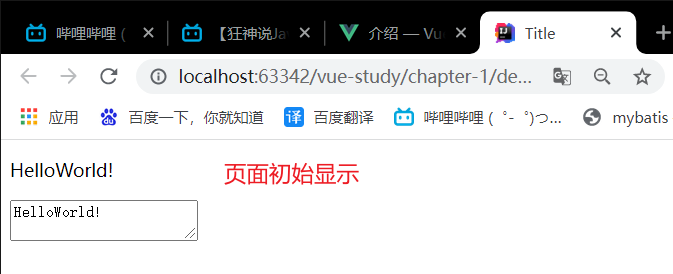

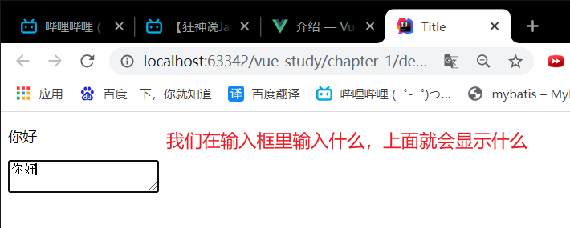

## 6.3 radio数据双向绑定

```html
<div id="app">
    <p>您选择的内容是：{{sex}}</p>
    请选择：
    <label><input type="radio" name="sex" value="man" v-model="sex"/>男</label>
    <label><input type="radio" name="sex" value="woman"  v-model="sex"/>女</label>
</div>
```

```js
var vm = new Vue({
    el: "#app",
    data: {
        /*初始选择男*/
        sex: "man"
    }
});
```

页面的显示效果如下：

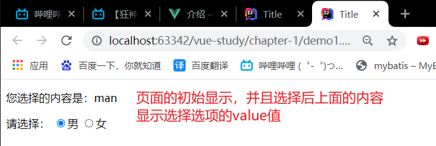

## 6.4 select数据双向绑定

```html
<div id="app">
    <p>您选择的内容是：{{option}}</p>
    请选择：
    <select name="char" v-model="option">
        <option disabled value="">--请选择--</option>
        <!--复习：如果没有指定 value 属性，选项的值将设置为 <option> 标签中的内容。-->
        <option value="A">A</option>
        <option value="B">B</option>
        <option value="C">C</option>
    </select>
</div>
```

```js
var vm = new Vue({
    el: "#app",
    data: {
        /*初始不选择*/
        option: ""
    }
});
```

页面的显示效果如下：

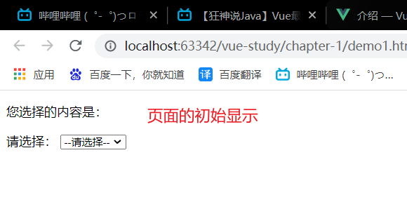

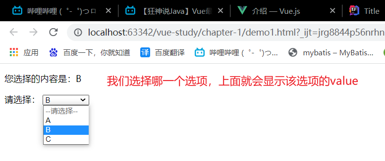

# 7. 组件化应用构建

组件系统是一种抽象，允许我们使用小型、独立和通常可复用的组件构建大型应用。几乎任何类型的应用界面都可以抽象为一棵组件树。

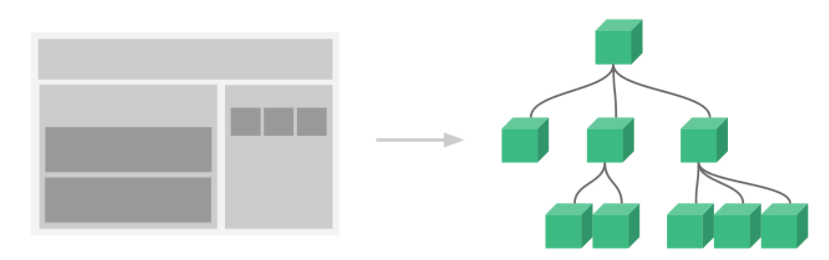

在Vue中，一个组件的本质是一个拥有预定义选项的一个Vue实例。下面为在Vue中注册组件：

```js
Vue.component(
    'todo-item',
    {
        template: '<li>这是一个待办项</li>'
    }
);
var vm = new Vue({
    el: "#app",
});
```

注册完组件后，我们需要在html代码中为组件创建实例：

```html
<div id="app">
    <ol>
        <!--为组件创建实例-->
        <todo-item></todo-item>
        <todo-item></todo-item>
    </ol>
</div>
```

页面的展示效果如下：

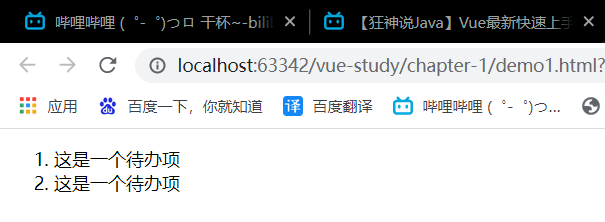

但是我们更应该从父作用域中将数据传到子组件，我们可以使用`v-bind:attribute`来让组件绑定数据。我们可以通过以下方式自定义attribute：

```js
Vue.component(
    'todo-item',
    {
        // todo-item 组件现在接受一个"prop"，类似于一个自定义 attribute。
        // 这个 prop 名为 todo(待办)。
        props: ['todo'],
        template: '<li>{{todo.text}}</li>'
    }
);
var vm = new Vue({
    el: "#app",
    data: {
        items: [
            {id: 0, text: '蔬菜'},
            {id: 1, text: '奶酪'},
            {id: 2, text: '其他'}
        ]
    }
});
```

现在我们可以通过`v-bind:attribute`指令将待办项传至循环输出的每个组件中：

```html
<div id="app">
    <ol>
        <todo-item v-for="item in items" v-bind:todo="item" v-bind:key="item.id"></todo-item>
    </ol>
</div>
```

页面展示的效果如下：

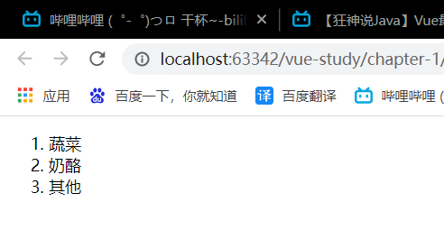

子单元通过 prop 接口与父单元进行了良好的解耦。我们现在可以进一步改进 `<todo-item>` 组件，提供更为复杂的模板和逻辑，而不会影响到父单元。在一个大型应用中，有必要将整个应用程序划分为组件，以使开发更易管理。

