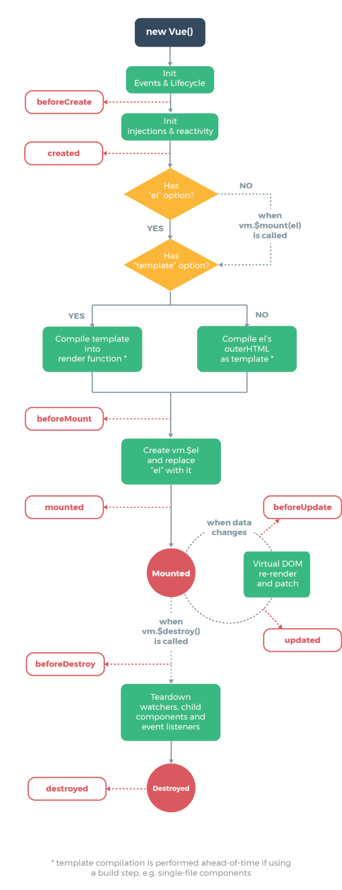
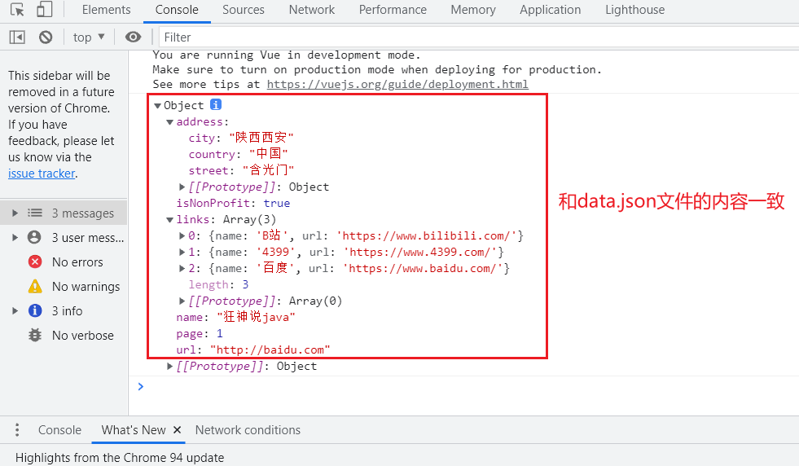
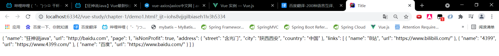
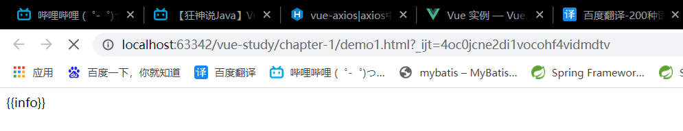

# 1. 什么是Axios

Axios是一个基于promise的HTTP库，是一个开源的异步通信框架，可以用在浏览器和node.js中。Axios的主要作用就是实现AJAX异步通信，其功能特点是：

- 从浏览器中创建 [XMLHttpRequests](https://developer.mozilla.org/en-US/docs/Web/API/XMLHttpRequest)
- 从 node.js 创建 [http](http://nodejs.org/api/http.html) 请求
- 支持 [Promise](https://developer.mozilla.org/en-US/docs/Web/JavaScript/Reference/Global_Objects/Promise) API
- 拦截请求和响应
- 转换请求数据和响应数据
- 取消请求
- 自动转换 JSON 数据
- 客户端支持防御 [XSRF](http://en.wikipedia.org/wiki/Cross-site_request_forgery)

# 2. 为什么要用Axios

由于`Vue.js`是一个视图层框架并且作者严格遵守SoC（关注点分离原则），所以`Vue`并不包含AJAX的通信功能。为了解决通信问题，作者原来单独开发了一个名为`vue-resource`的插件，不过在`Vue2.0`版本后停止了对该插件的使用并推荐使用`Axios`。

之所以少用`JQuery`，是因为会频繁操作DOM。

# 3. Vue实例的生命周期

Vue实例有一个完整的生命周期，包括开始创建、编译模板、挂载DOM、渲染、更新、卸载等一系列过程。我们把Vue实例从创建到销毁的全过程称为Vue实例的生命周期。

在Vue的整个生命周期中，它提供了一系列的事件，可以让我们在事件触发时注册JS方法，可以让我们用自己注册的JS方法控制全局。在这些事件响应方法中的this就是Vue的实例。

- **new Vue()**：实例化Vue对象
- **Init Events & Lifecycle**：初始化事件和生命周期
- **beforeCreate**：创建实例前执行的钩子函数
- **Init Injection & reactivity**：初始化注入
- **created**：实例创建完成后执行的钩子函数
- **Has “el” option?**：是否有“el”选项
- **Has “template” option?**：是否有“模板选项”
- **Compile template into render function**：编译模板到渲染函数里。
- **Compile el’s outerHTML as template**：编译el外面的HTML为模板。
- **beforeMount**：将编译完成的HTML挂载到对应虚拟DOM时触发的钩子，此时页面仍然没有内容。
- **Create vm.$el and replace “el” with it**：将编译好的HTML替换掉el属性所指向的DOM。
- **mounted**：编译好的HTML挂载到页面完成后执行的事件钩子，此钩子函数一般会做一些AJAX请求获取数据，进行数据的初始化。（该函数在整个Vue实例的生命周期只执行一次）
- **beforeUpdate**：更新之前的钩子函数
- **Virtual DOM re-render and patch**：虚拟DOM重新渲染和修补
- **beforeDestroy**：实行销毁之前的钩子函数
- **Teardown watchers, child components and event listeners**：拆除监视器，事件监听，子组件
- **Destroyed**：Vue实例销毁
- **destroyed**：销毁完成后的钩子函数



# 4. vue-axios整合

我们需要在某个钩子函数中执行`axios`的`get`方法，来获取后台的`data.json`文件数据。

## 4.1 导入axios的包

首先我们需要使用CDN导入Axios的包：

```html
<script src="https://unpkg.com/axios/dist/axios.min.js"></script>
```

## 4.2 data.json

`data.json`保存在与html文件同一级的目录下，文件的内容如下：

```json
{
    "name": "狂神说java",
    "url": "http://baidu.com",
    "page": 1,
    "isNonProfit": true,
    "address": {
        "street": "含光门",
        "city": "陕西西安",
        "country": "中国"
    },
    "links": [
        {
            "name": "B站",
            "url": "https://www.bilibili.com/"
        },
        {
            "name": "4399",
            "url": "https://www.4399.com/"
        },
        {
            "name": "百度",
            "url": "https://www.baidu.com/"
        }
    ]
}
```

## 4.3 axios的get方法

`axios`的`get`方法使用如下：

- ```js
  Vue.axios.get(api).then((response) => {
    console.log(response.data)
  })
  ```

- ```js
  this.axios.get(api).then((response) => {
    console.log(response.data)
  })
  ```

- ```js
  this.$http.get(api).then((response) => {
    console.log(response.data)
  })
  ```

## 4.4 vue-axios整合

```js
var vm = new Vue({
    el: "#app",
    /*编译好的HTML挂载到页面上后执行的钩子函数*/
    mounted(){
        axios.get('data.json').then(response=>(console.log(response.data)));
    }
});
```

`mounted`函数在编译的HTML挂载到页面后执行，该函数一般执行数据的初始化工作。

打开页面可以看到`data.json`已经成功输出到控制台。



但是`console.log`只能在控制台里面看到数据，如果我们需要在页面中看到，还需要使用下面的方式：

```html
<div id="app">
    {{info}}
</div>
```

```js
var vm = new Vue({
    el: "#app",
    /*使用info来接收数据*/
    data: {
        info: {}
    },
    /*编译好的HTML挂载到页面上后执行的钩子函数*/
    mounted(){
        axios.get('data.json').then(response=>(this.info = response.data));
    }
});
```

页面的展示效果如下：



我们也可以通过`v-bind:attribute`指令使得某个标签的属性值绑定数据：

```html
<a v-bind:href="info.url">链接</a>
```

# 5. 解决Vue加载时闪烁

在使用Vue的时候，可能会因为网速较慢，而导致页面先显示一段时间模板，然后才会将数据渲染到模板里面。这种现象称为Vue加载时闪烁。

如4.4节就可能出现显示模板的情况，如下：



我们可以通过CSS样式来解决该问题：

1. 在闪烁元素的最外层添加上一个v-cloak属性

   ```html
   <div id="app" v-cloak>
       {{info}}
   </div>
   ```

2. 添加CSS样式

   ```html
   <style>
       /*包含v-cloak属性的标签都不会显示（模板）*/
       [v-cloak] {
           display: none;
       }
   </style>
   ```

显示的效果为：页面一开始不会显示模板，而是会显示一段时间的空白，然后才会将数据渲染到模板里显示。


