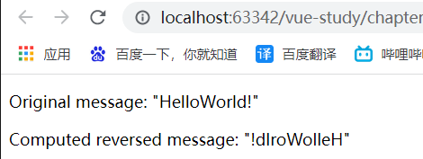
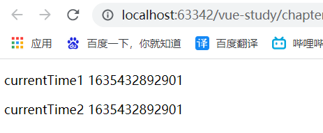
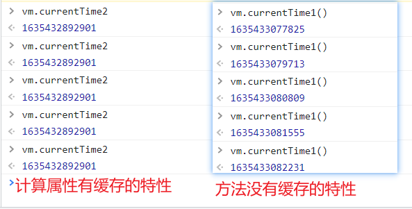

# 1. 什么是计算属性

计算属性的关键在于“属性”二字，从本质上来说属于名词。计算属性可以理解为**将方法计算的结果缓存到属性里面**，我们可以把计算属性当作缓存来使用。

Vue的模板中可以编写语句，那么我们为什么要使用计算属性呢？

```html
<div id="example">
	<!--复习：split('')表示将字符串拆成字符数组，reverse表示数组的顺序颠倒，join表示将数组表示为字符串，参数为分隔符-->
    {{ message.split('').reverse().join('') }}
</div>
```

模板中如果放入过多的逻辑，会让模板变得非常难以维护，当在模板的多处包含这个翻转字符串时，就会显得十分的冗余。

因此，对于任何的复杂逻辑，都应该使用计算属性。

# 2. 测试计算属性

```html
<div id="app">
    <p>Original message: "{{ message }}"</p>
    <p>Computed reversed message: "{{ reversedMessage }}"</p>
</div>
```

```js
var vm = new Vue({
    el: '#app',
    data: {
        message: 'HelloWorld!'
    },
    computed: {
        // 计算属性的 getter
        reversedMessage: function () {
            // `this` 指向 vm 实例
            return this.message.split('').reverse().join('')
        }
    }
})
```

页面显示的效果如下：



这里我们声明了一个计算属性`reversedMessage`，我们提供的函数将用作property`vm.reversedMessage`的getter函数。

你可以像绑定普通 property 一样在模板中绑定计算属性。Vue 知道 `vm.reversedMessage` 依赖于 `vm.message`，因此当 `vm.message` 发生改变时，所有依赖 `vm.reversedMessage` 的绑定也会更新。而且最妙的是我们已经以声明的方式创建了这种依赖关系：计算属性的 getter 函数是没有副作用 (side effect) 的，这使它更易于测试和理解。

# 3. 计算属性和方法的区别

我们使用方法一样可以达到计算属性的效果。

```html
<div id="app">
    <!--使用方法需要加括号-->
    <p>currentTime1 {{currentTime1()}}</p>
    <!--使用计算属性无需加括号-->
    <p>currentTime2 {{currentTime2}}</p>
</div>
```

```js
var vm = new Vue({
    el: "#app",
    methods: {
        currentTime1: function () {
            return Date.now();  //返回一个时间戳
        }
    },
    computed: {
        currentTime2: function () {
            return Date.now();//返回一个时间戳
        }
    }
});
```

页面显示的效果如下：



我们可以将同一函数定义为一个方法而不是一个计算属性。两种方式的最终结果确实是完全相同的。然而，不同的是**计算属性是基于它们的响应式依赖进行缓存的**。只在相关响应式依赖发生改变时它们才会重新求值。**也就是计算属性的定义方法中所依赖的数据改变，该计算属性才会改变。**

相比之下，每当触发重新渲染时，调用方法将**总会**再次执行函数。

我们可以在控制台反复测试计算属性和方法，测试结果如下：



==因此，如果我们需要减小系统开销，提高响应速度，需要使用计算属性。如果我们不需要缓存，则需要使用方法。==

# 4. 计算属性的setter

计算属性默认只有getter，不过我们也可以提供一个getter（只有当给计算属性赋值时才会调用定义方法）。

```js
computed: {
    fullName: {
        // getter
        get: function () {
            return this.firstName + ' ' + this.lastName
        },
        // setter
        set: function (newValue) {
        	var names = newValue.split(' ')
            this.firstName = names[0]
            this.lastName = names[names.length - 1]
        }
    }
}
```

现在再运行 `vm.fullName = 'John Doe'` 时，setter 会被调用，`vm.firstName` 和 `vm.lastName` 也会相应地被更新。

