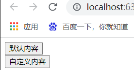
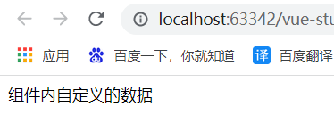
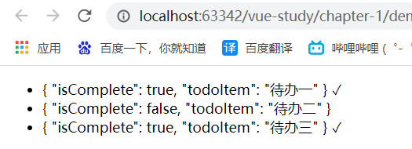

# 1. 复习组件component

插槽是组件系统的一部分，接下来先简略地复习一下组件的内容。

```js
/*组件的定义必须在Vue实例创建之前*/
Vue.component(
    'todo-item',
    {
        props: ['todo'],
        template: '<li>{{todo}}</li>'
    }
);
var vm = new Vue({
    el: "#app",
    data: {
        todo : '待办项'
    }
});
```

```html
<div id="app">
    <todo-item v-bind:todo="todo"></todo-item>
</div>
```

但是这样做，HTML页面显示的结构就完全由JS来控制了，HTML仅仅决定显示的内容。如果我们想要实现更加复杂的结构，比如说一个组件里面嵌套另外一个组件，这样仅仅依靠上面的`v-bind`指令就无法满足更高的需求了。

并且我们习惯的是内容在开始标签和结束标签中间，如`<div>HelloWorld!</div>`。上面我们定义的组件只能包括开始标签和结束标签，中间的内容会被自动忽略掉，如下：

```html
<!--下面的“HelloWorld!”实际上并不会显示-->
<div id="app">
    <todo-item v-bind:todo="todo">HelloWorld!</todo-item>
</div>
```

因此Vue提出了插槽`<slot>`的概念。

# 2. 插槽内容

Vue实现了一套内容分发的API，将`<slot>`元素作为承载分发内容的出口。

有了插槽的概念，将会允许下面的方式合成组件：

```html
<navigation-link url="/profile">
    Your Profile
</navigation-link>
```

其中，`<navigation-link>`组件的定义方式如下：

```html
<a v-bind:href="url" class="nav-link">
    <slot></slot>
</a>
```

当组件渲染的时候，`<slot></slot>`将会被替换成“Your Profile”。

插槽中可以包含任何模板代码，包括HTML和其他的组件。

**注意：如果组件定义时没有包含一个`<slot>`元素，则该组件起始标签和结束标签之间的任何内容都不会显示。**

# 3. 后备内容

我们经常会为一个插槽`<slot>`设置默认值，它只会在没有提供内容的时候被渲染。如下：

```js
/*我们选择button的显示内容默认为‘submit’*/
Vue.component(
    'mybutton',
    {
        template:   '<button>\
						<slot>默认内容</slot>\
					</button>'
    }
);
var vm = new Vue({
    el: "#app",
});
```

```html
<div id="app">
    <!--默认内容的按钮-->
    <mybutton></mybutton><br>
    <!--自定义内容的按钮-->
    <mybutton>自定义内容</mybutton>
</div>
```

页面的显示效果如下：



# 4. 具名插槽

插槽可以简单地分为三种类型：匿名插槽，具名插槽，作用域插槽。以上我们使用的都是匿名插槽，接下来介绍具名插槽。

顾名思义，具名插槽就是具体名字的插槽。有时候我们需要多个插槽，如下：

```html
<div class="container">
    <header>
        <!-- 我们希望把页头放这里 -->
    </header>
    <main>
        <!-- 我们希望把主要内容放这里 -->
    </main>
    <footer>
        <!-- 我们希望把页脚放这里 -->
    </footer>
</div>
```

对于这种情况，`<slot>`元素有一个特殊的attribute：`name`，可以用来定义额外的插槽。一个不带`name`的`<slot>`出口会带有隐含的名字“default”（匿名插槽）。

下面我们自定义一个`<base-layout>`组件：

```js
Vue.component(
        'base-layout',
        {
            template:   '<div class="container">\
                            <header>\
                                <slot name="header"></slot>\
                            </header>\
                            <main>\
                                <slot></slot>\
                            </main>\
                            <footer>\
                                <slot name="footer"></slot>\
                            </footer>\
                        </div>'
        }
    );
```

在向具名插槽提供内容的时候，我们可以在一个`<template>`元素上面使用`v-slot`指令，并以`v-slot`的参数的形式提供名称：

```html
<base-layout>
    <!--具名插槽-->
    <template v-slot:header>
        <h1>Here might be a page title</h1>
    </template>

    <!--匿名插槽-->
    <p>A paragraph for the main content.</p>
    <p>And another one.</p>

    <!--具名插槽-->
    <template v-slot:footer>
        <p>Here's some contact info</p>
    </template>
</base-layout>
```

现在 `<template>` 元素中的所有内容都将会被传入相应的插槽。

任何没有被包裹在带有 `v-slot` 的 `<template>` 中的内容都会被视为默认插槽的内容。但是我们为了整体的风格一致也可以使用`<template v-slot:default>`包裹默认插槽（匿名插槽）的内容。

# 5. 作用域插槽

接下来介绍匿名插槽和作用域插槽之外的第三种插槽——作用域插槽。

## 5.1 编译作用域

### 5.1.1 在自定义组件中定义数据

除了在Vue实例中定义数据外，在自定义的组件中也可以定义数据，如下：

```js
Vue.component(
        /*组件名称只能包含小写字母和'-'*/
        'my-component',
        {
            /*默认显示*/
            template:   '<div>\
            				<slot v-bind:message="message">{{message}}</slot>\
						</div>',
            /*组件里的data必须写成方法的形式*/
            data(){
                return {
                    message: "这是在组件中定义的数据"
                }
            }
        }
    );
```

**注意，组件中定义的数据必须以方法的形式定义**。

### 5.1.2 父级作用域和子作用域并不互通

事实上，==父级模板里的所有内容都是在父级作用域中编译的，子模板里的所有内容都是在子作用域中编译的。==

父和子的关系可以简单地这样理解：A使用`<template>`标签，往B的`slot`添加内容，那A就是父，B就是子。不同的组件之间的父子关系很容易区分，==但Vue实例是特殊的父级作用域。==

我们下面以一个例子说明这一点：

```js
Vue.component(
        /*组件名称只能包含小写字母和'-'*/
        'my-component',
        {
            /*自定义组件中无法使用Vue实例的data，这里无法使用vueData*/
            template:   '<span>\
                            <slot v-bind:componentData="componentData">\
            					{{ componentData.defaultData }}\
    						</slot>\
                        </span>',
            data(){
                return {
                    componentData: {
                        defaultData: "组件默认显示的数据",
                        customData: "组件内自定义的数据"
                    }
                }
            }
        }
    );
    var vm = new Vue({
        el: "#app",
        data: {
            vueData: {
                customData: "Vue实例内自定义的数据"
            }
        }
    });
```

```html
<div id="app">
    <!--使用Vue实例中的data-->
    <my-component v-bind:vueData="vueData">
        {{vueData.customData}}
    </my-component>
    <br>
    <!--使用component默认显示的data-->
    <my-component></my-component>
    <br>
    
    <!--父作用域使用子作用域的数据，无法显示内容，会报错-->
    <!--
		<my-component v-bind:componentData="componentData">
			{{componentData.defaultData}}
		</my-component>
	-->  
</div>
```

## 5.2 详解作用域插槽

为了解决父级模板和子模板内容分别在各自的作用域编译的问题，Vue提出了作用域插槽的概念。作用域插槽可以让父作用域访问到子作用域的data。

1. 为了让`componentData`在父级的插槽内容中可用，我们必须将`componentData`作为`<slot>`元素的一个attribute使用`<v-bind>`指令绑定上去，绑定在 `<slot>` 元素上的 attribute 被称为**插槽 prop**：

   ```js
   Vue.component(
       'my-component',
       {
           template:   '<span>\
                           <slot v-bind:componentData="componentData">\
   							{{ componentData.defaultData }}\
           				</slot>\
                       </span>',
           data(){
               return {
                   componentData: {
                       defaultData: "组件默认显示的数据",
                       customData: "组件内自定义的数据"
                   }
               }
           }
       }
   );
   var vm = new Vue({
       el: "#app",
   });
   ```

2. 现在在父级作用域中，我们可以使用带值的 `v-slot` 来定义我们提供的插槽 prop 的名字：

   ```html
   <div id="app">
       <!--使用组件里面的data-->
       <my-component>
           <template v-slot:default="defaultSlotProps">
               {{defaultSlotProps.componentData.customData}}
           </template>
       </my-component>
   </div>
   ```

   如上，`v-slot:default="defaultSlotProps"`表示将默认插槽中包含所有插槽prop的对象命名为defaultSlotProps，该名字可以任意。

3. 页面的显示效果如下：

   

## 5.3 独占作用域插槽的写法

当组件内只有一个插槽，并且插槽是默认插槽（`<slot>`内没有‘name’属性）时，我们可以把组件的标签当作插槽模板来使用，即可以将`<template>`省略，如下：

```html
<div id="app">
    <!--使用组件里面的data-->
    <my-component v-slot:default="defaultSlotProps">
        {{defaultSlotProps.componentData.customData}}
    </my-component>
</div>
```

上面这段代码和下面的代码效果一致：

```html
<div id="app">
    <!--使用组件里面的data-->
    <my-component>
        <template v-slot:default="defaultSlotProps">
            {{defaultSlotProps.componentData.customData}}
        </template>
    </my-component>
</div>
```

**注意：只要出现多个插槽，请始终为所有的插槽使用完整的基于 `<template>` 的语法：**

```html
<current-user>
    <template v-slot:default="slotProps">
        {{ slotProps.user.firstName }}
    </template>

    <template v-slot:other="otherSlotProps">
        ...
    </template>
</current-user>
```

# 6. 缩写

我们可以将参数之前的`v-slot:`替换成为字符`#`。例如`v-slot:header`可以被重写为`#header`。

```html
<!--具名插槽缩写-->
<base-layout>
    <template #header>
        <h1>Here might be a page title</h1>
    </template>

    <p>A paragraph for the main content.</p>
    <p>And another one.</p>

    <template #footer>
        <p>Here's some contact info</p>
    </template>
</base-layout>
```

但是需要注意的是使用作用域插槽时，默认插槽无法写成下面的形式：

```html
<!-- 这样会触发一个警告 -->
<current-user #="defaultSlotProps">
    {{ defaultSlotProps.user.firstName }}
</current-user>
```

正确的写法应该是：

```html
<!--作用域插槽缩写-->
<current-user #default="defaultSlotProps">
    {{ defaultSlotProps.user.firstName }}
</current-user>
```

# 7. 作用域插槽的实际使用

**插槽 prop 允许我们将插槽转换为可复用的模板，这些模板可以基于输入的 prop 渲染出不同的内容。**这在设计封装数据逻辑同时允许父级组件自定义部分布局的可复用组件时是最有用的。

```js
Vue.component(
    'my-component',
    {
        template:   '<ul>\
						<li v-for="todoItem in todoItems">\
							<!--我们为每个todoItem准备了一个插槽，将 `todo` 对象作为一个插槽的 prop 传入。-->\
							<slot v-bind:todoItem="todoItem">{{todoItem}}</slot>\
						</li>\
					</ul>',
        data(){
    		return {
        		todoItems: [
            		{isComplete: true, todoItem: "待办一"},
            		{isComplete: false, todoItem: "待办二"},
            		{isComplete: true, todoItem: "待办三"},
        		]
    		}
		}
	}
);
var vm = new Vue({
    el: "#app",
});
```

```html
<div id="app">
    <!--使用组件里面的data-->
    <my-component>
        <template v-slot:default="defaultSlotProps">
            <span>{{defaultSlotProps.todoItem}}</span>
            <span v-if="defaultSlotProps.todoItem.isComplete">✓</span>
        </template>
    </my-component>
</div>
```

页面的显示效果如下：



