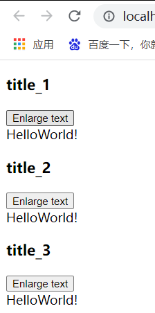

#  1. 监听子组件事件

有的时候，我们需要在子组件中添加某个事件。一旦触发该事件，需要使用父组件中的方法，改变父组件的data。但是父组件和子组件的作用域是相互隔离的，这就需要父组件监听子组件的事件。

## 1.1 明确需求，构建框架

首先明确需求：需要开发一个辅助功能来放大博文字号的组件，同时让页面的其他部分保持默认的字号。

首先，在其父组件中，我们可以通过添加一个`postFontSize`数据来支持这个功能：

```js
var vm = new Vue({
    el: "#app",
    data: {
        postFontSize: 1
    }
});
```

它可以在模板中用来控制所有博文的字号：

```html
<div id="app">
    <!--CSS绑定data，使用JS对象-->
    <div :style="{fontSize: postFontSize + 'em' }">
        <my-component v-for="post in posts" v-bind:key="post.id" v-bind:post="post">

        </my-component>
    </div>
</div>
```

现在我们在每篇博文正文前面添加一个按钮来放大字号：

```js
Vue.component(
    'my-component',
    {
        template:   '<div class="blog-post">\
                        <h3>{{ post.title }}</h3>\
                        <button>Enlarge text</button>\
                        <div v-html="post.content"></div>\
                    </div>'
    }
);
```

目前来说，该按钮还没有任何的作用：

```html
<button>Enlarge text</button>
```

## 1.2 父组件监听子组件事件

点击该按钮的时候，我们需要告诉父级组件放大所有博文的文本。在Vue中，父级组件可以通过`v-on`监听子组件实例的任何事件：

```html
<my-component ... v-on:enlarge-text="postFontSize += 0.1"></my-component>
```

上面表示父组件监听子组件实例的`enlarge-text`事件，一旦子组件触发该事件，父组件将会进行`postFontSize += 1`的操作。

## 1.3 子组件触发事件

同时子组件可以通过调用内建的`$emit`方法，来触发某个事件：

```js
Vue.component(
        'my-component',
        {
            props: ['post'],
            /*下面的内部单引号要转义*/
            template:   '<div>\
                            <h3>{{ post.title }}</h3>\
                            <button v-on:click="$emit(\'enlarge\')">Enlarge text</button>\
                            <div v-html="post.content"></div>\
                        </div>'
        }
    );
```

`<button v-on:click="$emit(\'enlarge\')">`表示子组件click时会触发了`enlarge`方法，父级组件监听到之后，会立即更新`postFontSize`的值。

## 1.4 功能测试

上面的几个功能汇总在一起，如下：

```js
Vue.component(
    'my-component',
    {
        props: ['post'],
        /*下面的内部单引号要转义*/
        template:   '<div>\
						<h3>{{ post.title }}</h3>\
						<button v-on:click="$emit(\'enlarge\')">Enlarge text</button>\
						<div v-html="post.content"></div>\
					</div>'
    }
);
var vm = new Vue({
    el: "#app",
    data: {
        postFontSize: 1,
        posts: [
            {title: "title_1", content: "HelloWorld!"},
            {title: "title_2", content: "HelloWorld!"},
            {title: "title_3", content: "HelloWorld!"}
        ]
    }
});
```

 ```html
 <div id="app">
     <div v-bind:style="{ fontSize: postFontSize + 'em' }">
         <my-component 
         	v-for="post in posts" 
             v-bind:post="post" 
             v-on:enlarge="postFontSize++">
         </my-component>
     </div>
 </div>
 ```

页面实现的效果如下：



点击按钮之后，文字的字体会放大。

# 2. 使用事件抛出一个值

## 2.1 子组件抛出值

有的时候使用一个事件来抛出一个特定的值是非常有用的。例如我们可能会想让子组件`<my-component>`自己决定文本要放大多少。我们可以使用`$emit`的第二个参数来提供这个值。

```html
<button v-on:click="$emit('enlarge-text', 0.1)">
    Enlarge text
</button>
```

## 2.2 父组件获取值

当在父组件监听这个事件的时候，我们可以通过`$event`访问到被子组件抛出的值：

```html
<my-componnet ... v-on:enlarge-text="postFontSize += $event">
</my-component>
```

如果父组件的事件处理函数是一个定义的方法：

```html
<my-component ... v-on:enlarge-text="onEnlargeText">
</my-component>
```

那么这个值将会作为第一个参数传入该方法：

```js
methods: {
    onEnlargeText: function (enlargeAmount) {
        this.postFontSize += enlargeAmount
    }
}
```

# 3. 在自定义组件上使用`v-model`

## 3.1 `v-model`的本质

我们始终都需要记住`v-model`的本质：

```html
<input v-model="searchText">
```

等价于：

```html
<input
	v-bind:value="searchText"
	v-on:input="searchText = $event.target.value"
>
```

其中，`input`事件会在用户输入时触发，即`<input>`或`<textarea>`元素的值发生改变时触发。

## 3.2 `v-model`在自定义组件中的使用

为了让`v-model`能够在自定义的组件里正常使用，这个组件内的`<input>`必须：

- 将其`value`attribute绑定到一个data上。
- 在其`input`事件触发时，将新的值通过自定义的`input`事件抛出。

写成代码之后是下面这样的：

```js
Vue.component('custom-input', {
  props: ['value'],
  template: `
    <input
      v-bind:value="value"
      v-on:input="$emit('input', $event.target.value)"
    >
  `
})
```

这样`v-model`就可以在这个组件上完美地工作了：

```html
<custom-input v-model="searchText"></custom-input>
```


