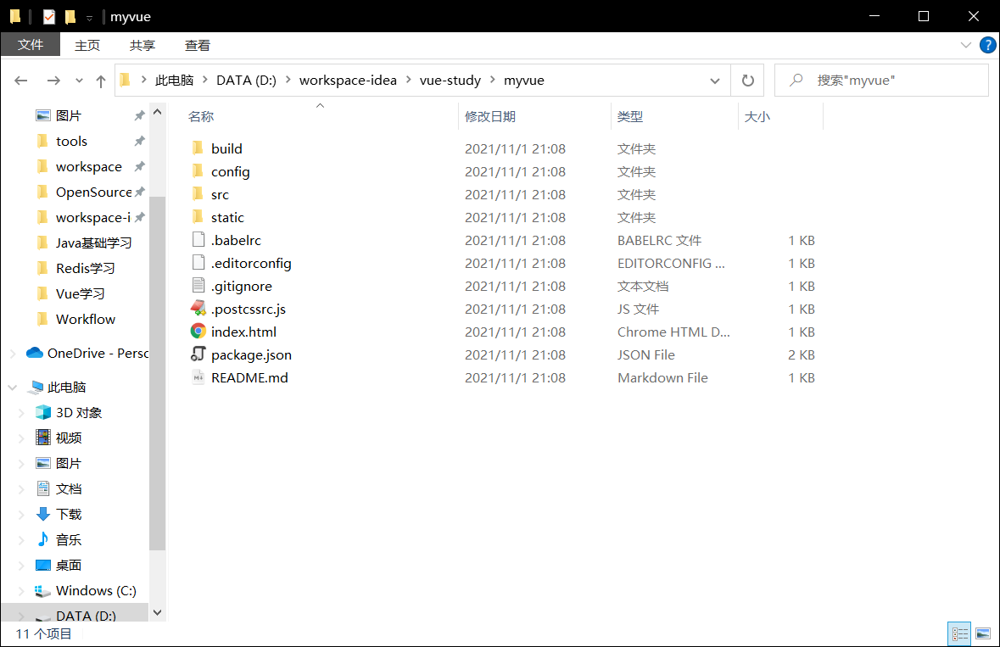

# 1. 什么是Vue CLI

Vue CLI 是一个基于 Vue.js 进行快速开发的完整系统，用于快速生成一个Vue的项目模板，提供：

- 通过`@vue/cli`实现的交互式项目脚手架。
- 通过`@vue/cli`+`@vue/cli-service-global`实现的零配置原型开发。
- 一个运行时依赖 `@vue/cli-service`，该依赖：
  - 可升级；
  - 基于 webpack 构建，并带有合理的默认配置；
  - 可以通过项目内的配置文件进行配置；
  - 可以通过插件进行扩展。
- 一个丰富的官方插件集合，集成了前端生态中最好的工具。
- 一套完全图形化的创建和管理 Vue.js 项目的用户界面.

Vue CLI 致力于将 Vue 生态中的工具基础标准化。它确保了各种构建工具能够基于智能的默认配置即可平稳衔接，这样你可以专注在撰写应用上，而不必花好几天去纠结配置的问题。与此同时，它也为每个工具提供了调整配置的灵活性，无需 eject。


# 2. 需要的环境

- Node.js：[https://nodejs.org/zh-cn/](https://nodejs.org/zh-cn/)

- git：[https://git-scm.com/](https://git-scm.com/)

确认Node.js安装成功：

- cmd下输入`node -v`，查看是否能够正确打印出版本号
- cmd下输入`npm -v`，查看是否能够正确打印出版本号（npm为软件包管理工具，和Linux的apt软件安装差不多）


## 2.1 安装淘宝镜像加速器cnpm

安装完Node.js后，还需要安装Node.js的淘宝镜像加速器cnpm，这样下载就会快很多，但我们平时需要尽量少用cnpm。

```shell
# -g指全局安装
npm install cnpm -g

# 或每次安装时使用下面的语句解决npm下载速度慢的问题
npm install --registry=http://registry.npm.taobao.org
```


安装的位置为：c:\Users\用户名\AppData\Roaming\npm


## 2.2 安装Vue CLI

现在（2021年11月2日）Vue CLI版本已经更新到了4.5.14，但是也可以使用4.x的版本来构建低版本的Vue项目，本教程针对的是Vue CLI 2.x。

```shell
cnpm install -g @vue/cli
```

安装完成后，我们可以使用`vue -V`来查看是否安装Vue CLI成功。


# 3. 第一个Vue CLI应用程序

## 3.1 新建一个空的文件夹作为项目目录


## 3.2 创建一个基于webpack模板的Vue应用程序

官网的介绍如下：


我们在新建的文件夹中打开cmd，输入以下命令创建一个基于webpack模板的Vue项目：

```shell
# 这里的myvue是项目名称
vue init webpack myvue
```

输入命令回车之后可能会出现以下提示：


这时需要使用`npm install -g @vue/cli-init`指令来安装`@vue/cli-init`插件：


之后就可以进行交互式的Vue项目创建了。交互式创建会跳出几个选项让我们选择：

- **Project name (myvue)**：项目名称，直接回车，按照括号中默认名字（注意这里的名字不能有大写字母，如果有会报错Sorry, name can no longer contain capital letters），阮一峰老师博客[为什么文件名要小写](https://link.jianshu.com?t=http://www.ruanyifeng.com/blog/2017/02/filename-should-be-lowercase.html)，可以参考一下。
- **Project description (A Vue.js project)**：项目描述，也可直接点击回车，使用默认名字

- **Author**：作者，输入作者名或者直接回车都可以。

- 选项选择，我们可以使用方向键和回车选择选项：
  - **Runtime + Compiler: recommended for most users**：运行加编译，既然已经说了推荐，就选它了
  - **Runtime-only: about 6KB lighter min+gzip, but templates (or any Vue-specificHTML) are ONLY allowed in .vue files - render functions are required elsewhere**：仅运行时，已经有推荐了就选择第一个了
- **Install vue-router? (y/n)**：是否安装vue-router，这是官方的路由，大多数情况下都使用，这里就输入“y”后回车即可。
- **Use ESLint to lint your code? (y/n)**：是否使用ESLint管理代码，ESLint是个代码风格管理工具，是用来统一代码风格的，一般项目中都会使用。
- **Set up unit tests(y/n)**：是否安装单元测试。我们这里填否，项目中一般会使用。
- **Setup e2e tests with Nightwatch(y/n)?** ：是否安装e2e测试 ，我选择安装y回车。
- **Should we run ‘npm install’ for you after ther project has been created? (recommend)(y/n)**：是否在项目创建完成后运行`npm install`来安装项目的所有依赖，一般这里选y，但是学习选n。


`Vue CLI 3`生成的Vue项目结构如下：



## 3.3 初始化并运行Vue项目

```shell
# 我们需要使用cd命令移动到Vue项目目录
cd myvue

# 安装项目的所有依赖环境
cnpm install

#运行项目
npm run dev
```

安装项目的所有依赖环境后，我们可以使用`npm run dev`运行该项目。


启动Vue项目之后，我们可以通过url`http://localhost:8080`来访问该Vue项目：


# 4. Vue项目结构

我们可以使用IntelliJ IDEA打开`@vue/cli`创建的Vue项目。使用`@vue/cli`工具构建的Vue项目的结构如下：


可以在终端（Terminal）中输入`npm run dev`运行Vue项目（IntelliJ IDEA必须以管理员身份打开）：


如果本地调试项目时，建议将`config/index.js`里的`assetsPublicPath`的路径前缀修改为 ' ./ '（开始是 ' / '），因为打包之后，外部引入 js 和 css 文件时，如果路径以 ' / ' 开头，在本地是无法找到对应文件的（服务器上没问题）。所以**如果需要在本地打开打包后的文件**，就得修改文件路径。


# 5. 在谷歌浏览器安装vue-devtools

vue-devtools是一款谷歌插件，可以在开发者工具中进行Vue的调试。

下载地址：[https://chrome.pictureknow.com/extension?id=d50143a5f53d406dbe992277bfc90521](https://chrome.pictureknow.com/extension?id=d50143a5f53d406dbe992277bfc90521)

下载之后将其加载到谷歌插件栏中，即可使用。我们在打开Vue开发的网页后，点击“F12”进入开发者工具，选择“Vue”即可点击之后就可以看见当前页面vue对象的一些信息。


