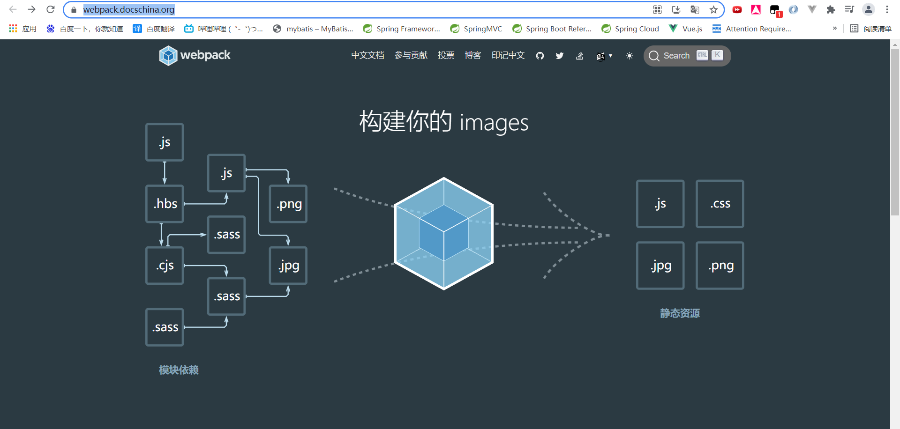
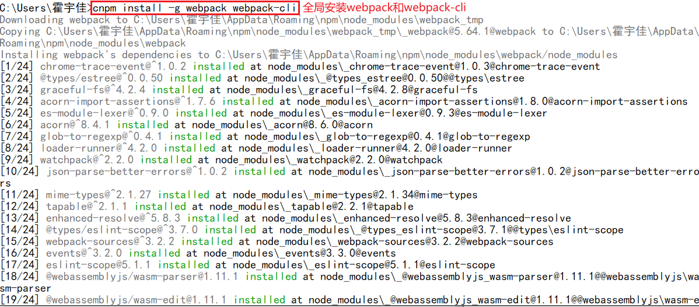
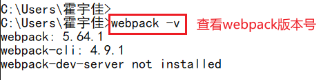
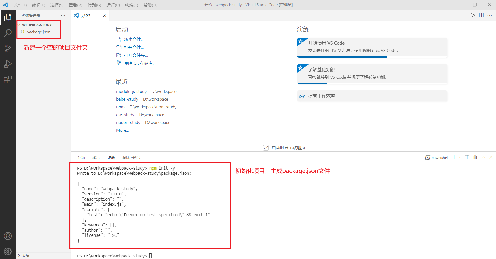
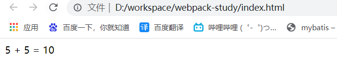
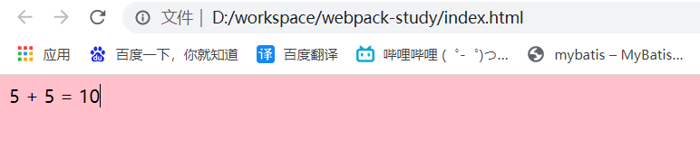

# 1. 模块化的演进

## 1.1 Script标签

```html
<script src="module1.js"></script>
<script src="module2.js"></script>
<script src="module3.js"></script>
<script src="module4.js"></script>
```

这是最原始的JavaScript文件加载方式，如果把一个文件看成一个模块，那么它们的接口通常暴露在全局的作用域下，也就是定义在window对象中，不同模块的调用都是同一个作用域。

这种原始的加载方式暴露了一些弊端：

- 全局作用域容易造成变量的冲突。
- 文件只能按照\<script>的书写顺序进行加载。
- 开发人员必须主观解决模块和代码库的依赖关系。
- 在大型项目中各种资源难以管理。

## 1.2 CommonJS

服务器的Node.js遵循CommonJS规范，核心思想是允许模块通过`require`方法来同步加载所需依赖的其他模块，然后通过`exports`或`module.exports`来导出需要暴露的接口。

```js
require("module");
require("../module.js");
exports.doStuff = function(){};
module.exports = someValue;
```

优点：

- 服务器端模块便于重用。
- NPM中已经有超过45万个可以使用的模块包。
- 简单易用。

缺点：

- 同步的模块加载方式不适合在浏览器环境中，同步意味着阻塞加载，浏览器资源是异步加载的。
- 不能非阻塞地并行加载多个模块。

## 1.3 AMD

Asynchronous Module Definition（AMD）规范主要包括一个接口`define(id?, dependency?, factory)`，它要在声明模块的时候指定所有的依赖dependencies，并且还要当作形参传入factory中，对于依赖的模块提前执行。

```js
define("module", ["dep1", "dep2"], function(d1, d2){
    return someExportedValue;
});

require(["module", "../file.js"], function(module, file){});
```

优点：

- 适合在浏览器环境中异步加载模块
- 可以并行加载多个模块

缺点：

- 提高了开发的成本，代码的阅读和书写比较困难，模块定义的语义不畅
- 不符合通用的模块化思维模式

## 1.4 CMD

Common Module Definition规范和AMD很类似，尽量保持简单，并于CommonJS和Node.js的规范保持了很大的兼容性。

```js
define(function(require, exports, module){
    var $ = require("jquery");
    var Spinning = require("./spinning");
    exports.doSomething = ...;
    module.exports = ...;
});
```

优点：

- 依赖就近，延迟执行
- 可以很容易在Node.js中运行

缺点：

- 依赖SPM打包，模块的加载逻辑偏重

## 1.5 ES6模块

EcmaScript 6标准增加了JavaScript语言层面的模块体系定义。ES6模块的设计思想，是尽量静态化，使编译的时候就能确定模块的依赖关系，以及输入和输出的变量。CommonJS和AMD模块都只能在运行时确定。

```js
import "jquery";
export function(){}
module "localModule"{}
```

优点：

- 容易进行静态分析
- 面向未来的EcmaScript

缺点：

- 原生浏览器端还没有实现该标准
- 全新的命令，新版的Node.js才支持

# 2. 什么是webpack

官方网址：[https://webpack.docschina.org/](https://webpack.docschina.org/)



本质上，webpack是一个用于现代JavaScript应用程序的**静态模块打包工具**。当webpack处理应用程序时，它会在内部从一个或多个入口点构建一个**依赖图（dependency graph）**，然后将项目中所需的每一个模块组合成一个或多个bundles，它们均为静态资源，用于展示你的内容。

从 v4.0.0 开始，webpack 可以不用再引入一个配置文件来打包项目，然而，它仍然有着高度可配置性，可以很好满足你的需求。

# 3. webpack安装

1. 全局安装

   ```shell
   cnpm install -g webpack webpack-cli
   ```

   

2. 安装后查看版本号

   ```shell
   webpack -v
   ```

   

# 4. 初始化项目

1. 创建`webpack-study`文件夹，并使用`npm init -y`初始化项目

   

2. 创建一个`src`文件夹，用于存放源文件

3. `src`文件夹下新建`common.js`

   ```js
   /*导出info方法*/
   exports.info = function(info){
       /* 浏览器窗口输出info */
       document.write(info);
   }
   ```

4. `src`文件夹下新建`util.js`

   ```js
   /*导出add方法*/
   exports.add = function(a, b){
       return a + b;
   }
   ```

5. `src`文件夹下新建`main.js`，作为入口

   ```js
   /* 导入模块 */
   const common = require("./common");
   const util = require("./util");
   
   common.info("5 + 5 = " + util.add(5, 5));
   ```

# 5. JS打包

1. 根目录下创建配置文件`webpack.config.js`

   ```js
   const path = require("path"); //Node.js内置模块
   module.exports = {
       entry: './src/main.js', //配置入口文件
       output: {
           path: path.resolve(__dirname, './dist'), //输出路径，__dirname：当前文件所在路径
           filename: 'bundle.js' //输出文件
       }
   }
   ```

   以上配置的意思是：读取当前项目目录下`src`文件夹中的`main.js`（入口文件）内容，分析资源依赖，把相关的js文件打包，打包后的文件放入当前目录的`dist`文件夹（==通常把src打包或者编译生成的目录称为`dist`分发目录==）下，打包后的js文件名为`bundle.js`。

2. 命令行执行编译命令

   我们可以使用`webpack`工具将`common.js`、`util.js`、`main.js`合并为一个`bundle.js`文件。

   ```shell
   webpack
   ```

3. 根目录下创建`index.html`，引用`bundle.js`

   ```html
   <!DOCTYPE html>
   <html lang="en">
   <head>
       <meta charset="UTF-8">
       <meta http-equiv="X-UA-Compatible" content="IE=edge">
       <meta name="viewport" content="width=device-width, initial-scale=1.0">
       <title>Document</title>
   </head>
   <body>
       <script src="./dist/bundle.js"></script>
   </body>
   </html>
   ```

4. 浏览器中测试

   

# 6. CSS打包

1. 安装`style-loader`和`css-loader`

   `webpack`只能理解JavaScript和JSON文件，这是`webpack`开箱可用的自带能力。**loader**让 webpack 能够去处理其他类型的文件，并将它们转换为有效[模块](https://webpack.docschina.org/concepts/modules)，以供应用程序使用，以及被添加到依赖图中。

   > Warning
   >
   > webpack 的其中一个强大的特性就是能通过 `import` 导入任何类型的模块（例如 `.css` 文件），其他打包程序或任务执行器的可能并不支持。我们认为这种语言扩展是很有必要的，因为这可以使开发人员创建出更准确的依赖关系图。

   在更高层面，在 webpack 的配置中，**loader**有两个属性：

   1. `test` 属性，识别出哪些文件会被转换。
   2. `use` 属性，定义出在进行转换时，应该使用哪个 loader。

   ------

   首先我们需要安装相关Loader插件

   ```shell
   npm install --save-dev style-loader css-loader
   ```

   - `css-loader`是将CSS装载到JavaScrip
   - `style-loader`是让JavaScript认识CSS

2. 修改`webpack.config.js`

   ```js
   const path = require("path"); //Node.js内置模块
   module.exports = {
       //...,
       output:{
           //其他配置
       },
       module: {
           rules: [  
               {  
                   test: /\.css$/,    //打包规则应用到以css结尾的文件上，正则表达式无需添加引号
                   use: ['style-loader', 'css-loader'] 
               }  
           ]  
       }
   }
   ```

   **注意：loader 从右到左（或从下到上）地取值(evaluate)/执行(execute)。上面use内loader的顺序不能调换，因为需要先让JavaScript加载CSS，然后再让JavaScript认识CSS。**

   > ###### Warning
   >
   > 重要的是要记住，在 webpack 配置中定义 rules 时，要定义在 `module.rules` 而不是 `rules` 中。为了使你便于理解，如果没有按照正确方式去做，webpack 会给出警告。

3. 在`src`目录下创建`style.css`

   ```css
   body{
       background:pink;
   }
   ```

4. 修改`main.js`，在第一行引入`style.css`

   ```js
   require('./style.css');
   ```

5. 使用`webpack`指令重新打包

6. 在浏览器里面进行测试

   

