# 1. 什么是Vue Router

官方网址：[https://router.vuejs.org/zh/](https://router.vuejs.org/zh/)

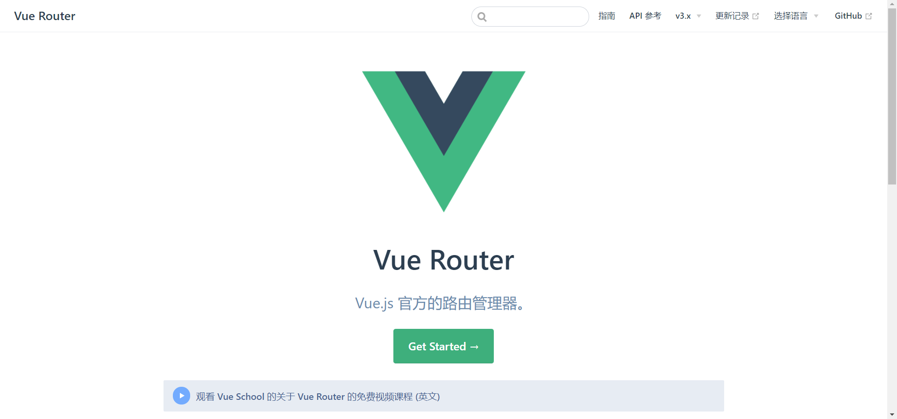

Vue Router是Vue.js官方的路由管理器，类似于Java后端的Servlet。它和Vue.js的核心深度集成，让构建单页面应用变得易如反掌。包含的功能有：

- 嵌套的路由/视图表
- 模块化的、基于组件的路由配置
- 路由参数、查询、通配符
- 基于Vue.js过渡系统的视图过渡效果
- 细粒度的导航控制
- 带有自动激活的CSS class的链接
- HTML5历史模式或hash模式，在IE9中自动降级
- 自定义的滚动条行为

# 2. 安装Vue Router

```shell
cnpm install vue-router --save-dev
```

`--save-dev`表示是在开发环境导入Vue Router。

如果在一个模块化工程中使用它，必须要通过 `Vue.use()` 明确地安装路由功能：

```js
import Vue from 'vue'
import VueRouter from 'vue-router'

Vue.use(VueRouter)
```

如果使用全局的 script 标签，则无须如此 (手动安装)：

```html
<script src="https://unpkg.com/vue-router/dist/vue-router.js"></script>
```

# 3. 初步使用Vue Router

## 3.1 HTML

以Vue CLI生产的脚手架为例，我们在`./src/App.vue`的`<template>`标签里面编写前端代码。

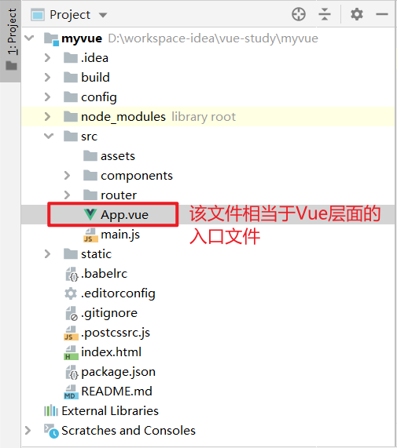

> App.vue

```vue
<template>
  <div id="app">
    <p>HelloWorld</p>
    <p>
      <!-- 使用 router-link 组件来导航. -->
      <!-- 通过传入 `to` 属性指定链接. -->
      <!-- <router-link> 默认会被渲染成一个 `<a>` 标签 -->
      <router-link to="/main">首页</router-link>
      <router-link to="/content">内容页</router-link>
    </p>
    <!-- 路由出口 -->
    <!-- 路由匹配到的组件将渲染在这里 -->
    <router-view></router-view>
  </div>
</template>

<script>
  export default {
    name: 'App',
    components: {}
  }
</script>

<style>
  #app {
    font-family: 'Avenir', Helvetica, Arial, sans-serif;
    -webkit-font-smoothing: antialiased;
    -moz-osx-font-smoothing: grayscale;
    text-align: center;
    color: #2c3e50;
    margin-top: 60px;
  }
</style>
```

在上面的例子中，我们使用`<router-link>`组件来导航，通过`to`属性指定该组件指向的链接。Vue会自动把该组件渲染为一个`<a>`标签。

除此之外，我们还需在该页面指定一个路由出口`<router-view>`，Vue Router匹配到的组件将会被渲染到此处。

**注意：Vue Router类似于Java后端的Servlet，也是通过url来匹配。只不过Servlet是指定处理请求的Java类，而Vue Router是指定路由对应的组件。如果我们不指定路由出口，那匹配到的组件没有地方显示，这与路由的初衷是相背离的。**

## 3.2 Component

由3.1小节的最后可以知道，Vue Router是指定路由对应的组件，因此在本小节介绍我们的自定义组件。

Vue CLI脚手架中，我们编写的自定义组件通常在`./src/component`目录下。

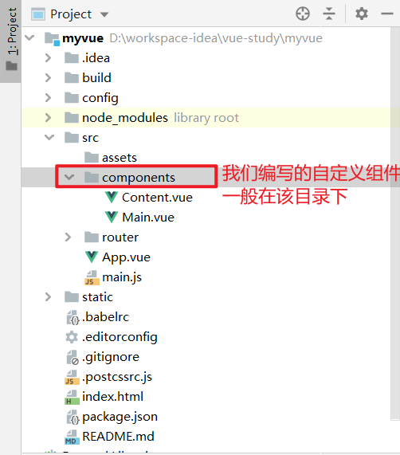

> Content.vue

```vue
<template>
  <h1>内容页</h1>
</template>

<script>
    export default {
        name: "content"
    }
</script>

<style scoped>

</style>
```

> Main.vue

```vue
<template>
    <h1>首页</h1>
</template>

<script>
    export default {
        name: "Main"
    }
</script>

<style scoped>

</style>
```

## 3.3 JavaScript

在Vue CLI生成的Vue开发框架中，一个文件夹所定义的入口文件通常使用`index.js`来命名，如`./config/index.js`。

因此，我们新建一个`./router/index.js`文件来定义路由器。

> index.js

```js
/*如果使用模块化机制编程，导入Vue和VueRouter
* 同时还需导入我们编写的自定义组件*/
import Vue from 'vue'
import VueRouter from 'vue-router'
import Content from "../components/Content";
import Main from "../components/Main";

/*安装使用路由*/
Vue.use(VueRouter);

/*以下包括定义路由、创建router实例、导出模块，我们也可以将这几步分开进行*/
export default new VueRouter({
  routes: [
    /*每个路由都相当于一个实例，应该映射一个组件*/
    {
      path: '/content',
      component: Content
    },
    {
      path: '/main',
      component: Main
    }
  ]
})
```

在上面这个例子中，我们需要导入Vue、Vue Router以及我们的自定义组件。然后，需要在Vue中安装使用路由，并通过new一个Vue Router实例来定义路由。最后导出模块。

## 3.4 通过router配置参数注入路由

创建和挂载根实例的时候，记得要通过 router 配置参数注入路由，从而让整个应用都有路由功能。

在Vue CLI搭建的脚手架中，`./src/main.js`创建和挂载根实例。

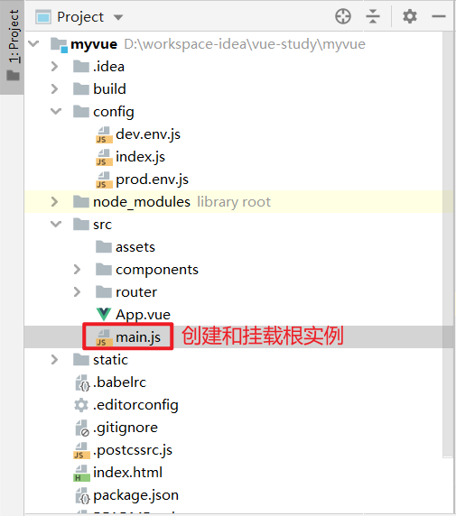

> main.js

```js
import Vue from 'vue'
import App from './App'
/*引入router模块*/
import index from "./router";

Vue.config.productionTip = false

/* eslint-disable no-new */
new Vue({
  el: '#app',
  /*我们需要router参数来注入路由*/
  router: index,
  components: { App },
  template: '<App/>'
})
```

## 3.5 路由的显示效果

我们在项目的根目录下运行`npm run dev`运行该Vue项目，测试路由的显示效果。

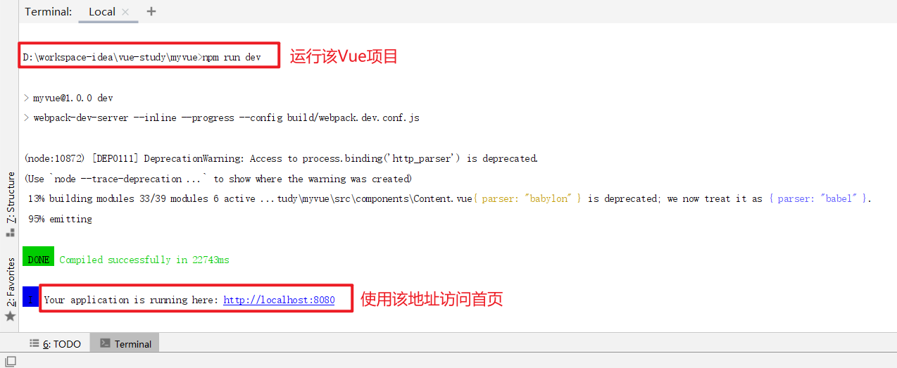

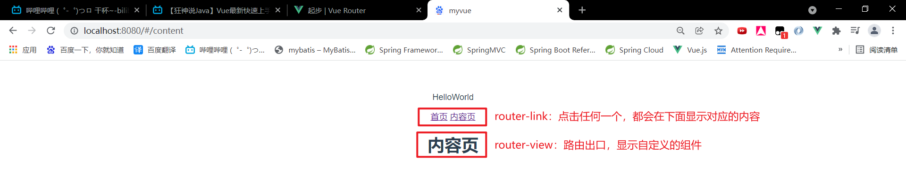

# 4. 嵌套路由

实际生活中的应用界面，通常由多层嵌套的组件组合而成。同样地，URL中各段动态路径也按某种结构对应嵌套的各层组件，例如：

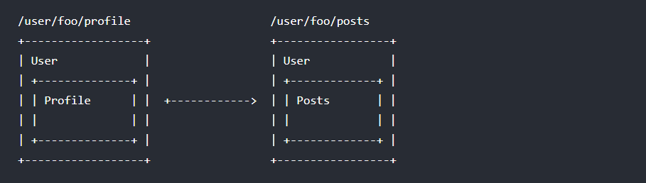

借助 `vue-router`，使用嵌套路由配置，就可以很简单地表达这种关系。一个被渲染组件同样可以包含自己的嵌套 `<router-view>`。

以`3.2 Component`小节为例，我们修改`Content.Vue`的内容，例如在 `Content` 组件的模板添加一个 `<router-view>`：

> Content.vue

```vue
<template>
	<h1>内容页</h1>
	<!--组件里面再添加路由-->
	<route-view></route-view>
</template>

<script>
    export default {
        name: "content"
    }
</script>

<style scoped>

</style>
```

要在嵌套的出口中渲染组件，我们需要修改路由配置文件`./src/route/index.js`，在 `VueRouter` 的参数中使用 `children` 配置：

> index.js

```js
/*如果使用模块化机制编程，导入Vue和VueRouter
* 同时还需导入我们编写的自定义组件*/
import Vue from 'vue'
import VueRouter from 'vue-router'
import Content from "../components/Content";
import Main from "../components/Main";
import Childen_1 from "../components/Childen_1";
import Childen_2 from "../components/Childen_2";

/*安装使用路由*/
Vue.use(VueRouter);

/*以下包括定义路由、创建router实例、导出模块，我们也可以将这几步分开进行*/
export default new VueRouter({
  routes: [
    /*每个路由都相当于一个实例，应该映射一个组件*/
    {
      path: '/content',
      component: Content,
      /* 子路由配置，最好使用相对路径 */
      children: [
        {
          path: "children_1",
          component: Childen_1
        },
        {
          path: "children_2",
          component: Childen_2
        }
      ]
    },
    {
      path: '/main',
      component: Main
    }
  ]
})

```

> Children_1.vue

```vue
<template>
  <p>childen_1</p>
</template>

<script>
    export default {
        name: "Childen_1"
    }
</script>

<style scoped>

</style>
```

> Children_2.vue

```vue
<template>
  <p>childen_2</p>
</template>

<script>
    export default {
        name: "Childen_1"
    }
</script>

<style scoped>

</style>
```

**要注意，以 `/` 开头的嵌套路径会被当作根路径。 这让你充分的使用嵌套组件而无须设置嵌套的路径。**

你会发现，`children` 配置就是像 `routes` 配置一样的路由配置数组，所以呢，你可以嵌套多层路由。

此时，基于上面的配置，当你访问 `/Content` 时，出口是不会渲染任何东西，这是因为没有匹配到合适的子路由。如果你想要渲染点什么，可以提供一个空的子路由。

只有我们访问`/content/children_1`或者`/content/children_2`时，才会正常显示。

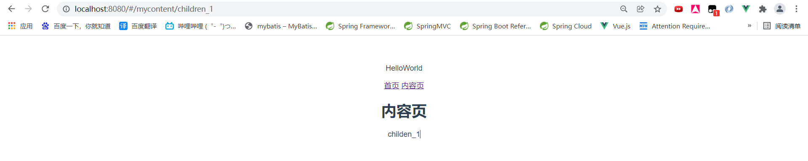

# 5. 路由组件传参

假如我们有一个 `User` 组件，对于所有ID各不相同的用户，都要使用这个组件来渲染。那么，我们可以在 `vue-router` 的路由路径中使用**动态路径参数（dynamic segment） **来达到这个效果：

> ./src/route/index.js

```js
import Vue from 'vue'
import VueRouter from 'vue-router'
import User from "../components/User";

Vue.use(VueRouter);

export default new VueRouter({
  routes: [
    {
      /* 动态路径参数以冒号开头 */
      path: "/user/:id",
      component: User
    }
  ]
})
```

现在呢，像 `/user/foo` 和 `/user/bar` 都将映射到该路由。一个“路径参数”使用冒号 `:` 标记。

## 5.1 使用$route.params接收参数

当匹配到一个路由时，参数值会被设置到 `this.$route.params`，可以在每个组件内使用。于是，我们可以更新 `User` 的模板，输出当前用户的 ID：

> ./src/component/User.vue

```vue
<template>
	/* 参数值会被设置到 this.$route.params */
    <div>user：{{$route.params.id}}</div>
</template>

<script>
    export default {
        name: "User"
    }
</script>

<style scoped>

</style>
```

通过`npm run dev`启动项目之后，我们在地址栏输入`http://localhost:8080/#/user/1`，即可看到如下内容

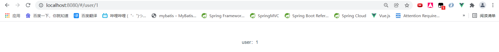

## 5.2 使用props接收参数

在组件中使用 `$route` 会使之与其对应路由形成高度耦合，从而使组件只能在某些特定的 URL 上使用，限制了其灵活性。我们可以使用 `props` 将组件和路由解耦。

### 5.2.1 布尔模式

这种方法适用于参数是动态的（用户来决定），使用RESTFul风格传入参数，与5.1小节类似。

如果路由的配置中 `props` 被设置为 `true`，`route.params` 将会被设置为组件属性。

> ./src/route/index.js

```js
import Vue from 'vue'
import VueRouter from 'vue-router'
import User from "../components/User";

Vue.use(VueRouter);

export default new VueRouter({
  routes: [
    {
      path: "/user/:id",
      component: User,
      /* props属性设置为true */
      props: true
    }
  ]
})
```

之后我们可以通过组件属性接收：

> ./src/component/User.vue

```vue
<template>
  <div>user: {{id}}</div>
</template>

<script>
  export default {
    /* 直接通过组件属性接收，属性名与路径冒号跟的内容相同 */
    props: ['id'],
    name: "User",
  }
</script>

<style scoped>

</style>
```

### 5.2.2 对象模式

这种方法适用于参数是静态（由程序员决定）的情况。

如果 `props`是一个对象，它会被按原样设置为组件属性。当 `props`是静态（由程序员决定而不是由用户决定）的时候有用。

> ./src/route/index.js

```js
import Vue from 'vue'
import VueRouter from 'vue-router'
import User from "../components/User";

Vue.use(VueRouter);

export default new VueRouter({
  routes: [
    {
      /* 由于参数是静态的，因此没有必要再用动态路径参数的形式了 */
      path: "/user",
      component: User,
      /* 对象模式，仅当props为静态时使用 */
      props: {name: '张三', age: '13'}
    }
  ]
})
```

之后通过组件属性进行参数的接收：

> ./src/component/User.vue

```vue
<template>
  <div>user: {{name}}-{{age}}</div>
</template>

<script>
  export default {
    props: ['name', 'age'],
    name: "User",
  }
</script>

<style scoped>

</style>
```

### 5.2.3 函数模式

这种方法适用于使用get方式传递的参数，例如URL为`http://localhost:8080/#/user?name=bob&age=23`的情况。可以创建一个函数返回 `props`。

> ./src/route/index.js

```js
import Vue from 'vue'
import VueRouter from 'vue-router'
import User from "../components/User";

Vue.use(VueRouter);

export default new VueRouter({
  routes: [
    {
      path: "/user",
      component: User,
      /* 函数模式，适用于参数通过GET的方式传递 */
      props: route => ({
        name: route.query.name,
        age: route.query.age
      })
    }
  ]
})
```

URL为`http://localhost:8080/#/user?name=bob&age=23`时，可以通过组件属性进行参数的接收：

> ./src/component/User.vue

```vue
<template>
  <div>user: {{name}}-{{age}}</div>
</template>

<script>
  export default {
    props: ['name', 'age'],
    name: "User",
  }
</script>

<style scoped>

</style>
```

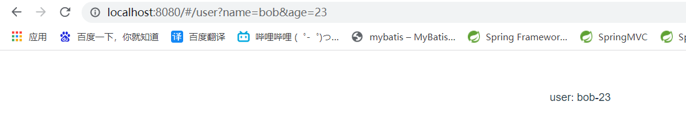

# 6. 重定向与别名

## 6.1 重定向

重定向也是通过 `routes` 配置来完成，下面例子是从 `/a` 重定向到 `/b`：

```js
export default new VueRouter({
  routes: [
    { path: '/a', redirect: '/b' }
  ]
})
```

重定向的目标也可以是一个命名的路由：

```js
export default new VueRouter({
  routes: [
    { path: '/a', redirect: { name: 'foo' }}
  ]
})
```

甚至是一个方法，动态返回重定向目标：

```js
export default new VueRouter({
  routes: [
    { path: '/a', redirect: to => {
      // 方法接收 目标路由 作为参数
      // return重定向的字符串路径或者路径对象
    }}
  ]
})
```

## 6.2 别名

“重定向”的意思是，当用户访问 `/a`时，URL 将会被替换成 `/b`，然后匹配路由为 `/b`，那么“别名”又是什么呢？

`/a` 的别名是 `/b`，意味着当用户访问 `/b` 时，URL 会保持为 `/b`，但是路由匹配则为 `/a`，就像用户访问 `/a` 一样。

上面对应的路由配置为：

```js
const router = new VueRouter({
  routes: [
    { path: '/a', component: A, alias: '/b' }
  ]
})
```

“别名”的功能让你可以自由地将UI结构映射到任意的 URL，而不是受限于配置的嵌套路由结构。

# 7. 路由模式

`vue-router`的路由模式有两种：

- **hash：**路径带#符号，如`http://localhost/#/login`
- **history：**路径不带#符号，如：`http://localhost/login`

默认 hash 模式 —— 使用 URL 的 hash 来模拟一个完整的 URL，于是当 URL 改变时，页面不会重新加载。

如果不想要很丑的 hash，我们可以用路由的 **history 模式**，这种模式充分利用 `history.pushState` API 来完成 URL 跳转而无须重新加载页面。

> ./src/route/index.js

```js
...
export default new VueRouter({
  mode: 'history',
  routes: [...]
})
```

# 8. 404页面

你应该在 Vue 应用里面覆盖所有的路由情况，然后再给出一个 404 页面。

```js
const router = new VueRouter({
  mode: 'history',
  routes: [
    { path: '*', component: NotFoundComponent }
  ]
})
```

或者，如果你使用 Node.js 服务器或者后端的Java服务器，你可以用服务端路由匹配到来的 URL，并在没有匹配到路由的时候返回 404，以实现回退。

# 9. 导航守卫

导航表示路由正在发生改变。

正如其名，`vue-router` 提供的导航守卫主要用来通过**跳转或取消**的方式守卫导航。有多种机会植入路由导航过程中：全局的，单个路由独享的，或者组件级的。

记住**参数或查询的改变并不会触发进入/离开的导航守卫**。你可以通过[观察$route对象](https://router.vuejs.org/zh/guide/essentials/dynamic-matching.html#响应路由参数的变化)来应对这些变化，或使用 `beforeRouteUpdate` 的组件内守卫。

## 9.1 守卫方法的参数

每个守卫方法接收三个参数：

- **to: Route**: 即将要进入的目标[路由对象](https://router.vuejs.org/zh/api/#路由对象)
- **from: Route**: 当前导航正要离开的路由
- **next: Function**: 一定要调用该方法来 **resolve** 这个钩子。执行效果依赖 `next` 方法的调用参数。
  - **next()**: 进行管道中的下一个钩子。如果全部钩子执行完了，则导航的状态就是 **confirmed** (确认的)。
  - **next(false)**: 中断当前的导航。如果浏览器的 URL 改变了 (可能是用户手动或者浏览器后退按钮)，那么 URL 地址会重置到 `from` 路由对应的地址。
  - **next('/')或者 next({ path: '/' })**: 跳转到一个不同的地址。当前的导航被中断，然后进行一个新的导航。你可以向 `next` 传递任意位置对象，且允许设置诸如 `replace: true`、`name: 'home'` 之类的选项以及任何用在[`router-link` 的 `to` prop](https://router.vuejs.org/zh/api/#to) 或 [`router.push`](https://router.vuejs.org/zh/api/#router-push) 中的选项。
  - **next(error)**: (2.4.0+) 如果传入 `next` 的参数是一个 `Error` 实例，则导航会被终止且该错误会被传递给 [`router.onError()`](https://router.vuejs.org/zh/api/#router-onerror) 注册过的回调。

**确保 `next` 函数在任何给定的导航守卫中都被严格调用一次。它可以出现多于一次，但是只能在所有的逻辑路径都不重叠的情况下，否则钩子永远都不会被解析或报错**。

## 9.2 全局前置守卫

你可以使用`router.beforeEach`注册一个全局前置守卫：

```js
const router = new VueRouter({ ... })

router.beforeEach((to, from, next) => {
  // ...
})
```

当一个导航触发时，全局前置守卫按照创建顺序调用。守卫是异步解析执行，此时导航在所有守卫 resolve 完之前一直处于**等待中**。

这里有一个在用户未能验证身份时重定向到 `/login` 的示例：

```js
router.beforeEach((to, from, next) => {
  if (to.name !== 'Login' && !isAuthenticated) next({ name: 'Login' })
  else next()
})
```

## 9.3 全局解析守卫

在2.5.0+，你可以用 `router.beforeResolve` 注册一个全局守卫。这和 `router.beforeEach` 类似，区别是在导航被确认之前，**同时在所有组件内守卫和异步路由组件被解析之后**，解析守卫就被调用。

## 9.4 路由独享的守卫

你可以在路由配置上直接定义 `beforeEnter` 守卫：

```js
const router = new VueRouter({
  routes: [
    {
      path: '/foo',
      component: Foo,
      beforeEnter: (to, from, next) => {
        // ...
      }
    }
  ]
})
```

这些守卫与全局前置守卫的方法参数是一样的。

## 9.5 组件内的守卫

最后，你可以在路由组件内直接定义以下路由导航守卫：

- beforeRouteEnter
- beforeRouteUpdate（2.2 新增）
- beforeRouteLeave

```js
const Foo = {
  template: `...`,
  beforeRouteEnter(to, from, next) {
    // 在渲染该组件的对应路由被 confirm 前调用
    // 不！能！获取组件实例 `this`
    // 因为当守卫执行前，组件实例还没被创建
  },
  beforeRouteUpdate(to, from, next) {
    // 在当前路由改变，但是该组件被复用时调用
    // 举例来说，对于一个带有动态参数的路径 /foo/:id，在 /foo/1 和 /foo/2 之间跳转的时候，
    // 由于会渲染同样的 Foo 组件，因此组件实例会被复用。而这个钩子就会在这个情况下被调用。
    // 可以访问组件实例 `this`
  },
  beforeRouteLeave(to, from, next) {
    // 导航离开该组件的对应路由时调用
    // 可以访问组件实例 `this`
  }
}
```

`beforeRouteEnter` 守卫**不能**访问 `this`，因为守卫在导航确认前被调用，因此即将登场的新组件还没被创建。不过，你可以通过传一个回调给 `next`来访问组件实例。在导航被确认的时候执行回调，并且把组件实例作为回调方法的参数。

```js
beforeRouteEnter (to, from, next) {
  next(vm => {
    // 通过 `vm` 访问组件实例
  })
}
```

注意 `beforeRouteEnter` 是支持给 `next` 传递回调的唯一守卫。对于 `beforeRouteUpdate` 和 `beforeRouteLeave` 来说，`this` 已经可用了，所以**不支持**传递回调，因为没有必要了。

```js
beforeRouteUpdate (to, from, next) {
  // just use `this`
  this.name = to.params.name
  next()
}
```

这个离开守卫通常用来禁止用户在还未保存修改前突然离开。该导航可以通过 `next(false)` 来取消。

```js
beforeRouteLeave (to, from, next) {
  const answer = window.confirm('Do you really want to leave? you have unsaved changes!')
  if (answer) {
    next()
  } else {
    next(false)
  }
}
```

## 9.6 完整的导航解析流程

1. 导航被触发。
2. 在失活的组件里调用 `beforeRouteLeave` 守卫。
3. 调用全局的 `beforeEach` 守卫。
4. 在重用的组件里调用 `beforeRouteUpdate` 守卫 (2.2+)。
5. 在路由配置里调用 `beforeEnter`。
6. 解析异步路由组件。
7. 在被激活的组件里调用 `beforeRouteEnter`。
8. 调用全局的 `beforeResolve` 守卫 (2.5+)。
9. 导航被确认。
10. 调用全局的 `afterEach` 钩子。
11. 触发 DOM 更新。
12. 调用 `beforeRouteEnter` 守卫中传给 `next` 的回调函数，创建好的组件实例会作为回调函数的参数传入。

# 10. 数据获取

有时候，进入某个路由后，需要从服务器获取数据。例如，在渲染用户信息时，你需要从服务器获取用户的数据。我们可以通过两种方式来实现：

- **导航完成之后获取**：先完成导航，然后在接下来的组件生命周期钩子中获取数据。在数据获取期间显示“加载中”之类的指示。
- **导航完成之前获取**：导航完成前，在路由进入的守卫中获取数据，在数据获取成功后执行导航。

有两类路由钩子：

- **beforeRouteEnter：**在进入路由之前执行
- **beforeRouteLeave：**在离开路由后执行

## 10.1  导航完成后获取数据

当你使用这种方式时，我们会马上导航和渲染组件，然后在组件的 `created` 钩子中获取数据。这让我们有机会在数据获取期间展示一个 loading 状态，还可以在不同视图间展示不同的 loading 状态。

假设我们有一个 `Post` 组件，需要基于 `$route.params.id` 获取文章数据：

```html
<template>
  <div class="post">
    <div v-if="loading" class="loading">
      Loading...
    </div>

    <div v-if="error" class="error">
      {{ error }}
    </div>

    <div v-if="post" class="content">
      <h2>{{ post.title }}</h2>
      <p>{{ post.body }}</p>
    </div>
  </div>
</template>
```

```js
export default {
  data () {
    return {
      loading: false,
      post: null,
      error: null
    }
  },
  created () {
    // 组件创建完后获取数据，
    // 此时 data 已经被 observed 了
    this.fetchData()
  },
  watch: {
    // 如果路由有变化，会再次执行该方法
    '$route': 'fetchData'
  },
  methods: {
    fetchData () {
      this.error = this.post = null
      this.loading = true
      // replace getPost with your data fetching util / API wrapper
      getPost(this.$route.params.id, (err, post) => {
        this.loading = false
        if (err) {
          this.error = err.toString()
        } else {
          this.post = post
        }
      })
    }
  }
}
```

## 10.2 导航完成前获取数据

通过这种方式，我们在导航转入新的路由前获取数据。我们可以在接下来的组件的 `beforeRouteEnter` 守卫中获取数据，当数据获取成功后只调用 `next` 方法。

```js
export default {
  data () {
    return {
      post: null,
      error: null
    }
  },
  beforeRouteEnter (to, from, next) {
    getPost(to.params.id, (err, post) => {
      next(vm => vm.setData(err, post))
    })
  },
  // 路由改变前，组件就已经渲染完了
  // 逻辑稍稍不同
  beforeRouteUpdate (to, from, next) {
    this.post = null
    getPost(to.params.id, (err, post) => {
      this.setData(err, post)
      next()
    })
  },
  methods: {
    setData (err, post) {
      if (err) {
        this.error = err.toString()
      } else {
        this.post = post
      }
    }
  }
}
```

## 10.3 使用Axios获取数据

1. 安装axios相关依赖

   在项目中运行下面的指令，安装axios和vue-axios模块。

   ```shell
   npm install --save axios vue-axios
   ```

2. 将下面代码加入入口文件

   ```js
   import Vue from 'vue'
   import axios from 'axios'
   import VueAxios from 'vue-axios'
   Vue.use(VueAxios, axios)
   ```
   
   **需要注意引入的顺序是固定的**
   
3. 你可以按照以下方式使用:
   
   ```js
   Vue.axios.get(api).then((response) => {
     console.log(response.data)
   })
   
   this.axios.get(api).then((response) => {
     console.log(response.data)
   })
   
   this.$http.get(api).then((response) => {
     console.log(response.data)
   })
   ```

### 10.3.1 放置数据文件

在Vue CLI的脚手架中，一般放置静态测试数据文件在`./static/mock`目录下，这是规范。

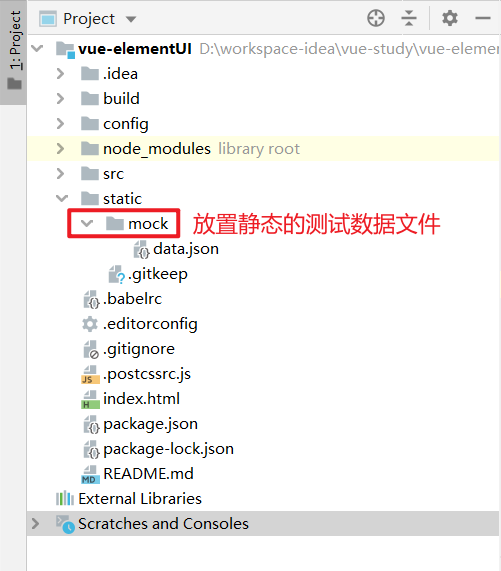

### 10.3.2 测试数据文件是否能够被访问

使用`npm run dev`指令启动项目后，我们在浏览器的地址栏中输入URL：`http://localhost:8080/static/mock/data.json`，来直接访问数据文件。

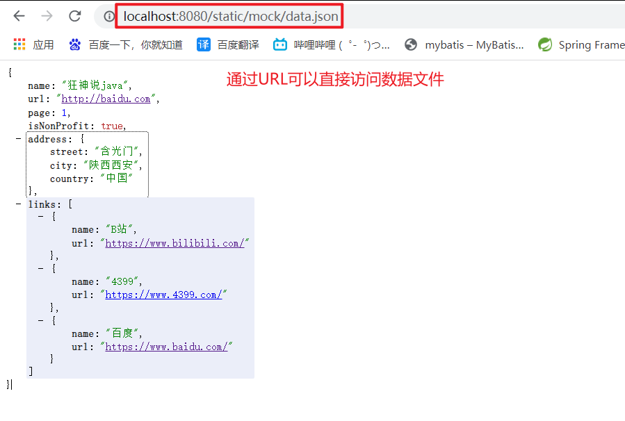

### 10.3.3 使用Axios获取数据

我们可以编写一个组件，每当路由指向该组件时就通过Axios从数据文件中获取数据。

> ./src/component/User.vue

```vue
<template>
    <h1>User.vue</h1>
</template>

<script>
    export default {
        name: "User",
        /* 在导航完成前获取数据 */
        beforeRouteEnter(to, from, next){
          console.log("进入路由之前");
          next(vm => {
            vm.getData();
          });
        },
        beforeRouteLeave(to, from, next) {
          console.log("离开路由之前");
          next();
        },
        methods:{
          getData(){
            this.axios.get("http://localhost:8080/static/mock/data.json")
                .then(response => {
              			console.log(response);
            		})
          }
        }
    }
</script>

<style scoped>

</style>
```

