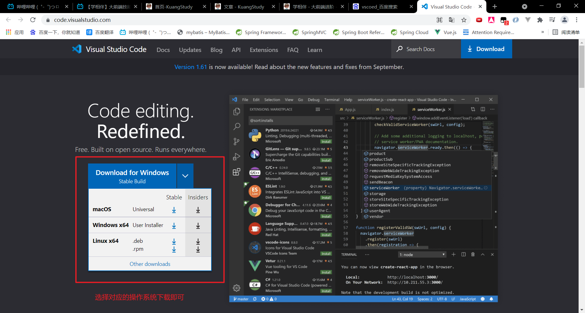
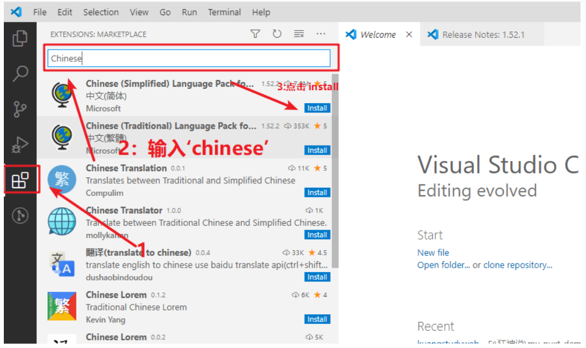
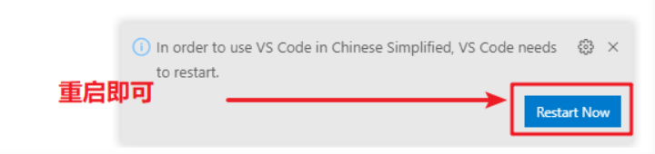
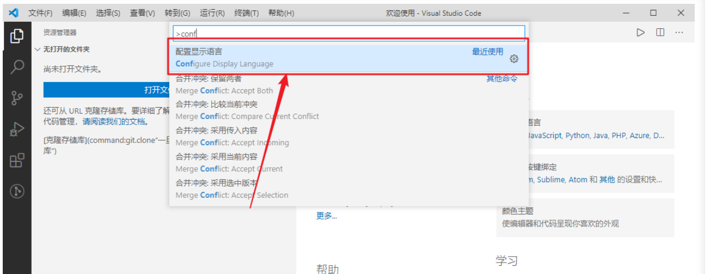
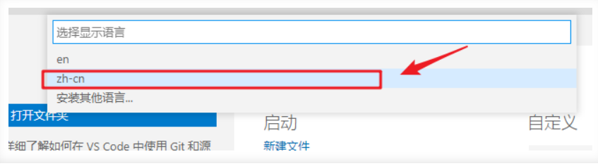
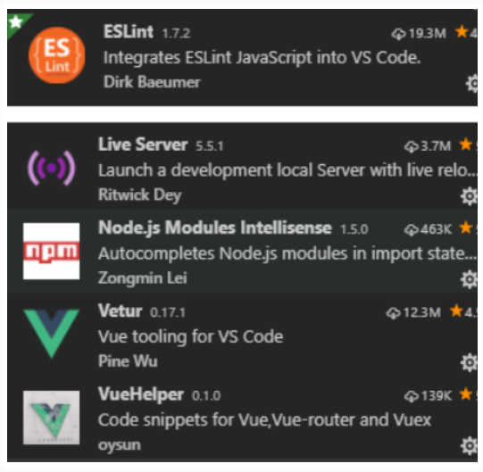
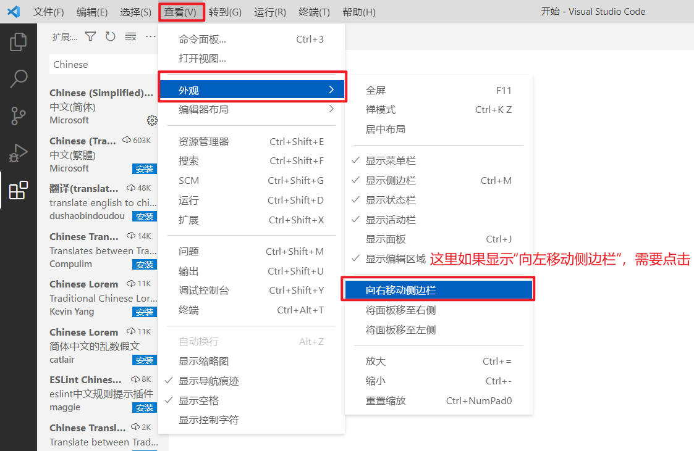

# 1. 下载安装VS Code

下载地址：[https://code.visualstudio.com/](https://code.visualstudio.com/)

安装过程中，除了更改安装路径外，其他的选项默认即可。

## 1.1 中文界面配置

1. 首先安装中文插件：Chinese (Simplified) Language Pack for Visual Studio Code。

   

2. 右下角弹出是否重启vs，点击“yes”。

   

3. 有些机器重启后如果界面没有变化，则 点击 左边栏Manage -> Command Paletet…【Ctrl+Shift+p】。

4. 在搜索框中输入“Configure Display Language”，回车。

   

5. 选择“zh-cn”。

   

6. 重启VS Code。

## 1.2 插件安装

为方便后续开发，建议安装如下插件：

# 1.3 设置字体大小

左边栏Manage -> settings -> 搜索 “font” -> Font size

# 1.4 开启完整的Emmet语法支持

设置中搜索 Emmet：启用如下选项，必要时重启vs。

# 1.5 视图

查看—> 外观—> 向左移动侧边栏。

