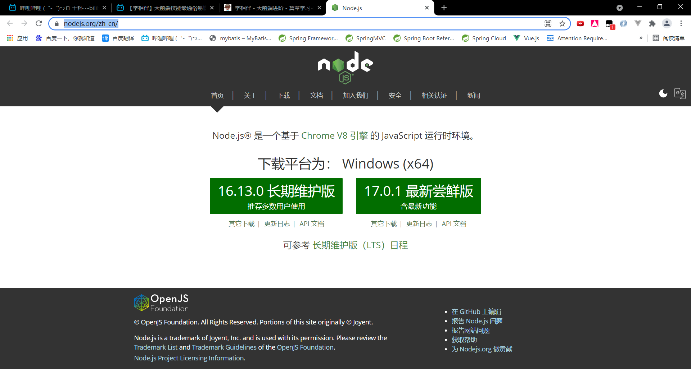

# 1. Node.js介绍与安装

Node.js官网：[https://nodejs.org/zh-cn/](https://nodejs.org/zh-cn/)



Node 是一个让 JavaScript 运行在服务端的开发平台，它让 JavaScript 成为与PHP、Python、Perl、Ruby 等服务端语言平起平坐的脚本语言。  发布于2009年5月，由Ryan Dahl开发，实质是对Chrome V8引擎进行了封装。

简单的说 Node.js 就是运行在服务端的 JavaScript。 Node.js 是一个基于Chrome JavaScript 运行时建立的一个平台。底层架构是：javascript. 文件后缀：.js

Node.js是一个事件驱动I/O服务端JavaScript环境，基于Google的V8引擎，V8引擎执行Javascript的速度非常快，性能非常好。


除了安装路径之外，其他的选项默认即可。安装成功之后，可以查看是否安装成功：

```shell
node -v
```


# 2. Node.js入门

## 2.1 快速入门

1. 创建文件夹`nodejs-study`

   

2. 在Visual Studio Code中打开新建文件夹

   

3. 创建helloworld.js

   ```js
   console.log('HelloWorld!');
   ```

4. 运行helloworld.js

   首先在VS Code中新建一个终端：

   

   JavaScript是一门解释型语言，不需要编译，因此可以在终端里输入`node helloworld.js`，回车运行：

   

   ==浏览器的内核包括两部分核心，分别是DOM渲染引擎和JavaScript解析器。==JS运行在浏览器内核中的JS引擎内部。

> tip：在项目的根目录下终端输入npm install --save-dev @types/node，即可在VS Code开启Node.js的代码提示

## 2.2 Node.js实现请求响应

Node.js有一套属于自己的API，就类似于JDK里面的包一样，我们也可以导入Node.js的模块。

Node.js中文网详细介绍了Node.js所包含的模块：[http://nodejs.cn/api/](http://nodejs.cn/api/)


Node.js实现请求响应的模块是`http`。

1. 创建`httpserver.js`

   ```js
   // 导入模块是require 就类似于import java.io 
   const http = require('http');
   // 创建一个httpserver服务
   http.createServer(function(request,response){
       // 这句话的含义是：告诉浏览器将以text-html去解析hello server这段数据。
       response.writeHead(200,{'content-type':'text/html'}); 
       // 给浏览器输出内容
       response.end("<div>HelloWorld!</div>");
   }).listen(8888);// 监听一端口8888
   console.log("你启动的服务是：http://localhost:8888,已启动成功!!");
   ```

2. 运行服务器程序

   ```shell
   node httpserver.js
   ```

3. 在浏览器中输入：http://localhost:8888/ 查看webserver成功运行，并输出html页面。

   

4. 在终端输入`ctrl+C`终止服务器服务。

## 2.3 Node.js操作MySQL数据库

参考文档：[https://www.npmjs.com/package/mysql](https://www.npmjs.com/package/mysql)

1. 安装MySQL依赖

   ```shell
   cnpm install mysql
   ```

   

2. 在数据库中新建表用于查询

   

   数据库名为`huoyujia`，表名是`t-user`。

3. 定义`db.js`进行MySQL的操作

   ```js
   var db = require("mysql");
   
   /* 获取MySQL数据库连接 */
   var connection = db.createConnection({
       host: "127.0.0.1",
       port: 3306,
       user: "root",
       password: "333",
       database: "huoyujia"
   });
   
   /* 建立MySQL数据库连接 */
   connection.connect();
   
   /* 进行数据库的查询 */
   connection.query("select * from t_user", function(error, results, fields){
       if(error) throw error;
       console.log(results);
   })
   
   /* 关闭数据库连接 */
   connection.end();
   ```

4. 查询结果如下：

   

以上只是学习了Node.js的最简单的知识，如果想开发更复杂的基于Node.js的应用程序后台，需要进一步学习Node.js的Web开发相关框架express、art-template、koa等。

