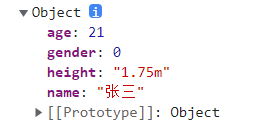
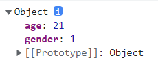

# 1. ES6概述

**ECMAScript**是一种由Ecma国际（前身为欧洲计算机制造商协会，European Computer Manufacturers Association）通过ECMA-262标准化的脚本程序设计语言。这种语言在万维网上应用广泛，它往往被称为JavaScript或JScript，所以它可以理解为是JavaScript的一个标准,但实际上后两者是ECMA-262标准的实现和扩展。

ECMAScript 6（简称ES6）是于2015年6月正式发布的JavaScript语言的标准，正式名为ECMAScript 2015（ES2015）。它的目标是使得JavaScript语言可以用来编写复杂的大型应用程序，成为企业级开发语言。另外，一些情况下ES6也泛指ES2015及之后的新增特性，虽然之后的版本应当称为ES7、ES8等。

> 2000年，ECMAScript 4.0开始酝酿。这个版本最后没有通过，但是它的大部分内容被ECMAScript6继承了。因此，ECMAScript6制定的起点其实是2000年。
>
> 2007年10月，ECMAScript 4.0草案发布，本来预计2008年8月发布正式版本。但是，各方对于是否通过这个标准，发生了严重分歧。以[Yahoo](https://baike.baidu.com/item/Yahoo/125377)、[Microsoft](https://baike.baidu.com/item/Microsoft/125917)、[Google](https://baike.baidu.com/item/Google/86964)为首的大公司，反对JavaScript的大幅升级，主张小幅改动；以JavaScript创造者[Brendan Eich](https://baike.baidu.com/item/Brendan Eich/561441)为首的[Mozilla](https://baike.baidu.com/item/Mozilla/7148071)公司，则坚持当前的草案。
>
> 2008年7月，由于对于下一个版本应该包括哪些功能，各方分歧太大，争论过于激烈，[ECMA](https://baike.baidu.com/item/ECMA/1499618)开会决定，中止ECMAScript 4.0的开发，将其中涉及现有功能改善的一小部分，发布为ECMAScript 3.1，而将其他激进的设想扩大范围，放入以后的版本，由于会议的气氛，该版本的项目代号起名为Harmony（和谐）。会后不久，ECMAScript 3.1就改名为ECMAScript 5。
>
> 2009年12月，ECMAScript 5.0正式发布。Harmony项目则一分为二，一些较为可行的设想定名为 JavaScript.next继续开发，后来演变成ECMAScript 6；一些不是很成熟的设想，则被视为JavaScript.next.next，在更远的将来再考虑推出。
>
> 2011年，ECMAScript 5.1发布后开始6.0版的制定。
>
> 2013年3月，ECMAScript 6草案冻结，不再添加新功能。新的功能设想将被放到ECMAScript 7。
>
> 2013年12月，ECMAScript 6草案发布。然后是12个月的讨论期，听取各方反馈。由于这个版本引入的语法功能太多，而且制定过程当中，还有很多组织和个人不断提交新功能。标准委员会最终决定，标准在每年的6月份正式发布一次，作为当年的正式版本。接下来的时间，就在这个版本的基础上做改动，直到下一年的6月份，草案就自然变成了新一年的版本。
>
> 2015年6月，ECMAScript 6（ES6）正式通过，成为国际标准，正式名称是“ECMAScript 2015”（简称ES2015）。
>
> 2016年6月，小幅修订的“ECMAScript 2016”（简称ES2016或ES7）标准发布，相当于ES6.1版，因为两者的差异非常小（只新增了[数组](https://baike.baidu.com/item/数组/3794097)实例的includes方法和指数运算符），基本上是同一个标准 [1] 。

# 2. ES6新语法：let和const

## 2.1 问题的提出

1. **JS没有块级作用域**

   ```js
   function runTowerExperiment(tower, startTime) {
       var t = startTime;
       tower.on("tick", function () {
           ... 使用了变量t的代码 ...
           if (bowlingBall.altitude() <= 0) {
               var t = readTachymeter();
               ...
           }
        });
        ... 更多使用了变量t的代码 ...
   } 
   ```

   在JS函数中的var声明，其作用域是函数体的全部。在代码块内声明的变量，其作用域是整个函数作用域而不是块级作用域。

   JavaScript 中`var`声明的作用域像是Photoshop中的油漆桶工具，从声明处开始向前后两个方向扩散，直到触及函数边界才停止扩散。这种变量t的作用域甚广，所以一进入函数就要马上将它创建出来。这就是所谓的 **提升（hoisting）**。变量提升就好比是，JS 引擎用一个很小的代码起重机将所有`var`声明和`function`函数声明都举起到函数内的最高处。

   > JS声明提升详细介绍：[https://www.runoob.com/js/js-hoisting.html](https://www.runoob.com/js/js-hoisting.html)

   现在看来，提升特性自有它的优点。如果没有提升的动作，许多在全局作用域范围内看似合理的完美技术在立即调用函数表达式（[ IIFE ](https://en.wikipedia.org/wiki/Immediately-invoked_function_expression)）中通通失效。但在上面演示的这种情况下，提升会引发令人不愉快的 bug：所有使用变量`t`进行的计算最终的结果都是`NaN`。这种问题极难定位，你会发狂到崩溃。

2. **循环内变量过度共享**

   > 会说话的猫

   ```js
   var messages = [" 喵！", " 我是一只会说话的猫！", " 回调（callback）非常有趣!"];
   for (var i = 0; i < messages.length; i++) {
       setTimeout(function () {
           cat.say(messages[i]);
       }, i * 1500);
   }
   ```

   事实上，上面的代码执行结果为：cat说了三次“undefined”。

   循环本身及三次 timeout 回调均共享唯一的变量 i。当循环结束执行时，i的值为 3（因为`messages.length`的值为 3），此时回调尚未被触发。

   所以当第一个 timeout 执行时，调用`cat.say(messages[i])`，此时 i 的值为 3，所以猫咪最终打印出来的是`messages[3]`的值亦即`undefined`。

   ==回调函数会在所有初始化代码执行结束后再执行。实际上在达到回调函数的条件后，会将回调函数依次放在一个队列中等待执行，而真正开始执行回调函数队列中的回调函数的时候是在所有的初始化代码（可以理解为除了回调函数的所有代码）执行完之后才开始执行的。==

## 2.2 let和var的不同

为了解决var声明或初始化带来的不合理的问题，十年以前Brendan Eich决定引入一个新的关键词`let`。`let`与`var`一样，也可以用来声明变量，但它有着更好的作用域规则。

使用`let`可以帮助你捕捉 bug，除了`NaN`错误以外，每一个异常都会在当前行抛出。

### 2.2.1 let声明的变量拥有块级作用域

也就是说用`let`声明的变量的作用域只是外层块，而不是整个外层函数。

`let`声明仍然保留了提升的特性，但不会盲目提升。在2.1节`runTowerExperiment`这个示例中，通过将`var`替换为`let`可以快速修复问题，如果你处处使用`let`进行声明，就不会遇到类似的 bug。

### 2.2.2 let声明的全局变量不是全局对象的属性

`let`声明的全局变量不是全局对象的属性。这就意味着，你不可以通过`window.变量名`的方式访问这些变量。它们只存在于一个不可见的块的作用域中，这个块理论上是 Web 页面中运行的所有 JS 代码的外层块。

### 2.2.3 形如for (let x...)的循环在每次迭代时都为 x 创建新的绑定。

这是一个非常微妙的区别，拿2.1节循环内变量过度共享来说，如果一个`for (let...)`循环执行多次并且循环保持了一个闭包，那么每个闭包将捕捉一个循环变量的不同值作为副本，而不是所有闭包都捕捉循环变量的同一个值。

所以在2.1节会说话的猫示例中，也可以通过将`var`替换为`let`修复 bug。

这种情况适用于现有的三种循环方式：`for-of`、`for-in`、以及传统的用分号分隔的类 C 循环。

### 2.2.4 let声明的变量直到控制流到达该变量被定义的代码行时才会被装载，所以在到达之前使用该变量会触发错误

举个例子：

```js
function update() {
    console.log(" 当前时间:", t);  // 引用错误（ReferenceError）
	...
    let t = readTachymeter();
}
```

不可访问的这段时间变量一直处于作用域中，但是尚未装载，它们位于**临时死区（Temporal Dead Zone，简称 TDZ）**中。

（脆弱的性能细节：在大多数情况下，查看代码就可以区分声明是否已经执行，所以事实上，JavaScript引擎不需要在每次代码运行时都额外执行一次变量可访问检查来确保变量已经被初始化。然而在闭包内部有时不是透明的，这时JavaScript引擎将会做一个运行时检查，也就意味着`let`相对`var`而言比较慢。）

### 2.2.5 用let重定义变量会抛出一个语法错误

这一条规则也可以帮助你检测琐碎的小问题。诚然，这亦是`var`与`let`的不同之处，当你全局搜索`var`替换为`let`时也会导致`let`重定义语法错误，因为这一规则对全局`let`变量也有效。

如果你的多个脚本中都声明了相同的全局变量，你最好继续用`var`声明这些变量。如果你换用了`let`，后加载的脚本都会执行失败并抛出错误。

（脆弱的语法细节：`let`是一个严格模式下的保留词。在非严格模式下，出于向后兼容的目的，你仍可以用`let`命名来声明变量、函数和参数，虽然你不会犯傻，但是你确实可以编写`var let = 'q';`这样的代码！不过`let let;`无论如何都是非法的。）

## 2.3 const

ES6引入的第三个声明类关键词与`let`类似：`const`。

`const`声明的变量与`let`声明的变量类似，`let`具有的特点`const`也基本具有。

它们的不同之处在于，`const`声明的变量只可以在声明时赋值，不可随意修改，否则会导致`SyntaxError`（语法错误），用`const`声明变量后必须要赋值，否则也抛出语法错误。

## 2.4 使用let和const的建议

再实际开发和生产中，如果是小程序、uniapp或者一些脚本框架，可以大胆地使用let和const。

如果是web开发，还是建议使用var。因为一些低版本的浏览器仍然不支持let和const。

# 3. ES6新语法：模板字符串

模板字面量是允许嵌入表达式的字符串字面量。你可以使用多行字符串和字符串插值功能。它们在ES2015规范的先前版本中被称为“模板字符串”。

模板字符串使用反引号 (\`) 来代替普通字符串中的用双引号和单引号。


模板字符串可以包含特定语法（`${expression}`）的占位符。占位符中的表达式和周围的文本会一起传递给一个默认函数，该函数负责将所有的部分连接起来，如果一个模板字符串由表达式开头，则该字符串被称为带标签的模板字符串，该表达式通常是一个函数，它会在模板字符串处理后被调用，在输出最终结果前，你都可以通过该函数来对模板字符串进行操作处理。在模版字符串内使用反引号（`）时，需要在它前面加转义符（\）。

```html
<!DOCTYPE html>
<html lang="en">
    <head>
        <meta charset="UTF-8">
        <meta name="viewport" content="width=device-width, initial-scale=1.0">
        <meta http-equiv="X-UA-Compatible" content="ie=edge">
        <title>模板字符串</title>
    </head>
    <body>
        <script>
            var username = "张三";
            var age = 30;
            // 1: 原始的做法就是去拼接字符串
            var str = "我名字叫 " + username+",年龄是: "+age;
            console.log(str);  
            // 2:用模板字符串来替代。注意：这里是 `（飘键：tab键盘的上面那个键)
            var str2 = `我名字叫 ${username},年龄是: ${age}`;
            console.log(str2);
        </script>
    </body>
</html>
```

# 4. ES6新语法：默认参数和剩余参数

从ECMAScript 6开始，有两个新的类型的参数：默认参数，剩余参数。

## 4.1 默认参数

在JavaScript中，函数参数的默认值是`undefined`。然而，在某些情况下设置不同的默认值是有用的。这时默认参数可以提供帮助。

在过去，用于设定默认参数的一般策略是在函数的主体中测试参数值是否为`undefined`，如果是则赋予这个参数一个默认值。如果在下面的例子中，调用函数时没有实参传递给`b`，那么它的值就是`undefined`，于是计算`a*b`得到、函数返回的是 `NaN`。但是，在下面的例子中，这个已经被第二行获取处理：

```jsx
function multiply(a, b) {
  b = (typeof b !== 'undefined') ?  b : 1;

  return a*b;
}

multiply(5); // 5
```

使用默认参数，在函数体的检查就不再需要了。现在，你可以在函数头简单地把1设定为`b`的默认值：

```js
function multiply(a, b = 1) {
  return a*b;
}

multiply(5); // 5
```

### 4.1.1 传递未定义的值或者其他错误的值

在本例中的第二个调用中，即使第一个参数显式设置为undefined（尽管不是null或其他错误值），num参数的值仍然是默认值。

```js
function test(num = 1) {
  console.log(typeof num)
}

test()           // 'number' (num is set to 1)
test(undefined)  // 'number' (num is set to 1 too)

// test with other falsy values:
test('')         // 'string' (num is set to '')
test(null)       // 'object' (num is set to null)
```

### 4.1.2 在调用时计算

默认参数在调用时计算。因此，与（例如）Python不同，每次调用函数时都会创建一个新对象。

```js
function append(value, array = []) {
  array.push(value)
  return array
}

append(1)  // [1]
append(2)  // [2], not [1, 2]
```

这甚至适用于函数和变量：

```js
function callSomething(thing = something()) {
  return thing
}

let numberOfTimesCalled = 0
function something() {
  numberOfTimesCalled += 1
  return numberOfTimesCalled
}

callSomething()  // 1
callSomething()  // 2
```

### 4.1.3 之前的参数也可以用作以后的默认参数

先前（左侧）定义的参数可用于以后的默认参数：

```js
function greet(name, greeting, message = greeting + ' ' + name) {
  return [name, greeting, message]
}

greet('David', 'Hi')                     // ["David", "Hi", "Hi David"]
greet('David', 'Hi', 'Happy Birthday!')  // ["David", "Hi", "Happy Birthday!"]
```

### 4.1.4 在默认参数之后没有设置默认的参数

参数仍然从左向右设置，即使以后有没有默认值的参数，也会覆盖默认参数。

```js
function f(x = 1, y) {
  return [x, y]
}

f()   // [1, undefined]
f(2)  // [2, undefined]
```

### 4.1.5 范围效应

如果为一个或多个参数定义了默认参数，则会创建第二个作用域（环境记录），特别是针对参数列表中的标识符。此作用域是为函数体创建的作用域的父级。

这意味着函数体中声明的函数和变量不能被默认值参数的初始值引用，尝试这样做会引发运行时引用错误。如下：

```js
function f(a = go()) { // Throws a `ReferenceError` when `f` is invoked.
    function go() { return ':P' }
}
```

这也意味着在函数体中使用var声明的变量将屏蔽相同名称的参数，而不是重复var声明的通常行为没有效果。如下，此函数将打印`undefined`，因为变量`var a`仅提升到为函数体创建的作用域的顶部（而不是为参数列表创建的父作用域）：

```js
function f(a, b = () => console.log(a)) {
    var a = 1
    b() // Prints `undefined`, because default parameter values exist in their own scope
}
```

## 4.2 剩余参数

剩余参数语法允许我们将一个不定数量的参数表示为一个数组。语法为：

```js
function(a, b, ...theArgs) {
    // ...
}

```

如果函数的最后一个命名参数以`...`为前缀，则它将成为一个由剩余参数组成的真数组，其中从`0`（包括）到`theArgs.length`（排除）的元素由传递给函数的实际参数提供。

在上面的例子中，`theArgs`将收集该函数的第三个参数（因为第一个参数被映射到`a`，而第二个参数映射到`b`）和所有后续参数。

### 4.2.1 剩余参数和arguments的区别

剩余参数和 `arguments`对象之间的区别主要有三个：

- 剩余参数只包含那些没有对应形参的实参，而 `arguments` 对象包含了传给函数的所有实参。
- `arguments`对象不是一个真正的数组，而剩余参数是真正的 `Array`实例，也就是说你能够在它上面直接使用所有的数组方法，比如 `sort`，`map`，`forEach`或`pop`。
- `arguments`对象还有一些附加的属性 （如`callee`属性）。


# 5. ES6新语法：箭头函数

在hacks.mozilla.org的博文中，详细介绍了箭头函数：[https://hacks.mozilla.org/2015/06/es6-in-depth-arrow-functions/](https://hacks.mozilla.org/2015/06/es6-in-depth-arrow-functions/)

JavaScript中的箭头函数，实际上和目前C++、Python、C#和Java目前广泛使用的Lambda表达式一样。只是换了一个名称而已。

**箭头函数表达式**的语法比函数表达式更简洁，并且没有自己的`this`，`arguments`，`super`或`new.target`。箭头函数表达式更适用于那些本来需要匿名函数的地方，并且它不能用作构造函数。

## 5.1 箭头函数语法

### 5.1.1 基础语法

```js
(param1, param2, …, paramN) => { statements }
(param1, param2, …, paramN) => expression
//相当于：(param1, param2, …, paramN) =>{ return expression; }

// 当只有一个参数时，圆括号是可选的：
(singleParam) => { statements }
singleParam => { statements }

// 没有参数的函数应该写成一对圆括号。
() => { statements }
```

### 5.1.2 高级语法

```js
//必须加括号的函数体返回对象字面量表达式：
params => ({foo: bar})

//支持剩余参数和默认参数
(param1, param2, ...rest) => { statements }
(param1 = defaultValue1, param2, …, paramN = defaultValueN) => {
statements }

//同样支持参数列表解构
let f = ([a, b] = [1, 2], {x: c} = {x: a + b}) => a + b + c;
f();  // 6
```

## 5.2 箭头函数的作用

### 5.2.1 更简短的函数

```js
var elements = [
  'Hydrogen',
  'Helium',
  'Lithium',
  'Beryllium'
];

elements.map(function(element) {
  return element.length;
}); // 返回数组：[8, 6, 7, 9]

// 上面的普通函数可以改写成如下的箭头函数
elements.map((element) => {
  return element.length;
}); // [8, 6, 7, 9]

// 当箭头函数只有一个参数时，可以省略参数的圆括号
elements.map(element => {
 return element.length;
}); // [8, 6, 7, 9]

// 当箭头函数的函数体只有一个 `return` 语句时，可以省略 `return` 关键字和方法体的花括号
elements.map(element => element.length); // [8, 6, 7, 9]

// 在这个例子中，因为我们只需要 `length` 属性，所以可以使用参数解构
// 需要注意的是字符串 `length` 是我们想要获得的属性的名称，而 `lengthFooBArX` 则只是个变量名，
// 可以替换成任意合法的变量名
elements.map(({ "length": lengthFooBArX }) => lengthFooBArX); // [8, 6, 7, 9]
```

### 5.2.2. 不绑定this

在箭头函数出现之前，每一个新函数根据它是被如何调用的来定义这个函数的this值：

- 如果该函数是一个构造函数，this指针指向一个新的对象
- 在严格模式下的函数调用下，this指向undefined
- 在非严格模式下的函数调用，this指向全局对象window
- 如果该函数是一个对象的方法，则它的this指针指向这个对象
- 等等

`This`被证明是令人厌烦的面向对象风格的编程。

```js
function Person() {
    // Person() 构造函数定义 `this`作为它自己的实例.
    this.age = 0;

    setInterval(function growUp() {
        // 在非严格模式, growUp()函数定义 `this`作为全局对象,
        // 与在 Person()构造函数中定义的 `this`并不相同.
        this.age++;
    }, 1000);
}

var p = new Person();
```

上面的程序中`p.age`始终为0。这个问题在ECMAScript 3/5中，通过将`this`值分配给封闭的变量（下例中为`that`），可以解决`this`问题，如下：

```js
function Person() {
    //将`this`值分配给封闭的变量
    var that = this;
    that.age = 0;

    setInterval(function growUp() {
        // 回调引用的是`that`变量, 其值是预期的对象.
        that.age++;
    }, 1000);
}

var p = new Person();
```

或者，可以创建绑定函数，以便将预先分配的`this`值传递到绑定的目标函数（上述示例中的`growUp()`函数）。

箭头函数不会创建自己的this，它只会从自己的作用域链的上一层继承this。因此，在下面的代码中，传递给`setInterval`的函数内的`this`与封闭函数中的`this`值相同：

```js
function Person(){
    this.age = 0;

    setInterval(() => {
        this.age++; // |this| 正确地指向 p 实例
    }, 1000);
}

var p = new Person();
```

**注意：如果箭头函数体中使用严格模式，所有跟this有关的严格模式规则都会被忽略。**

## 5.3 换行

箭头函数在参数和箭头之间不能换行，如下会报错：

```js
var func = ()
           => 1;
// SyntaxError: expected expression, got '=>'
```

但是，可以通过在`=>`之后换行，或者用`()`、`{ }`来实现换行，如下：

```js
var func = (a, b, c) =>
  1;

var func = (a, b, c) => (
  1
);

var func = (a, b, c) => {
  return 1
};

var func = (
  a,
  b,
  c
) => 1;

// 不会有语法错误
```

## 5.4 箭头函数的三元运算符

箭头函数也可以使用条件（三元）运算符：

```js
var simple = a => a > 15 ? 15 : a;
simple(16); // 15
simple(10); // 10

let max = (a, b) => a > b ? a : b;
```

## 5.5 箭头函数内定义的变量及其作用域

```js
// 常规写法
var greeting = () => {
    let now = new Date(); 
    return ("Good" + ((now.getHours() > 17) ? " evening." : " day."));
}
greeting();          //"Good day."
console.log(now);    // ReferenceError: now is not defined 标准的let作用域

// 参数括号内定义的变量是局部变量（默认参数）
var greeting = (now=new Date()) => "Good" + (now.getHours() > 17 ? " evening." : " day.");
greeting();          //"Good day."
console.log(now);    // ReferenceError: now is not defined

// 对比：函数体内{}不使用var定义的变量是全局变量
var greeting = () => {
    now = new Date(); 
    return ("Good" + ((now.getHours() > 17) ? " evening." : " day."));
}
greeting();           //"Good day."
console.log(now);     // Fri Dec 22 2017 10:01:00 GMT+0800 (中国标准时间)

// 对比：函数体内{} 用var定义的变量是局部变量
var greeting = () => {
    var now = new Date(); 
    return ("Good" + ((now.getHours() > 17) ? " evening." : " day."));
}
greeting(); //"Good day."
console.log(now);    // ReferenceError: now is not defined
```

# 6. ES6新语法：对象初始化简写

```js
/* 通常我们这样返回对象 */
console.log({
    name: "张三", 
    age: 12, 
    study: function(){
    	console.log("正在学习");    
    }
});

/* 接下来是对象的初始化简写，只要对象的属性和变量的名称相同就可以使用 */
var name = "张三";
var age = 12;
console.log({
    name,
    age,
    study(){
        console.log("正在学习");
    }
});
```

下面是对象初始化简写在实际开发中的使用：

```html
<!DOCTYPE html>
<html lang="en">

<head>
    <meta charset="UTF-8">
    <meta http-equiv="X-UA-Compatible" content="IE=edge">
    <meta name="viewport" content="width=device-width, initial-scale=1.0">
    <title>Document</title>
</head>

<body>
    <p>用户名：<input type="text" name="username" id="username" /></p>
    <p>密 码：<input type="password" name="password" id="password" /></p>
    <p><button id="myButton">登录</button></p>
    
    <script>
        /* 下面使用异步后台处理请求 */
        /* 点击按钮异步提交表单 */
        $("#button").on("click", () => {
            var username = $("#username").val;
            var password = $("#password").val;
            
            /* 使用对象初始化简写的形式 */
            var user = { username, password };

            /* 向后台提交表单 */
            $.ajax({
                type: "post",
                data: user,
                url: "...",

                /* 这里实际上等价于 success: function(data){...} */
                success(data){
                    ...
                }
            })
        })
    </script>
</body>

</html>
```

# 7. ES6新语法：对象解构

对象解构是ES6快捷获取对象属性和行为方式的一种方式。

之前获取对象属性和方法的方式主要有2种：通过`.`或者`[]`，如下：

```js
var person = {
    name: "张三",
    age: 23，
    study: function(){
        console.log("正在学习");
    }
}

/*通过.的方式*/
console.log(person.name);
console.log(person.age);
person.study();

/*通过[]的方式*/
console.log(person["name"]);
console.log(person["age"]);
person["study"]();
```

下面通过对象解构的方式获取对象属性和行为方式：

```js
/*name和age必须和属性名相同*/
var {name, age, study} = person;
console.log(name);
console.log(age);
study();

/*也可以使用别名的方式*/
var {name: username, age, study} = person;
console.log(username);
```

# 8. ES6新语法：对象传播操作符

对象传播操作符为`...`，我们可以使用对象传播操作符来融合对象或者是分解对象。

## 8.1 使用对象传播操作符来融合对象

```js
var person_1 = {
    name: "张三",
    age: 21
}

var person_2 = {
    /* 使用...对象传播操作符来融合对象，person_2对象也具有了name和age属性 */
    ...person_1,
    gender: 0,
    height: "1.75m"
}

console.log(person_2);
```

输出结果如下：



## 8.2 使用对象传播操作符来分解对象

```js
var person_1 = {
    name: "张三",
    age: 21,
    gender: 1
}

/* 使用对象传播操作符来分解对象，需要先使用解构 */
var {name, ...person_2} = person_1;

console.log(person_2);
```

输出结果如下：



# 9. ES6新语法：数组map和reduce方法

## 9.1 数组的map方法

`map()` 方法创建一个新数组，其结果是该数组中的每个元素是调用一次提供的函数后的返回值。

```js
const array1 = [1, 4, 9, 16];

// pass a function to map
const map1 = array1.map(x => x * 2);

console.log(map1);
// expected output: Array [2, 8, 18, 32]
```

### 9.1.1 数组中map方法的语法

```js
var new_array = arr.map(function callback(currentValue[, index[, array]]) {
 // Return element for new_array 
}[, thisArg])
```

参数如下：

- `callback`为生成新数组元素的函数，使用三个参数：
  - `currentValue` ：数组中正在处理的当前元素。
  - `index`可选：数组中正在处理的当前元素的索引。
  - `array`可选：`map` 方法调用的数组。

- `thisArg`可选：执行 `callback` 函数时值可以使用`this`来表示传入的`thisArg`。

返回值为一个由原数组每个元素执行回调函数的结果组成的新数组。

### 9.1.2 数组中map方法的描述

`map` 方法会给原数组中的每个元素都按顺序调用一次  `callback` 函数。`callback` 每次执行后的返回值（包括 `undefined`）组合起来形成一个新数组。 `callback` 函数只会在有值的索引上被调用，那些从来没被赋过值或者使用 `delete` 删除的索引则不会被调用。

因为`map`生成一个新数组，当你不打算使用返回的新数组却使用`map`是违背设计初衷的，请用`forEach`或者`for-of`替代。下列情况你不该使用`map`: A）你不打算使用返回的新数组， B）你没有从回调函数中返回值。

`callback` 函数会被自动传入三个参数：数组元素，元素索引，原数组本身。

如果 `thisArg` 参数提供给`map`，则会被用作回调函数的`this`值。否则`undefined`会被用作回调函数的`this`值。`this`的值最终相对于`callback`函数的可观察性是依据[the usual rules for determining the this seen by a function](https://developer.mozilla.org/en-US/docs/Web/JavaScript/Reference/Operators/this)决定的。下面是使用`thisArg`的示例，我们可以利用该参数在回调函数中传入更多的参数。

```js
var person = {
    name: "张三",
    age: 28,
    study(){
        var thisArg = {hello: "Hello"};
        var array = [1, 2, 3, 4];
        var newArray = array.map(function(v){
            /* 下面的this实际上是thisArg对象，我们可以利用该参数往回调函数中传参 */
            console.log(this);  //输出{hello: "Hello"}
            return v + 1;
        }, thisArg);
        console.log(newArray);
    }
}

person.study();
```

`map `不修改调用它的原数组本身（当然可以在 `callback` 执行时改变原数组）。

`map` 方法处理数组元素的范围是在 `callback` 方法第一次调用之前就已经确定了。调用`map`方法之后追加的数组元素不会被`callback`访问。如果存在的数组元素改变了，那么传给`callback`的值是`map`访问该元素时的值。在`map`函数调用后但在访问该元素前，该元素被删除的话，则无法被访问到。

**注意：如果回调函数没有return任何值，那么新的数组元素将会是undefined。**

### 9.1.3 使用map方法重新格式化数组中的对象

以下代码使用一个包含对象的数组来重新创建一个格式化后的数组：

```js
var kvArray = [{key: 1, value: 10},
               {key: 2, value: 20},
               {key: 3, value: 30}];

var reformattedArray = kvArray.map(function(obj) {
    var rObj = {};
    rObj[obj.key] = obj.value;	//map键值对存储语法
    return rObj;
});

// reformattedArray 数组为： [{1: 10}, {2: 20}, {3: 30}],

// kvArray 数组未被修改:
// [{key: 1, value: 10},
//  {key: 2, value: 20},
//  {key: 3, value: 30}]
```

### 9.1.4 使用map方法的易错点

通常情况下，`map` 方法中的 `callback` 函数只需要接受一个参数，就是正在被遍历的数组元素本身。但这并不意味着 `map` 只给 `callback` 传了一个参数。这个思维惯性可能会让我们犯一个很容易犯的错误。

考虑下例：

```
["1", "2", "3"].map(parseInt);
```

我们期望输出 `[1, 2, 3]`, 而实际结果是 `[1, NaN, NaN]`。

事实上，`Array.prototype.map`传递3个参数:

- the element
- the index
- the array

parseInt可以接收两个参数：第一个是字符串，第二个是数字基数（可选，0或者不选时会自动根据字符串来选择数字基数）。第一个数组元素执行：`parseInt("1", 0)`；第二个数组元素执行`parseInt("2", 1)`；第三个数组元素执行`parseInt("3", 2)`。

我们可以使用以下方法来避免这种错误：

```js
/*方法一*/
function returnInt(element) {
  return parseInt(element, 10);
}

['1', '2', '3'].map(returnInt); // [1, 2, 3]
-----------------------------------------------------------------------
/*方法二*/
['1', '2', '3'].map( str => parseInt(str) );

-----------------------------------------------------------------------
/*方法三：Number方法只有一个参数*/
['1', '2', '3'].map(Number); // [1, 2, 3]    
```

## 9.2 数组中的reduce方法

`reduce()` 方法对数组中的每个元素执行一个由您提供的**reducer**函数(升序执行)，将其结果汇总为单个返回值。

```js
const array1 = [1, 2, 3, 4];
const reducer = (previousValue, currentValue) => previousValue + currentValue;

// 1 + 2 + 3 + 4
console.log(array1.reduce(reducer));
// expected output: 10

// 5 + 1 + 2 + 3 + 4
console.log(array1.reduce(reducer, 5));
// expected output: 15
```

### 9.2.1 数组中reduce方法的语法

```js
arr.reduce(callback(accumulator, currentValue[, index[, array]])[, initialValue])
```

参数如下：

- `callback`为执行数组中每个值 (如果没有提供 `initialValue则第一个值除外`)的函数，包含四个参数：
  - `accumulator`：累计器累计回调的返回值; 它是上一次调用回调时返回的累积值，或`initialValue`（见于下方）
  - `currentValue`：数组中正在处理的元素。
  - `index`可选：数组中正在处理的当前元素的索引。 如果提供了`initialValue`，则起始索引号为0，否则从索引1起始。
  - `array`可选：调用`reduce()`的数组
- `initialValue`可选：作为第一次调用 `callback`函数时的第一个参数的值。 如果没有提供初始值，则将使用数组中的第一个元素。 在没有初始值的空数组上调用 reduce 将报错。

返回值为函数累计处理的结果。

### 9.2.2 数组中reduce方法的描述

`reduce`为数组中的每一个元素依次执行`callback`函数，不包括数组中被删除或从未被赋值的元素，接受四个参数：

- `accumulator 累计器`
- `currentValue 当前值`
- `currentIndex 当前索引`
- `array 数组`

回调函数第一次执行时，`accumulator` 和`currentValue`的取值有两种情况：如果调用`reduce()`时提供了`initialValue`，`accumulator`取值为`initialValue`，`currentValue`取数组中的第一个值；如果没有提供 `initialValue`，那么`accumulator`取数组中的第一个值，`currentValue`取数组中的第二个值。

**注意：**如果没有提供`initialValue`，reduce 会从索引1的地方开始执行 callback 方法，跳过第一个索引。如果提供`initialValue`，从索引0开始。

如果数组为空且没有提供`initialValue`，会抛出`TypeError`。如果数组仅有一个元素（无论位置如何）并且没有提供`initialValue`， 或者有提供`initialValue`但是数组为空，那么此唯一值将被返回并且`callback`不会被执行。

提供初始值通常更安全，正如下面的例子，如果没有提供`initialValue`，则可能有四种输出：

```js
var maxCallback = ( acc, cur ) => Math.max( acc.x, cur.x );
var maxCallback2 = ( max, cur ) => Math.max( max, cur );

// reduce() 没有初始值
[ { x: 2 }, { x: 22 }, { x: 42 } ].reduce( maxCallback ); 
// NaN，这里是因为第一次返回22，但是第二次比较时accumulator为22，没有x属性，因此所以返回结果是NaN
[ { x: 2 }, { x: 22 }            ].reduce( maxCallback ); // 22
[ { x: 2 }                       ].reduce( maxCallback ); // { x: 2 }
[                                ].reduce( maxCallback ); // TypeError

// map/reduce; 这是更好的方案，即使传入空数组或更大数组也可正常执行
[ { x: 22 }, { x: 42 } ].map( el => el.x ).reduce( maxCallback2, -Infinity );
```

### 9.2.3 reduce函数如何运行

#### 9.2.3.1 不提供初始值

假如运行下段`reduce()`代码：

```js
[0, 1, 2, 3, 4].reduce(function(accumulator, currentValue, currentIndex, array){
  return accumulator + currentValue;
});
```

callback 被调用四次，每次调用的参数和返回值如下表：

|  callback   | accumulator | currentValue | currentIndex |      array      | return value |
| :---------: | :---------: | :----------: | :----------: | :-------------: | :----------: |
| first call  |      0      |      1       |      1       | [0, 1, 2, 3, 4] |      1       |
| second call |      1      |      2       |      2       | [0, 1, 2, 3, 4] |      3       |
| third call  |      3      |      3       |      3       | [0, 1, 2, 3, 4] |      6       |
| fourth call |      6      |      4       |      4       | [0, 1, 2, 3, 4] |      10      |

由`reduce`返回的值将是最后一次回调返回值（10）。

你还可以使用箭头函数来代替完整的函数。 下面的代码将产生与上面的代码相同的输出：

```js
[0, 1, 2, 3, 4].reduce((prev, curr) => prev + curr );
```

#### 9.2.3.2 提供初始值

如果你打算提供一个初始值作为`reduce()`方法的第二个参数，以下是运行过程及结果：

```js
[0, 1, 2, 3, 4].reduce((accumulator, currentValue, currentIndex, array) => {
    return accumulator + currentValue
}, 10)
```

|  callback   | accumulator | currentValue | currentIndex |      array      | return value |
| :---------: | :---------: | :----------: | :----------: | :-------------: | :----------: |
| first call  |     10      |      0       |      0       | [0, 1, 2, 3, 4] |      10      |
| second call |     10      |      1       |      1       | [0, 1, 2, 3, 4] |      11      |
| third call  |     11      |      2       |      2       | [0, 1, 2, 3, 4] |      13      |
| fourth call |     13      |      3       |      3       | [0, 1, 2, 3, 4] |      16      |
| fifth call  |     16      |      4       |      4       | [0, 1, 2, 3, 4] |      20      |

这种情况下`reduce()`返回的值是`20`。

### 9.2.4 reduce函数的使用场景

详细见：[https://developer.mozilla.org/zh-CN/docs/Web/JavaScript/Reference/Global_Objects/Array/Reduce#%E4%BE%8B%E5%AD%90](https://developer.mozilla.org/zh-CN/docs/Web/JavaScript/Reference/Global_Objects/Array/Reduce#%E4%BE%8B%E5%AD%90)

