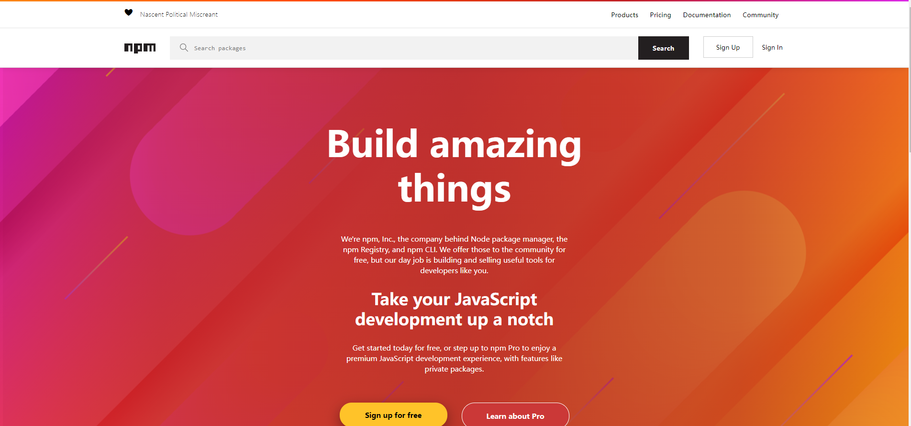
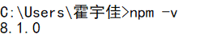
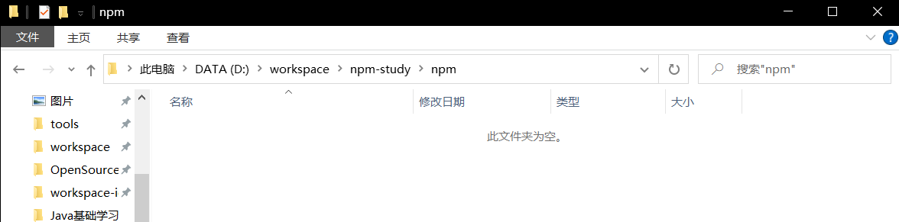
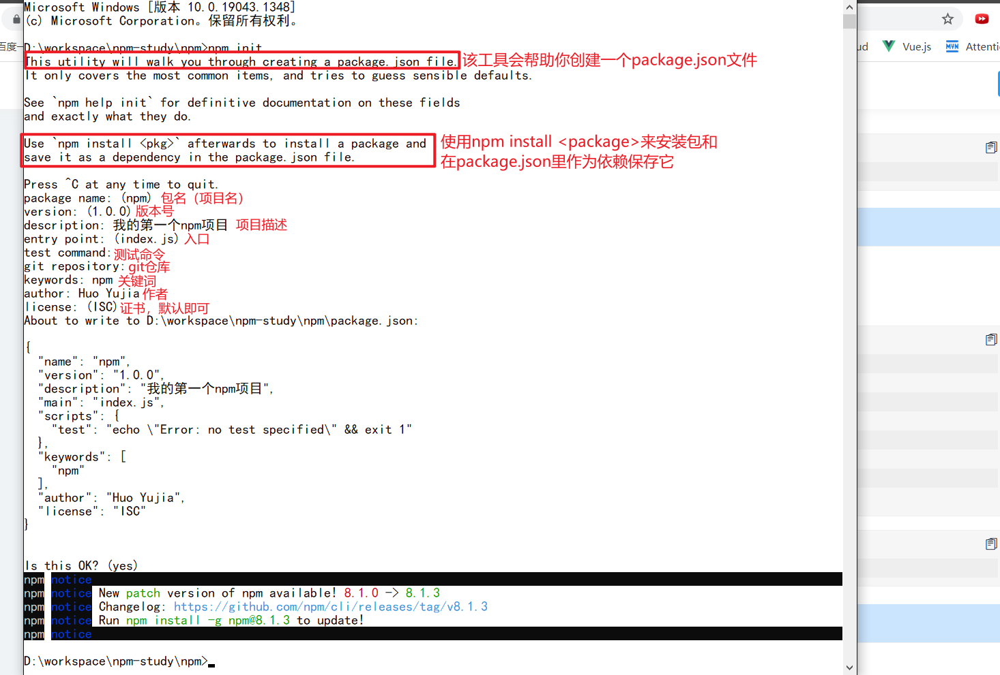
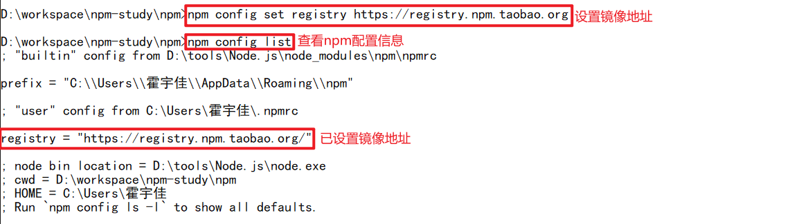
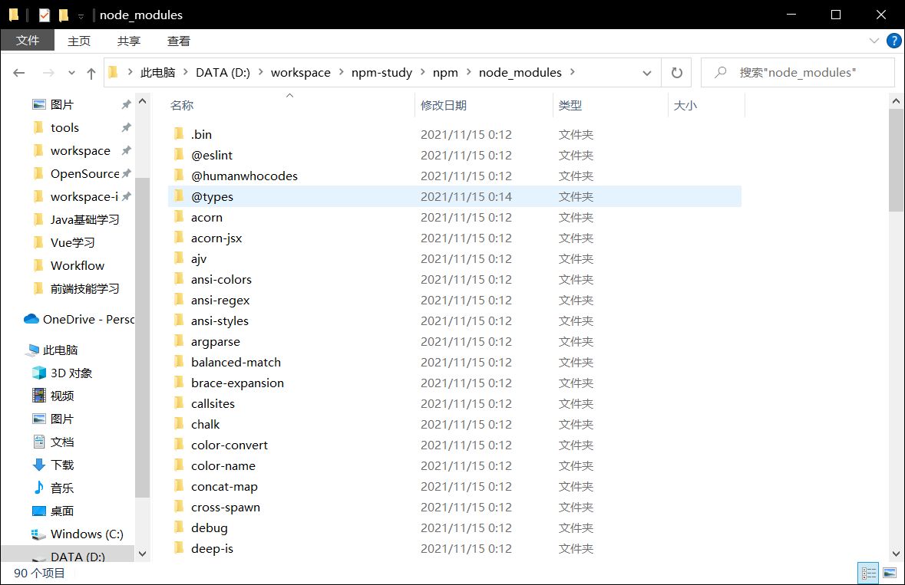
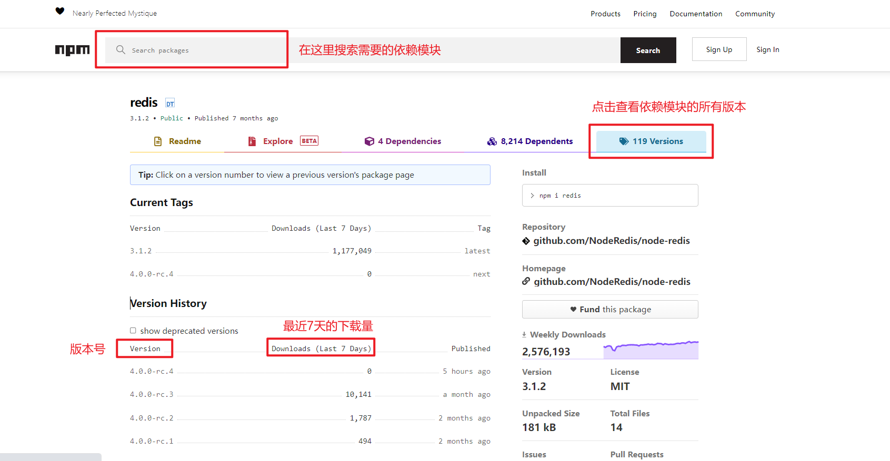

# 1. npm包管理器简介

官方网站：[https://www.npmjs.com/](https://www.npmjs.com/)



NPM全称Node Package Manager，是Node.js包管理工具，是全球最大的模块生态系统，里面所有的模块都是开源免费的，也是Node.js的包管理工具，相当于前端的Maven 。

在命令提示符里面输入`npm -v`，可查看当前的npm版本：



# 2. 使用npm创建项目

1. 创建项目的初始文件夹

   

2. 使用cmd进入项目文件夹，执行`npm init`进行项目初始化

   

   最后会生成package.json文件，这个是包的配置文件，相当于maven的pom.xml。我们之后也可以根据需要来进行修改。生成的`package.json`内容如下：

   ```json
   {
       "name": "npm",//工程名
       "version": "1.0.0",//版本号
       "description": "我的第一个npm项目",//描述
       "main": "index.js",//入口js
       "scripts": {
           "test": "echo \"Error: no test specified\" && exit 1"
       },
       "author": "Huo Yujia",//开发者
       "license": "ISC"//授权协议
   }
   ```
   
   如果想直接生成`package.json`文件，可以使用`npm init -y`命令。我们可以按照需要对其进行修改。

# 3. npm install

我们可以使用`npm install`命令来安装依赖包的最新版本。模块安装的位置为：`项目目录/node_modules`。

安装会自动在项目目录下添加 package-lock.json文件，这个文件帮助锁定安装包的版本。

同时package.json 文件中，依赖包会被添加到dependencies节点下，类似maven中的 \<dependencies>。

```shell
#npm install
npm install jquery

#如果安装时想指定特定的版本
npm install jquery@2.1.x

#devDependencies节点：开发时的依赖包，项目打包到生产环境的时候不包含的依赖
#使用 -D参数将依赖添加到devDependencies节点
npm install --save-dev eslint
#或
npm install -D eslint

#全局安装
#Node.js全局安装的npm包和工具的位置：用户目录\AppData\Roaming\npm\node_modules
#一些命令行工具常使用全局安装的方式
npm install -g webpack

#npm管理的项目在备份和传输的时候一般不携带node_modules文件夹
npm install #根据package.json中的配置下载依赖，初始化项目
```

如果下载npm包的速度过慢，我们可以修改镜像源。NPM官方的管理的包都是从[http://npmjs.com](http://npmjs.com)下载的，但是这个网站在国内速度很慢。这里推荐使用淘宝 NPM 镜像 [http://npm.taobao.org/](http://npm.taobao.org/)。淘宝 NPM 镜像是一个完整的NPM镜像，同步频率目前为10分钟一次，以保证尽量与官方服务同步。

如下设置镜像地址：

```shell
#经过下面的配置，以后所有的 npm install 都会经过淘宝的镜像地址下载
npm config set registry https://registry.npm.taobao.org 
#查看npm配置信息
npm config list
```



# 4. npm的常见问题

1.  **快速安装依赖第三方模块**

   ```shell
   npm install 模块名 或者 npm i 模块名
   ```

2. **安装模块放在什么地方**

   安装的模块放在项目的`node_modules`文件夹中，如下：

   

3. **安装的模块如何使用**

   ```js
   //导入模块redis
   const redis = require("redis");
   
   //导入模块mysql
   const mysql = require("mysql");
   ```

4. **模块和`package.json`的关系**

   ```json
   “dependencies”: {
       "jquery": "^3.5.1",
       "mysql": "^2.18.1",
       "redis": "^3.0.2",
       "vue": "^2.6.12"
   }
   ```

   通过`npm install 模块名`命令，会把模块以及版本号记录在`package.json`文件中，类似于Maven中`pom.xml`文件的作用。

   记录的目的就是为了复用。我们可以从别的项目中复制`package.json`文件，通过`npm install`命令把`package.json`所依赖的模块全部自动下载。这样可以避免重复下载模块。

   如果直接复制其他项目的`node_modules`文件夹，动辄几万到几十万的文件数量，复制的内容过多，不方便。

5. **如果安装模块怎么办**

   首先安装`cnpm`包管理器，如下，此后我们可以使用`cnpm`指令来替代`npm`指令。

   ```shell
   npm install -g cnpm --registry=https://registry.npm.taobao.org
   ```

   > **npm 和 cnpm 的区别**
   >
   > （1） 两者之间只是 node 中包管理器的不同
   >
   > （2） npm是node官方的包管理器。cnpm是个中国版的npm，是淘宝定制的 [cnpm](https://github.com/cnpm/cnpm) 命令行工具代替默认的 npm
   >
   > （3）如果因为网络原因无法使用npm下载，那cnpm这个就派上用场了。

6. **如何运行js代码**

   ```shell
   node xxxx.js
   #或者
   node xxxx
   ```

   如果需要终止程序运行，输入`Ctrl+C`。

7. **如何下载多个依赖模块**

   ```shell
   cnpm install mysql redis jquery
   ```

8. **下载指定的版本号**

   ```shell
   npm install xxx@版本号
   ```

   具体的版本号，可以查看官方网址：[https://www.npmjs.com/](https://www.npmjs.com/)

   

9. **如何卸载模块**

   ```shell
   npm uninstall vue jquery
   ```

   

