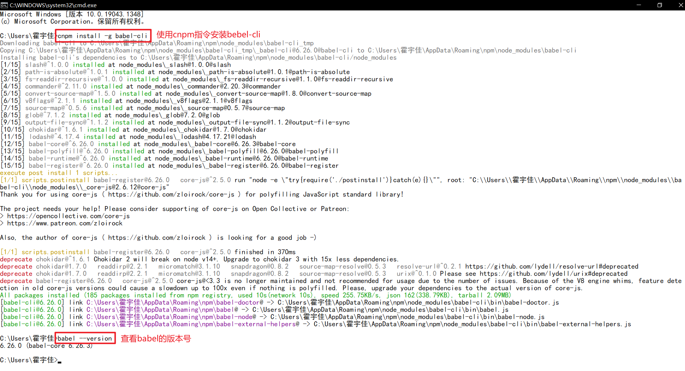
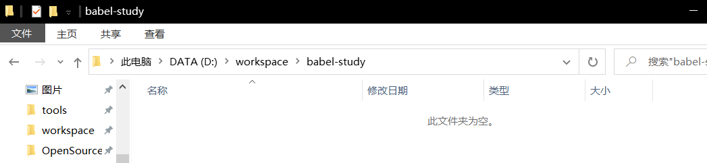
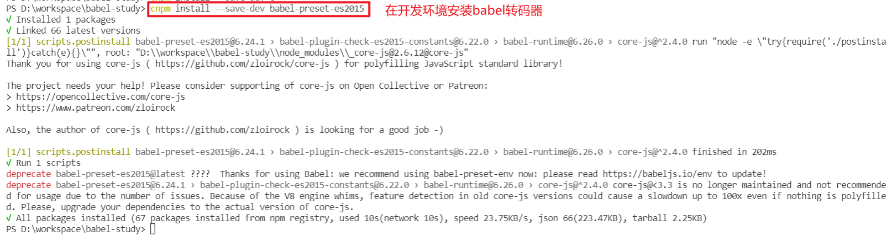
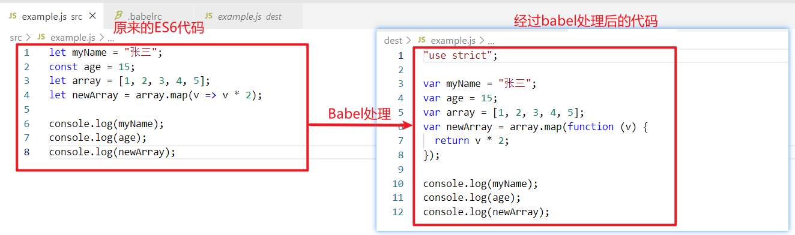
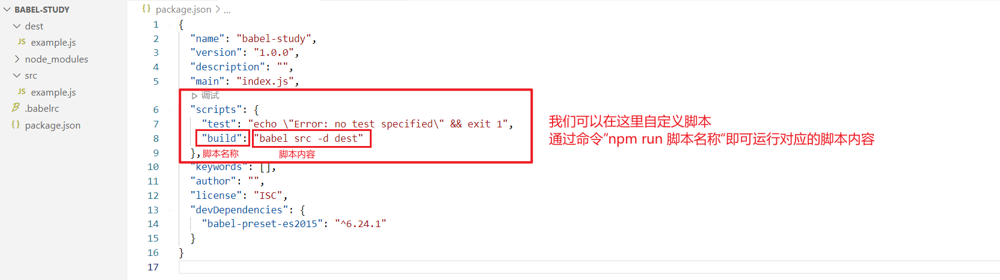
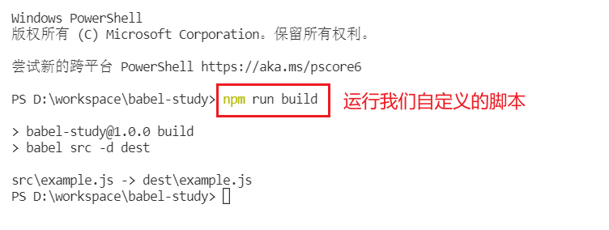

# 1. Babel是什么

==Babel 是一个 JavaScript 编译器。==

Babel是一个工具链，主要用于将采用ECMAScript 2015+语法编写的代码转换为向后兼容的 JavaScript 语法，以便能够运行在当前和旧版本的浏览器或其他环境中。也就是说，我们现在就可以放心地使用ES2015（ES6）来进行编程，而不用担心浏览器是否能够兼容ES6。

下面列出的是 Babel 能为你做的事情：

- 语法转换
- 通过Polyfill方式在目标环境中添加缺失的特性（通过引入第三方polyfill模块，例如 [core-js](https://github.com/zloirock/core-js)）
- 源码转换（codemods）

```js
// Babel 输入： ES2015（ES6）箭头函数
[1, 2, 3].map(n => n + 1);

// Babel 输出： ES5 语法实现的同等功能
[1, 2, 3].map(function(n) {
  return n + 1;
});
```

# 2. 安装Babel

Babel提供`babel-cli`工具，用于命令行转码。安装命令如下：

```shell
# 安装babel-cli
cnpm install -g babel-cli
```

安装完成之后我们可以查看是否安装成功：

```shell
babel --version
```



# 3. Babel的使用

1. 创建项目的文件夹

   

2. 初始化项目

   ```shell
   npm init -y
   ```

3. 创建文件`src/example.js`。

   下面是一段ES2015（ES6）的代码：

   ```js
   let myName = "张三";
   const age = 15;
   let array = [1, 2, 3, 4, 5];
   let newArray = array.map(v => v * 2);
   
   console.log(myName);
   console.log(age);
   console.log(newArray);
   ```

4. 配置`.babelrc`

   Babel的配置文件是`.babelrc` ，存放在项目的根目录下，该文件用于设置转码规则和插件，基本格式如下：

   ```json
   {
       "presets": [],
       "plugins": []
   }
   ```

   `presets`字段设定转码规则，将ES2015（ES6）规则配置到`.babelrc`：

   ```json
   {
       "presets": ["es2015"],
       "plugins": []
   }
   ```

5. 安装转码器，在项目中安装。

   ```shell
   cnpm install --save-dev babel-preset-es2015
   ```

   其中`--save-dev`表示该依赖模块在项目发布时不会同时发布出去。

   

6. 进行项目的源代码转码

   ```shell
   # npm install --save-dev csv-loader xml-loader
   # 转码结果写入一个文件
   mkdir dest
   # --out-file 或 -o 参数指定输出文件
   babel src/example.js --out-file dest/compiled.js
   # 或者
   babel src/example.js -o dest/compiled.js
   # 整个目录转码
   mkdir dist2
   # --out-dir 或 -d 参数指定输出目录
   babel src --out-dir dest
   # 或者
   babel src -d dest
   ```

   

   最后输出得到的js文件如下：

   

# 4. 自定义脚本

我们可以在`package.json`文件里面自定义脚本。如下：



脚本定义位于`script`的字段内，以键值对的方式定义脚本名称和脚本内容。

定义之后，我们可以通过`npm run 脚本名称`来运行脚本名称对应的脚本内容，如下：



这种自定义脚本的方式可以不单单使用在`Babel`里面，对于冗长的命令我们都可以使用自定义脚本的方式快速运行，对于我们加快开发速度是十分有利的。