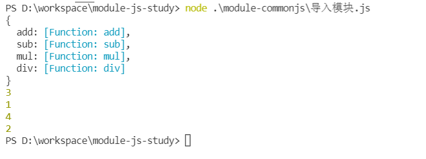
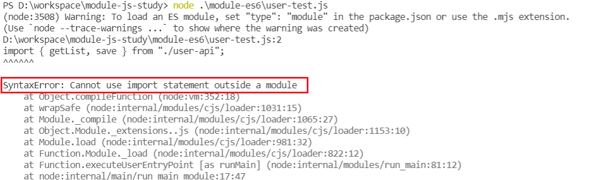
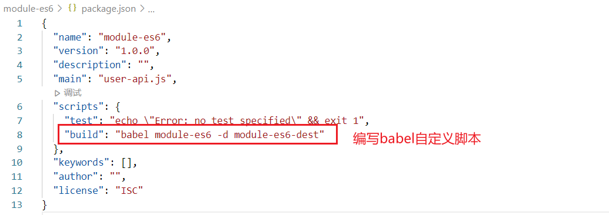
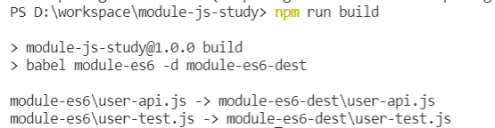
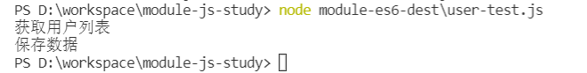

# 1. 模块化开发简介

模块化是一个语言发展的必经之路，其能够帮助开发者拆分和组织代码，随着前端技术的发展，前端编写的代码量也越来越大，就需要对代码有很好的管理，而模块化能够帮助开发者解决命名冲突、管理依赖、提高代码的可读性、代码解耦以及提高代码的复用性。

模块化开发其实就是封装细节，提供使用接口，彼此之间互不影响，每个模块都是实现某一特定的功能，同时也需要避免全局变量的污染，最初通过函数实现模块，实际上是利用了函数的局部作用域来形成模块。

```js
function func1(){
     //...
}

function func2(){
     //...
}
```

上述的`func1`与`func2`函数分别形成了两个模块，需要使用的时候直接调用即可，但是这样无法保证不与其他模块发生变量名冲突，而且模块成员之间看不出直接关系，再之后便有使用对象作为模块，将成员的都放置于对象中。

```js
var nameModule={
    name:0,
    func1:function(){
        //...
    },
    func2:function(){
        //...
    }
}
```

在模块化规范形成之前，JavaScript并不是一种模块化的语言，它不支持类（class）、包（package）、模块（module）等面向对象语言的特性。开发者通常使用`Module`设计模式来解决Js全局作用域的污染问题。`Module`模式最初被定义为一种在传统软件工程中为类提供私有和公有封装的方法，在JavaScript中，`Module`模式使用匿名函数自调用构建闭包来封装，通过自定义暴露行为来区分私有成员和公有成员。

```js
var nameModule = (function() {
    var moduleName = "module";  // private

    function setModuleName(name) {
        moduleName = name;
    }

    function getModuleName() {
        return moduleName;
    }
    return { 
        setModuleName: setModuleName, 
        getModuleName: getModuleName
    }
})();

console.log(nameModule.getModuleName()); // module
nameModule.setModuleName("nameModule");
console.log(nameModule.getModuleName()); // nameModule
```

# 2. CommonJS规范

对于`CommonJS`来说，每个文件就是一个模块，有自己的作用域。在一个文件里面定义的变量、函数、类等都是私有的，对其他文件不可见。

1. 我们首先创建`module-commonjs/四则运算.js`文件

   该文件里面定义了加减乘除四个方法，如下：

   ```js
   let add = function(a, b){
       return a + b;
   }
   let sub = function(a, b){
       return a - b;
   }
   let mul = function(a, b){
       return a * b;
   }
   let div = function(a, b){
       return a / b;
   }
   ```

2. 导出模块中的成员

   ```js
   /* 导出成员，成员名字相同则不用采用js对象形式 */
   module.exports = {
       add,
       sub,
       mul,
       div
   }
   
   /*或者如下直接导出成员*/
   exports.add = function(){
       return a + b;
   }
   ```

3. 创建文件`module-commonjs/导入模块.js`

   该文件导入我们之前编写完成的模块，测试如下：

   ```js
   /* 导入我们已经编写好的模块 */
   const m = require("./四则运算.js");
   
   console.log(m);
   
   console.log(m.add(1, 2));
   console.log(m.sub(2, 1));
   console.log(m.mul(2, 2));
   console.log(m.div(4, 2));
   ```

   输出结果如下：

   

   **总结：CommonJS模块化开发虽然在平时开发时使用很少（前端框架大部分使用ES6模块化开发），但是仍然需要了解（Node.js开发使用CommonJS规范），使用`module.exports`导出模块成员，使用`require`导入模块。**

# 3. ES6规范

## 3.1 使用export和import来导出和导入模块

1. 我们首先创建`module-es6/user-api.js`文件

   该文件用于导出我们定义的`getList`和`save`方法，如下：

   ```js
   /* 导出方法getList */
   export function getList(){
       console.log("获取用户列表");
   }
   
   /* 导出方法save */
   export function save(){
       console.log("保存数据");
   }
   ```

2. 创建`module-es6/user-test.js`文件

   该文件用于导入我们在`module-es6/user-api.js`文件中定义的`getList`和`save`方法，并进行如下测试：

   ```js
   /* 导入模块中的成员 */
   import { getList, save } from "./user-api";
   
   getList();
   save();
   ```

   此时使用`node`指令，提示报错：

   

3. 引入`Babel`转换代码

   这是因为`Node.js`不支持这种ES6语法（很多浏览器也不支持），我们需要使用`Babel`来转换代码，步骤如下：

   - 安装`babel-preset-es2015`（如果此前还未下载babel-cli的话还需下载babel-cli）

     ```shell
     # 安装babel-preset-es2015
     cnpm install --save-dev babel-preset-es2015
     ```

   - 在`module-es6`目录的上级目录使用`npm init -y`创建`package.json`文件

   - 在`package.json`文件中编写Babel脚本，如下：

     

   - 在`package.json`的同级目录下编写`.babelrc`文件

     ```json
     {
         "presets": ["es2015"],
         "plugins": []
     }
     ```

   - 运行Babel脚本，注意要在`module-es6`目录的上级目录中运行脚本

     

4. 进行最后的测试

   

## 3.2 更简洁的ES6模块化写法

在3.1小节中已经介绍了ES6的模块化开发，但是模块每导出一个成员都要使用一次`export`，并且导入时还需要依次写出需要导入的所有方法。这在实际的开发（模块动辄上百个方法）是很不合理的。

因此ES6又提出了新的更简洁的语法来支持模块化开发。这种模块化写法在实际的前端框架（Vue）里面经常使用，因此一定要掌握。

### 3.2.1 导出模块成员

> module-es6/user-api.js

```js
/* 导出成员 */
export default{
    getList : function(){
        console.log("获取用户列表");
    },  //这里一定要记得加逗号

    /* 成员方法的简写 */
    save(){
        console.log("保存数据");
    }
}
```

### 3.2.2 导入模块

我们可以直接导入整个模块，如下：

> module-es6/user-test.js

```js
/* 导入整个模块 */
import user from "./user-api";

user.getList();
user.save();
```

### 3.3.3 使用Babel转换代码

这里和3.1小节的内容完全一样，在此不赘述。
