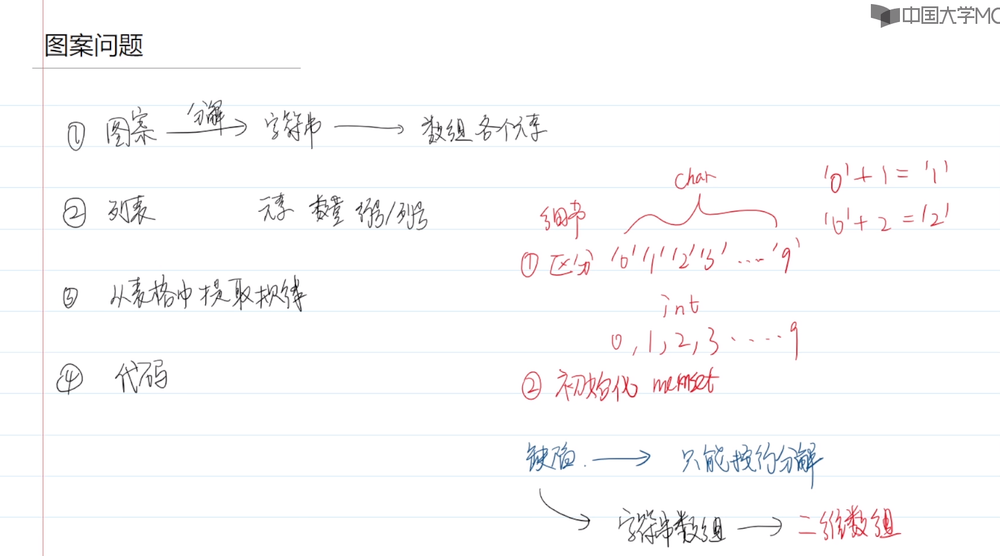
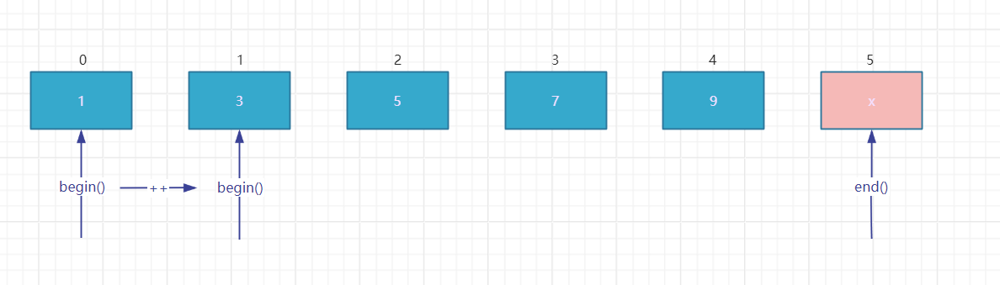

# 字符串初始化

字符串初始化时一般全部填充为终止符。有两种方式：

```c
char str[100] = {0};
```

```c
#include <string.h>
memset(str, 0 , 100); // 第一个参数是字符数组，第二个参数是要填充的内容，第三个参数是填充的长度 
```

# 图案问题



# 日期问题

```C
// 是否是闰年（&&优先级高于||）
int isLeap = year % 400 == 0 || year % 4 == 0 && year % 100 != 0 
```

```C
/*得到下一天的日期*/
void nextDay(int year, int month, int day) {
    int daysOfMonth[13] = {0, 31, 28, 31, 30, 31, 30, 31, 31, 30, 31, 30, 31};
    int isLeap = year % 400 == 0 || year % 4 == 0 && year % 100 != 0; // 是否是闰年
    if (isLeap) {
        daysOfMonth[2] = 29;
    } else {
        daysOfMonth[2] = 28;
    }
    day++;
    if (day > daysOfMonth[month]) { // 如果日不合法
        month++;
        day = 1;
    }
    if (month > 12) { // 如果月不合法
        year++;
        month = 1;
    }
    printf("next day is %d-%d-%d\n", year, month, day);
}
```

```C
printf("%d-%02d-%02d", year, month, day); // 格式化输出，不足两位的用0填充
```


# C++的引用

如果想在被调函数中修改主调函数中的数据，就必须使用引用。

```C
/*得到下一天的日期*/
void nextDay(int &year, int &month, int &day) {
    // & 出现在定义或或者形参当中，表示引用的意思，出现在其他的位置，表示取地址
}
```

# 静态数组的不足

- 如果是定义在函数内部的数组（局部变量），大小不能超过1MB。也就是char类型数组的大小不能超过`char[1000][1000]`，int类型的数组大小不能超过250000个int类型的元素大小。

- 全局变量可以定义几百MB的大小，但是一般题目会限制大小。

  一般局部不够，使用全局。全局不够，改算法。

- 数组作为函数参数时，被调函数只能拿到第一个元素的地址，不知道数组长度信息。

  可以传递两个参数：数组地址+长度。

# vector

vector位于C++的STL库。

```C++
// 引入vector
#include <vector> //vector不需要.h
```

## 迭代器iterator

迭代器可以间接访问数据结构的内容，可以把迭代器理解为高级的指针。 

迭代器的类型：`动态数组类型 :: iterator`。

`begin()`：获取迭代器的起始位置，初始为vector下标为0的位置。

`end()`：获取迭代器的尾部位置，初始为vector下标为`size()`的位置，即vector最后一个元素的后一个位置。

`++`：迭代器自增，即迭代器向后移动一个位置，`begin()`得到的结果也会加1。



## 增（构造&初始化）

```C++
struct MyType{
    int val1;
    double val2;
}; // 自定义类
vector<int> vec1; // vector不是类型 vector<type>才是类型
vector<double> vec2;
vector<MyType> vec3;
vector<vector<int>> vec4; // 动态二维数组
vector<int> int[10]; // 机试推荐二维动态数组写法，相当于包含10个动态数组的静态数组，用于图算法，邻接表
```

## 增（插入）

```C++
vector<int> vec2(100); // vec2一开始就有100个元素
// push_back() 往动态数组的尾部插入
int a;
vector<int> vec1;
while(scanf("%d", &a) != EOF) {
    vec1.push_back(a);
}
```

```c++ 
vector<int> vec1 = {1,3,5,7,9};
vector<int>::iterator it;
it = vec1.begin();
vec1.insert(it, 2); // 第一个参数是迭代器，迭代器所在的位置就是要插入的位置，要插入的位置及后面位置的元素会自动往后移动移动一位

it = vec1.begin();
it = it + 3; // vector的迭代器支持这样的操作，相当于3次++操作，其他类型的迭代器不一定支持
vec1.insert(it, 6);
```

**注意：往迭代器所在位置插入元素之后，迭代器就无效了。需要重新获取迭代器。**

## 查（访问某个元素）

### []

```c++
vector<int> vec1 = {1,3,5,7,9};
int i = 0;
printf("vec1[i] = %d\n", vec1[i]); // 和静态数组一样

// 获取vector长度
int size = vec1.size();
```

和静态数组一样，访问动态数组下标如果超过数组长度减1，会报错。

## 查（遍历）

```c++
vector<int> vec1 = {1,3,5,7,9};
vector<int>::iterator it;
/*迭代器遍历*/
for(it = vec1.begin(); it != vec1.end(); it++) {
    printf("*it = %d\n", *it);
}
```


## 查（通过元素信息得到元素位置）

## 改

## 删除

### 删除某个元素

```C++
vector<int> vec1 = {1,3,5,7,9};
vec1.pop_back(); // 删除最后一个元素
```

```c++
vector<int> vec1 = {1,3,5,7,9};
vector<int>::iterator it;
it = vec1.begin() + 2;
vec1.erase(it); // 删除迭代器所在位置的元素，之后位置的元素向前移动一个位置
```

**注意：使用迭代器删除元素后，迭代器会失效。**

### 删除整个vector

```c++
vector<int> vec1 = {1,3,5,7,9};
vec1.clear(); // 清空所有数据
```

# list

可以把`list`当作链表使用，除了不支持vector的随机访问，list的其他用法和vector基本一样。

```c++
list<int> ls1 = {1,3,5,7,9};
list<int>::iterator it = ls1.begin();
it++; // list的迭代器只支持++运算符，不支持+2
it++;
printf("it = %d\n", *it); // 获取迭代器所在位置的元素
ls1.erase(it); // 删除迭代器所在位置的元素

/*迭代器遍历list*/
for(it = ls1.begin(); it != ls1.end(); it++) {
    printf("after erase, *it = %d\n", *it);
}
```

线性数据结构默认使用vector，如果包含大量的在线性表中间插入删除的操作，可以使用list。

# set

## 非线性数据结构

- 有序不重复`set`
- 有序可重复`multiset`
- 无序不重复`unordered_set`
- 无序可重复`unordered_multiset`

有序省内存，无序省时间。机试中一般使用有序的，如果有序超时可以换成无序的。

所有的set都不允许修改，可以先删除再插入元素。

## 构造

```c++
set<int> set1 = {1, 3, 5};
multiset<int> set2 = {1, 3, 5, 1, 3, 5};
unordered_set<int> set3 = {1, 3, 5};
unordered_multiset<int> set4 = {1, 3, 5, 1, 3, 5};
```

## 新增元素

```c++
set1.insert(2);
```

## 删除元素

```c++
set1.erase(1);
set2.erase(1); // 会删除可重复set的所有1元素
```

## 遍历

```c++
unordered_multiset<int>::iterator it;
for(it = set4.begin(); it != set4.end(); it++) {
    printf("%d ", *it);
}
```

## 查找

### find()

```c++
// find 查找元素的位置，找不到就返回一个尾后迭代器
if (set3.find(3) == set3.end()) {
    printf("3 is not in set3\n");
} else {
    printf("3 is in set3\n");
}
```

### count()

```c++
// count 获取元素的数量
printf("2 occurs %d times\n", set2.count(2));
```

# map

map可以通过一个下标（键/key）访问元素（值/value），它的下标可以是任意类型，元素也可以是任意类型。

map本质上是一个集合，集合里存放的是键值对（pair）。

## 构造map

```c++
map<char, int> map1; // 有序 不允许重复
// char是键的类型，int是值的类型
multimap<char, int> map2; // 有序 允许重复
unordered_map<char, int> map3; // 无序 不允许重复 经常使用，时间开销小
unordered_multimap<char, int> map4; // 无序 允许重复
```

`multimap`允许键重复，`map`不允许键重复。

## 键值对

```c++
pair<char, int> pair1 = {'w', 0};
// first键  second值
printf("key = %c, value = %d\n", pair1.first, pair1.second);
```

## 新增

```c++
map1.insert(pair1);
map1.insert({'w', 0}); // 如果不创建pair，必须要用花括号

// 或者直接在声明的时候赋值
map<char, int> map1 = {
    {'w', 0}, {'o', 1}, {'r', 2}, {'l', 3}, {'d', 4}
};
```

## 删除

```c++
map1.erase('w');
map2.erase('w'); // 全部键为'w'的键值对都会被删除
```

## 迭代器

```c++
map<char, int>::iterator it;
for(it = map1.begin(); it != map1.end(); it++) {
    printf("key = %c, value = %d\n", it->first, it->second);
}
```

## 查询

```c++
int value = map1['w']; // 如果键不存在，会自动创建{'w', 0}的键值对
if (map1.find('a') == map1.end()) {
    printf("key is not in map\n");
} else {
    prinf("value = %d\n", map1['a']);
}
```

**`multimap`不支持方括号访问值**。

```c++
// multimap.lowbound(key) 返回key对应的第一个值的位置，相当于begin()
// multimap.upperbound(key) 返回key对应的最后一个值的位置，相当于end()
for(it = multimap.lowbound('o'); it != multimap.upperbound(key); it++) {
    printf("key = %c, value = %d\n", it->first, it->second);
}
```


## 赋值

```c++
map1['o'] = 5;
```

