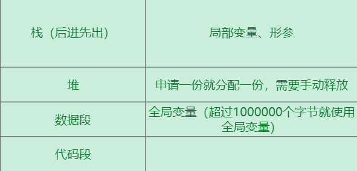

# 存储模式

- 顺序存储：只需要分配一个数组，只有特殊的树（完全二叉树）适合。
- 链式存储：存储其他结点的地址

# C++内存模型



## C++中的&

如果`&`出现在定义中，表示定义了一个引用；如果`&`出现在其他语句，表示取地址

## C++中的*

如果`*`出现在定义中，表示定义了一个指针变量；如果`*`出现在其他语句，表示解引用（间接访问：通过指针变量访问指向的内容）

```c++
int main() {
    int i = 10;
    int *p, *q; // 定义指针变量，p是一个指针变量，打算指向一个int变量
    p = &i; // 取出i的地址放入p中
    *p++; // 根据p找到指向的数据，再对数据进行自增
}
```

## 指针的注意事项

```c++
/*不要返回局部变量的地址*/
int *func() {
    int i = 10;
    return &i; // func函数返回后，局部变量i会自动回收
}

int main() {
    p = func();
    *p...;
}
```

## 堆空间的使用和释放

### new申请堆空间

`new type`：type可以是int/float/double/自定义struct等，会返回type*类型

`new type[length]`：申请长度为length的动态数组（不推荐使用，优先使用局部变量、全局变量、vector）

### delete释放堆空间

`delete`：对应`new type`

`delete[]`：对应`new type[]`

```c++
int *func() {
    int *p = new int; // 申请堆空间
    *p = 10;
    return p;
}

int main() {
    int *p1;
    p1 = func();
    *p1++;
    delete p1; // 释放堆空间
    return 0;
}
```

# 完全二叉树的顺序存储

从上到下、从左往右顺序存入数组。

假设从数组下标0开始存储（根结点下标为0），某一个结点的下标为`i`，则其父节点的下标为`(i - 1) / 2`向下取整，其左孩子下标为`2 * i + 1`，其右孩子下标为`2 * i + 2`。

# 二叉树的链式存储

完全二叉树可以使用顺序存储，对于任意二叉树需要使用链式存储。

结点需要存储的内容：

- 数据域
- 指针域：至少两个部分，left，right，也可以加上parent（通过孩子找父亲）

## 结点类型

```c++
struct TreeNode {
	DataType data;
    TreeNode *left; // 必须使用指针（确定大小），不能定义TreeNode left，因为无法确定TreeNode大小
    TreeNode *right;
};
```

## 使用二叉树

```c++
int main() {
    TreeNode *proot = NULL;
    
}
```

# 层序建树

1. 创建根结点，将其left和righ的位置入队
2. 再来新的数据，如果数据不是#，创建树结点，获取队首并且出队，根据原队首做插入，新节点的left和right入队；如果数据是#，出队。

```c++
struct QueueNode {
    TreeNode *parent;
    bool isLeft;
}
void buildTree(TreeNode* &proot, queue<QueueNode*> &pos, char data) {
    if(data != '#') {
        // 申请一个树结点
        TreeNode *pNew = new TreeNode;
        pNew->data = data; // 等价于(*pNew).data = data
        // 申请一个队列结点
        QueueNode *pQueueNode = new QueueNode;
        pQueueNode->parent = pNew; // 打算保存刚创建新节点的位置
        pQueueNode->isLeft = false; // 左孩子还没有被访问过
        pos.push(pQueueNode);
        if(proot == NULL) {
            proot = pNew;
        } else {
            QueueNode *pCur = pos.front;
            if(pCur->isLeft == false) {
                pCur->parent->left = pNew;
                pCur->isLeft = true;
            } else {
                p->parent->right = pNew;
                pos.pop();
                delete pCur;
            }
        }
    } else {
        if(proot != NULL) {
            QueueNode *pCur = pos.front();
            if(pCur->isLeft == false) {
                pCur->parent->left = NULL;
                pCur->isLeft = true;
            } else {
                p->parent->right = NULL;
                pos.pop();
                delete pCur;
            }
        }
    }
}
```

# 二叉搜索树

二叉搜索树：左子树的结点值小于根结点的结点值，右子树的结点值大于根结点的结点值，中序遍历序列有序。

二叉搜索树的插入：方案一递归，方案二双指针。

# 优先队列

优先队列实际上就是堆，形状上是一棵完全二叉树，数值上是根结点大于所有孩子结点（大根堆）或者根结点小于所有孩子结点（小根堆）。

C++标准库提供`priority_queue`，需包含头文件`#include <queue>`

```c++
priority_queue<Type> pq;
pq.pop(); // 出队，总是出最大值
pq.push(data); // 入队
pq.top(); // 获取队首，就是最大值
pq.empty(); // 判断堆是否为空
```

> [!IMPORTANT]
>
> Type类型必须支持`<`运算符，如果想要实现小根堆，需要修改`<`运算符的含义或者取相反数（int,float,double）。

## 自定义小于运算符

C++支持运算符重载

```c++
struct Complex {
	int re; // 实部
	int im; // 虚部
};

// 自定义小于运算符
// 重载原本的小于号，有两个参数，返回值是bool
// 自定义一个函数，参数数量不变，返回值类型不变，名字是opreator 运算符
// 若a<b，返回true，大根堆
// 若a<b，返回false，小根堆
bool operator < (Complex lhs, Complex rhs) {
    if (lhs.re * lhs.re + lhs.im * lhs.im > rhs.re * rhs.re + rhs.im * rhs.im) {
        return true;
    } else {
        return false;
    }
}
```

## 构造函数

```c++
struct Complex {
    int re;
    int im;
    // 构造函数在类的内部，名字和类名一样，没有返回值
    Complex(int _re, int _im) {
        re = _re;
        im = _im;
    }
}

int main() {
    int re, im;
    scanf("%d+i%d", &re, &im); // 格式化输入
    Complex c(re, im); // 构造函数
}
```

